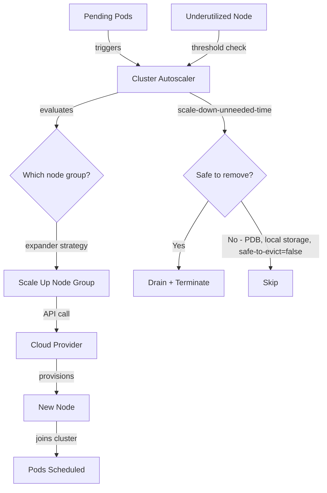

> 💡 **Quick Answer:** Cluster Autoscaler (CA) adds nodes when pods are **Pending** as unschedulable and removes nodes whose pods can all be rescheduled elsewhere and whose utilization stays below `--scale-down-utilization-threshold` (default `0.5`) for `--scale-down-unneeded-time` (default `10m`). It won't consider scale-down for `--scale-down-delay-after-add` (default `10m`) after a scale-up. If a new node isn't Ready within `--max-node-provision-time` (default `15m`), CA gives up on it and tries another node group.
>
> **Key command:** `kubectl -n kube-system get configmap cluster-autoscaler-status -o yaml`

## The Problem

- Pods stuck in Pending because no node has enough resources
- Paying for idle nodes during off-peak hours
- GPU nodes sitting empty but too expensive to keep
- Scale-down too aggressive (kills nodes during brief dips) or scale-up too slow

CA complements HPA: HPA scales pod replicas, CA scales nodes so those replicas fit.

## Install (EKS with Helm)

```bash
helm repo add autoscaler https://kubernetes.github.io/autoscaler
helm install cluster-autoscaler autoscaler/cluster-autoscaler \
  --namespace kube-system \
  --set autoDiscovery.clusterName=my-cluster \
  --set awsRegion=eu-west-1 \
  --set extraArgs.balance-similar-node-groups=true \
  --set extraArgs.expander=least-waste \
  --set extraArgs.scale-down-delay-after-add=10m \
  --set extraArgs.scale-down-unneeded-time=10m \
  --set extraArgs.skip-nodes-with-local-storage=false
```

Match the CA image minor version to your Kubernetes minor version (CA 1.30.x for Kubernetes 1.30). The CA service account needs IAM permissions for `autoscaling:SetDesiredCapacity`, `autoscaling:TerminateInstanceInAutoScalingGroup` and the `Describe*` calls (IRSA or Pod Identity).

Auto-discovery finds ASGs tagged with:

```text
k8s.io/cluster-autoscaler/enabled = true
k8s.io/cluster-autoscaler/my-cluster = owned
```

## Core Configuration Flags

```yaml
apiVersion: apps/v1
kind: Deployment
metadata:
  name: cluster-autoscaler
  namespace: kube-system
spec:
  template:
    spec:
      containers:
        - name: cluster-autoscaler
          image: registry.k8s.io/autoscaling/cluster-autoscaler:v1.30.1
          command:
            - ./cluster-autoscaler
            - --v=4
            - --cloud-provider=aws
            # Scale-up
            - --scan-interval=10s
            - --max-node-provision-time=15m
            # Scale-down
            - --scale-down-enabled=true
            - --scale-down-delay-after-add=10m
            - --scale-down-delay-after-delete=0s
            - --scale-down-delay-after-failure=3m
            - --scale-down-unneeded-time=10m
            - --scale-down-utilization-threshold=0.5
            # Node group discovery
            - --node-group-auto-discovery=asg:tag=k8s.io/cluster-autoscaler/enabled,k8s.io/cluster-autoscaler/my-cluster
            # Which node group to grow
            - --expander=least-waste
            # Safety
            - --skip-nodes-with-local-storage=false
            - --skip-nodes-with-system-pods=true
            - --balance-similar-node-groups=true
            - --max-graceful-termination-sec=600
```

| Parameter | Default | Description |
|-----------|---------|-------------|
| `scan-interval` | 10s | How often CA re-evaluates pending pods and nodes |
| `max-node-provision-time` | 15m | Max wait for a new node to register and become Ready before CA treats the scale-up as failed |
| `scale-down-delay-after-add` | 10m | No scale-down evaluation for this long after any scale-up |
| `scale-down-delay-after-delete` | scan-interval | Pause after deleting a node |
| `scale-down-delay-after-failure` | 3m | Pause after a failed scale-down |
| `scale-down-unneeded-time` | 10m | Node must be unneeded this long before removal |
| `scale-down-utilization-threshold` | 0.5 | Sum of pod *requests* / allocatable below this makes a node a candidate |
| `skip-nodes-with-local-storage` | true | Don't remove nodes running pods with `emptyDir`/hostPath |
| `skip-nodes-with-system-pods` | true | Don't remove nodes running non-DaemonSet `kube-system` pods (unless they have a PDB) |
| `balance-similar-node-groups` | false | Keep similar groups (e.g. one per AZ) the same size |

Utilization is computed from **requests**, not live usage — pods without requests make nodes look empty and pods with inflated requests keep nodes alive.

If nodes regularly take longer than 15 minutes to join (large GPU AMIs, slow bootstrap), raise `--max-node-provision-time`; otherwise CA marks the node group as backed off and the pending pods wait.

## Expanders

The expander decides which node group grows when several could fit the pending pods:

| Expander | Strategy |
|----------|----------|
| `random` | Random choice among fitting groups |
| `most-pods` | Group whose node fits the most pending pods |
| `least-waste` | Group leaving the least idle CPU/memory after scale-up |
| `price` | Cheapest node (GCE and a few providers only) |
| `priority` | User-defined priorities from a ConfigMap |

Expanders can be chained, e.g. `--expander=priority,least-waste` (the next one breaks ties).

### Priority Expander

```yaml
apiVersion: v1
kind: ConfigMap
metadata:
  name: cluster-autoscaler-priority-expander   # Name is fixed
  namespace: kube-system
data:
  priorities: |-
    200:
      - .*spot.*          # Higher number = tried first
    100:
      - .*general.*
    10:
      - .*gpu.*           # Expensive: last resort
```

## GKE and AKS

```bash
# GKE: CA is built in — enable per node pool
gcloud container node-pools update gpu-pool \
  --cluster=my-cluster \
  --enable-autoscaling --min-nodes=0 --max-nodes=8 \
  --location-policy=ANY

# More aggressive scale-down profile
gcloud container clusters update my-cluster \
  --autoscaling-profile=optimize-utilization

# AKS: built in as well
az aks nodepool update -g my-rg --cluster-name my-cluster -n gpupool \
  --enable-cluster-autoscaler --min-count 0 --max-count 8
az aks update -g my-rg -n my-cluster \
  --cluster-autoscaler-profile scale-down-unneeded-time=5m scale-down-delay-after-add=5m
```

## Scale-to-Zero for GPU Node Groups

```bash
eksctl create nodegroup --cluster my-cluster --name gpu-workers \
  --node-type g5.2xlarge --nodes-min 0 --nodes-max 8 --asg-access
```

When a group is at 0 nodes, CA has no live node to learn labels, taints and extended resources from. On AWS, add node-template tags to the ASG so CA can simulate the node:

```text
k8s.io/cluster-autoscaler/node-template/label/nvidia.com/gpu.present = true
k8s.io/cluster-autoscaler/node-template/taint/nvidia.com/gpu = true:NoSchedule
k8s.io/cluster-autoscaler/node-template/resources/nvidia.com/gpu = 1
```

Taint GPU nodes so only pods tolerating `nvidia.com/gpu` land there — otherwise ordinary pods pin GPU nodes and they never scale down.

## Preventing Scale-Down

```bash
# Node-level
kubectl annotate node worker-5 cluster-autoscaler.kubernetes.io/scale-down-disabled=true
```

```yaml
# Pod-level: this pod blocks its node from being removed
metadata:
  annotations:
    cluster-autoscaler.kubernetes.io/safe-to-evict: "false"
```

Use `safe-to-evict: "true"` on pods with `emptyDir` that are fine to lose. Protect availability during scale-down drains with a PodDisruptionBudget:

```yaml
apiVersion: policy/v1
kind: PodDisruptionBudget
metadata:
  name: myapp-pdb
spec:
  minAvailable: 2
  selector:
    matchLabels:
      app: myapp
```

## Monitoring

```bash
kubectl -n kube-system get configmap cluster-autoscaler-status -o yaml
kubectl -n kube-system logs -l app.kubernetes.io/name=aws-cluster-autoscaler -f   # label depends on chart release
kubectl get events -A --field-selector source=cluster-autoscaler
```

```promql
sum(kube_pod_status_phase{phase="Pending"})
cluster_autoscaler_unschedulable_pods_count
cluster_autoscaler_scaled_up_nodes_total
cluster_autoscaler_scaled_down_nodes_total
cluster_autoscaler_failed_scale_ups_total
```


```mermaid
graph TD
    A[Pending Pods] -->|triggers| B[Cluster Autoscaler]
    B -->|evaluates| C{Which node group?}
    C -->|expander strategy| D[Scale Up Node Group]
    D -->|API call| E[Cloud Provider]
    E -->|provisions| F[New Node]
    F -->|joins cluster| G[Pods Scheduled]
    H[Underutilized Node] -->|threshold check| B
    B -->|scale-down-unneeded-time| I{Safe to remove?}
    I -->|Yes| J[Drain + Terminate]
    I -->|No - PDB, local storage, safe-to-evict=false| K[Skip]
```

## Common Issues

| Issue | Cause | Fix |
|-------|-------|-----|
| Pods Pending but no scale-up | Node group at max, or no group can fit the pod (selector/taint/size) | Check `NotTriggerScaleUp` events on the pod |
| Scale-down not happening | Pods with local storage, no controller, kube-system pods without PDB, restrictive PDB | Check CA logs / status for "cannot remove node" reason |
| Wrong node type scales up | `random` expander | Use `least-waste` or `priority` |
| Node takes >15min to join | Slow AMI bootstrap / image pull | Raise `max-node-provision-time`, pre-bake images |
| GPU group never scales to 0 | Non-GPU pods on GPU nodes, or `min > 0` | Taint GPU nodes, set min to 0 (DaemonSet pods don't block scale-down) |
| Can't scale up from 0 | CA can't see labels/resources of an empty group | Add `node-template` ASG tags |
| Flapping | Delays too short | Raise `scale-down-unneeded-time` to 15m |

## Best Practices

1. **Keep `scale-down-delay-after-add` around 10m** to prevent thrashing
2. **Use `least-waste` or `priority` expander** for cost-aware node group choice
3. **Scale GPU groups to zero** with taints + `min: 0` + node-template tags
4. **Enable `balance-similar-node-groups`** with one node group per AZ
5. **Set requests on every pod** — CA decisions are request-based
6. **Consider Karpenter on EKS** for faster, groupless provisioning

## Frequently Asked Questions

### What does max-node-provision-time do?

It's how long CA waits (default 15 minutes) for a node it requested to register and become Ready. After that, CA considers the scale-up failed, backs off that node group, and may try another group for the pending pods.

### Why isn't my node scaling down?

Common blockers: pods using `emptyDir`/hostPath with `skip-nodes-with-local-storage=true`, bare pods without a controller, non-DaemonSet `kube-system` pods without a PDB, PDBs allowing zero disruptions, `safe-to-evict: "false"`, or the node group already at its minimum. CA logs and the status ConfigMap state the reason per node.

### Cluster Autoscaler vs Karpenter?

CA grows and shrinks existing node groups (ASGs, MIGs, VMSS). Karpenter launches right-sized instances directly without node groups, which is faster and packs better. On EKS, Karpenter is usually the better choice; CA covers more clouds and on-prem providers.

### How do I check what Cluster Autoscaler is doing?

Read the `cluster-autoscaler-status` ConfigMap in `kube-system`, the CA pod logs, and events on Pending pods (`TriggeredScaleUp` / `NotTriggerScaleUp`).
