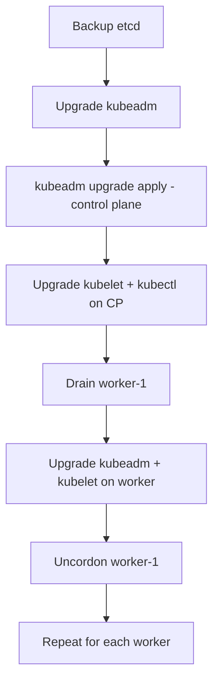

> 💡 **Quick Answer:** Upgrade Kubernetes clusters safely with kubeadm. Covers pre-flight checks, control plane upgrade, worker node drain, and rollback procedures.

## The Problem

This is one of the most searched Kubernetes topics. A comprehensive, well-structured guide helps engineers of all levels quickly find actionable solutions.

## The Solution

Detailed implementation with production-ready examples below.


### Pre-Upgrade Checklist

```bash
# 1. Check current version
kubectl version
kubeadm version

# 2. Check upgrade path (can only skip one minor version)
kubeadm upgrade plan

# 3. Backup etcd
ETCDCTL_API=3 etcdctl snapshot save /backup/etcd-$(date +%Y%m%d).db \
  --endpoints=https://127.0.0.1:2379 \
  --cacert=/etc/kubernetes/pki/etcd/ca.crt \
  --cert=/etc/kubernetes/pki/etcd/server.crt \
  --key=/etc/kubernetes/pki/etcd/server.key

# 4. Check PodDisruptionBudgets
kubectl get pdb -A
```

### Upgrade Control Plane

```bash
# Update kubeadm
sudo apt-get update
sudo apt-get install -y kubeadm=1.31.0-1.1

# Plan upgrade
sudo kubeadm upgrade plan

# Apply upgrade (first control plane node)
sudo kubeadm upgrade apply v1.31.0

# Upgrade kubelet and kubectl
sudo apt-get install -y kubelet=1.31.0-1.1 kubectl=1.31.0-1.1
sudo systemctl daemon-reload
sudo systemctl restart kubelet
```

### Upgrade Worker Nodes (One at a Time)

```bash
# 1. Drain the node
kubectl drain worker-1 --ignore-daemonsets --delete-emptydir-data

# 2. SSH to the node and upgrade
sudo apt-get install -y kubeadm=1.31.0-1.1
sudo kubeadm upgrade node
sudo apt-get install -y kubelet=1.31.0-1.1
sudo systemctl daemon-reload
sudo systemctl restart kubelet

# 3. Uncordon
kubectl uncordon worker-1

# 4. Verify
kubectl get nodes
```



## Frequently Asked Questions

### Can I skip Kubernetes versions?

You can skip one minor version (e.g., 1.29 → 1.31). For larger gaps, upgrade one minor version at a time. Always check the release notes for breaking changes.

## Common Issues

Check `kubectl describe` and `kubectl get events` first — most issues have clear error messages pointing to the root cause.

## Best Practices

- **Follow least privilege** — only grant the access that's needed
- **Test in staging** before applying to production
- **Monitor and alert** on key metrics
- **Document your runbooks** for the team

## Key Takeaways

- Essential knowledge for Kubernetes operations
- Start simple and evolve your approach
- Automation reduces human error
- Share knowledge with your team
