## The Problem

Kubernetes releases new versions every ~4 months with security patches, bug fixes, and new features. Clusters running outdated versions miss critical updates and eventually become unsupported. Upgrading incorrectly can cause outages.

## The Solution

Follow a systematic upgrade process: prepare the cluster, backup critical data, upgrade control plane first, then worker nodes, and validate at each step. Always have a rollback plan.

## Kubernetes Upgrade Overview

```mermaid
flowchart TB
    subgraph P1["Phase 1: PREPARATION"]
        P1A["☐ Review release notes and breaking changes"]
        P1B["☐ Check component compatibility - CNI, CSI, Ingress"]
        P1C["☐ Backup etcd"]
        P1D["☐ Ensure PodDisruptionBudgets are in place"]
        P1E["☐ Test upgrade in staging environment"]
    end
    
    subgraph P2["Phase 2: CONTROL PLANE UPGRADE"]
        P2A["Control Plane Node 1 → Node 2 → Node 3<br/>one at a time for HA"]
        P2B["Order: etcd → kube-apiserver →<br/>kube-controller-manager → kube-scheduler →<br/>cloud-controller-manager"]
    end
    
    subgraph P3["Phase 3: WORKER NODE UPGRADE"]
        P3A["Worker 1: Cordon → Drain → Upgrade → Uncordon"]
        P3B["Worker 2: Cordon → Drain → Upgrade → Uncordon"]
        P3C["Worker N: Cordon → Drain → Upgrade → Uncordon"]
    end
    
    subgraph P4["Phase 4: VALIDATION"]
        P4A["☐ All nodes Ready"]
        P4B["☐ All system pods Running"]
        P4C["☐ Application health checks passing"]
        P4D["☐ Monitoring and logging functional"]
    end
    
    P1 --> P2
    P2 --> P3
    P3 --> P4
```



## Version Skew Policy

```mermaid
flowchart LR
    subgraph SKEW["Kubernetes Version Skew Rules"]
        direction TB
        API["kube-apiserver<br/>N/A - defines the version"]
        CM["kube-controller-mgr<br/>±1 minor from apiserver"]
        SCHED["kube-scheduler<br/>±1 minor from apiserver"]
        KL["kubelet<br/>-3 to 0 from apiserver"]
        KP["kube-proxy<br/>Same as kubelet"]
        KC["kubectl<br/>±1 minor from apiserver"]
    end
```



**Example:** If API server is 1.29:
- Control plane: Must be 1.28, 1.29, or 1.30
- Kubelet: Can be 1.26, 1.27, 1.28, or 1.29
- kubectl: Can be 1.28, 1.29, or 1.30

## Phase 1: Pre-Upgrade Preparation

### Check Current Versions

```bash
# Check cluster version
kubectl version

# Check node versions
kubectl get nodes -o custom-columns=\
NAME:.metadata.name,\
VERSION:.status.nodeInfo.kubeletVersion,\
OS:.status.nodeInfo.osImage

# Check component versions
kubectl get pods -n kube-system -o custom-columns=\
NAME:.metadata.name,\
IMAGE:.spec.containers[*].image | grep -E "kube-|etcd|coredns"
```

### Review Release Notes

```bash
# Key areas to check:
# 1. Deprecations and removals
# 2. API changes
# 3. Feature gate changes
# 4. Known issues

# Check for deprecated APIs in use
kubectl get --raw /metrics | grep apiserver_requested_deprecated_apis

# Or use kubent (kube-no-trouble)
kubent
```

### Verify Component Compatibility

```bash
# Check CNI plugin compatibility
kubectl get pods -n kube-system -l k8s-app=calico-node -o jsonpath='{.items[0].spec.containers[0].image}'

# Check CSI driver compatibility
kubectl get csidrivers

# Check Ingress controller version
kubectl get pods -n ingress-nginx -o jsonpath='{.items[0].spec.containers[0].image}'
```

### Backup etcd

```bash
# Create etcd snapshot
ETCDCTL_API=3 etcdctl snapshot save /backup/etcd-pre-upgrade-$(date +%Y%m%d).db \
  --endpoints=https://127.0.0.1:2379 \
  --cacert=/etc/kubernetes/pki/etcd/ca.crt \
  --cert=/etc/kubernetes/pki/etcd/server.crt \
  --key=/etc/kubernetes/pki/etcd/server.key

# Verify backup
ETCDCTL_API=3 etcdctl snapshot status /backup/etcd-pre-upgrade-*.db --write-out=table
```

### Ensure PodDisruptionBudgets

```bash
# Check existing PDBs
kubectl get pdb -A

# Create PDBs for critical workloads if missing
cat <<EOF | kubectl apply -f -
apiVersion: policy/v1
kind: PodDisruptionBudget
metadata:
  name: critical-app-pdb
  namespace: production
spec:
  minAvailable: 2
  selector:
    matchLabels:
      app: critical-app
EOF
```

### Pre-Upgrade Checklist Script

```bash
#!/bin/bash
# pre-upgrade-check.sh

echo "=== Kubernetes Pre-Upgrade Checklist ==="

echo -e "\n1. Cluster Health"
kubectl get nodes
kubectl get componentstatuses 2>/dev/null || kubectl get --raw='/readyz?verbose'

echo -e "\n2. System Pods Status"
kubectl get pods -n kube-system | grep -v Running

echo -e "\n3. Deprecated APIs in Use"
kubectl get --raw /metrics 2>/dev/null | grep apiserver_requested_deprecated_apis | head -10

echo -e "\n4. PodDisruptionBudgets"
kubectl get pdb -A

echo -e "\n5. Pending PVCs"
kubectl get pvc -A | grep -v Bound

echo -e "\n6. Nodes with Issues"
kubectl get nodes -o json | jq -r '.items[] | select(.status.conditions[] | select(.type=="Ready" and .status!="True")) | .metadata.name'

echo -e "\n7. etcd Health"
kubectl exec -n kube-system etcd-$(hostname) -- etcdctl endpoint health \
  --cacert=/etc/kubernetes/pki/etcd/ca.crt \
  --cert=/etc/kubernetes/pki/etcd/server.crt \
  --key=/etc/kubernetes/pki/etcd/server.key 2>/dev/null || echo "Run on control plane node"

echo -e "\n=== Pre-upgrade checks complete ==="
```

## Phase 2: Control Plane Upgrade (kubeadm)

### Upgrade First Control Plane Node

```bash
# Check available versions
apt update
apt-cache madison kubeadm

# Upgrade kubeadm
apt-mark unhold kubeadm
apt-get update && apt-get install -y kubeadm=1.29.0-1.1
apt-mark hold kubeadm

# Verify kubeadm version
kubeadm version

# Check upgrade plan
kubeadm upgrade plan

# Apply upgrade (first control plane node only)
kubeadm upgrade apply v1.29.0

# Upgrade kubelet and kubectl
apt-mark unhold kubelet kubectl
apt-get update && apt-get install -y kubelet=1.29.0-1.1 kubectl=1.29.0-1.1
apt-mark hold kubelet kubectl

# Restart kubelet
systemctl daemon-reload
systemctl restart kubelet
```

### Upgrade Additional Control Plane Nodes

```bash
# On each additional control plane node:

# Upgrade kubeadm
apt-mark unhold kubeadm
apt-get update && apt-get install -y kubeadm=1.29.0-1.1
apt-mark hold kubeadm

# Upgrade node (not "apply", use "node")
kubeadm upgrade node

# Upgrade kubelet and kubectl
apt-mark unhold kubelet kubectl
apt-get update && apt-get install -y kubelet=1.29.0-1.1 kubectl=1.29.0-1.1
apt-mark hold kubelet kubectl

# Restart kubelet
systemctl daemon-reload
systemctl restart kubelet
```

## Phase 3: Worker Node Upgrade

### Upgrade Worker Nodes (One at a Time)

```bash
# From a machine with kubectl access:

# 1. Cordon the node (mark unschedulable)
kubectl cordon worker-1

# 2. Drain the node (evict pods)
kubectl drain worker-1 \
  --ignore-daemonsets \
  --delete-emptydir-data \
  --force \
  --grace-period=300

# 3. SSH to worker node and upgrade
ssh worker-1

# Upgrade kubeadm
apt-mark unhold kubeadm
apt-get update && apt-get install -y kubeadm=1.29.0-1.1
apt-mark hold kubeadm

# Upgrade node configuration
kubeadm upgrade node

# Upgrade kubelet and kubectl
apt-mark unhold kubelet kubectl
apt-get update && apt-get install -y kubelet=1.29.0-1.1 kubectl=1.29.0-1.1
apt-mark hold kubelet kubectl

# Restart kubelet
systemctl daemon-reload
systemctl restart kubelet

exit

# 4. Uncordon the node (allow scheduling)
kubectl uncordon worker-1

# 5. Verify node is ready
kubectl get node worker-1
```

### Automated Worker Upgrade Script

```bash
#!/bin/bash
# upgrade-worker.sh

NODE=$1
VERSION=${2:-1.29.0-1.1}

echo "Upgrading $NODE to version $VERSION"

# Cordon
echo "Cordoning $NODE..."
kubectl cordon $NODE

# Drain
echo "Draining $NODE..."
kubectl drain $NODE \
  --ignore-daemonsets \
  --delete-emptydir-data \
  --force \
  --grace-period=300 \
  --timeout=600s

# Upgrade via SSH
echo "Upgrading packages on $NODE..."
ssh $NODE << EOF
  apt-mark unhold kubeadm kubelet kubectl
  apt-get update
  apt-get install -y kubeadm=$VERSION kubelet=$VERSION kubectl=$VERSION
  apt-mark hold kubeadm kubelet kubectl
  kubeadm upgrade node
  systemctl daemon-reload
  systemctl restart kubelet
EOF

# Wait for node to be ready
echo "Waiting for $NODE to be ready..."
kubectl wait --for=condition=Ready node/$NODE --timeout=300s

# Uncordon
echo "Uncordoning $NODE..."
kubectl uncordon $NODE

echo "$NODE upgrade complete!"
```

## Phase 4: Post-Upgrade Validation

### Validate Cluster Health

```bash
# Check all nodes are Ready and correct version
kubectl get nodes

# Check control plane components
kubectl get pods -n kube-system

# Check component health
kubectl get --raw='/readyz?verbose'

# Verify etcd health
kubectl exec -n kube-system etcd-controlplane -- etcdctl endpoint health \
  --cacert=/etc/kubernetes/pki/etcd/ca.crt \
  --cert=/etc/kubernetes/pki/etcd/server.crt \
  --key=/etc/kubernetes/pki/etcd/server.key
```

### Validate Applications

```bash
# Check all deployments are healthy
kubectl get deployments -A -o wide

# Check for pods not running
kubectl get pods -A --field-selector=status.phase!=Running,status.phase!=Succeeded

# Run application-specific health checks
kubectl exec -n production deploy/myapp -- /health-check.sh
```

### Validation Script

```bash
#!/bin/bash
# post-upgrade-validation.sh

EXPECTED_VERSION=$1

echo "=== Post-Upgrade Validation ==="

echo -e "\n1. Node Versions"
kubectl get nodes -o custom-columns=NAME:.metadata.name,VERSION:.status.nodeInfo.kubeletVersion | \
  grep -v $EXPECTED_VERSION && echo "WARNING: Version mismatch found!" || echo "All nodes on $EXPECTED_VERSION"

echo -e "\n2. Node Status"
NOT_READY=$(kubectl get nodes -o json | jq -r '.items[] | select(.status.conditions[] | select(.type=="Ready" and .status!="True")) | .metadata.name')
if [ -n "$NOT_READY" ]; then
  echo "WARNING: Nodes not ready: $NOT_READY"
else
  echo "All nodes Ready"
fi

echo -e "\n3. System Pods"
FAILING=$(kubectl get pods -n kube-system --field-selector=status.phase!=Running,status.phase!=Succeeded 2>/dev/null)
if [ -n "$FAILING" ]; then
  echo "WARNING: Failing system pods:"
  echo "$FAILING"
else
  echo "All system pods healthy"
fi

echo -e "\n4. API Server Health"
kubectl get --raw='/readyz' && echo " - API server healthy" || echo "WARNING: API server issues"

echo -e "\n5. CoreDNS Test"
kubectl run dns-test --image=busybox:1.28 --rm -it --restart=Never -- nslookup kubernetes.default 2>/dev/null && \
  echo "DNS working" || echo "WARNING: DNS issues"

echo -e "\n=== Validation Complete ==="
```

## Managed Kubernetes Upgrades

### EKS Upgrade

```bash
# Check available versions
aws eks describe-addon-versions --kubernetes-version 1.29 --query 'addons[].addonVersions[0].addonVersion'

# Update control plane
aws eks update-cluster-version \
  --name my-cluster \
  --kubernetes-version 1.29

# Wait for update
aws eks wait cluster-active --name my-cluster

# Update node groups
aws eks update-nodegroup-version \
  --cluster-name my-cluster \
  --nodegroup-name my-nodegroup \
  --kubernetes-version 1.29

# Update add-ons
aws eks update-addon --cluster-name my-cluster --addon-name coredns
aws eks update-addon --cluster-name my-cluster --addon-name kube-proxy
aws eks update-addon --cluster-name my-cluster --addon-name vpc-cni
```

### AKS Upgrade

```bash
# Check available upgrades
az aks get-upgrades --resource-group myResourceGroup --name myAKSCluster --output table

# Upgrade control plane and nodes
az aks upgrade \
  --resource-group myResourceGroup \
  --name myAKSCluster \
  --kubernetes-version 1.29.0

# Or upgrade control plane only
az aks upgrade \
  --resource-group myResourceGroup \
  --name myAKSCluster \
  --kubernetes-version 1.29.0 \
  --control-plane-only
```

### GKE Upgrade

```bash
# Check available versions
gcloud container get-server-config --zone us-central1-a

# Upgrade control plane
gcloud container clusters upgrade my-cluster \
  --master \
  --cluster-version 1.29 \
  --zone us-central1-a

# Upgrade node pools
gcloud container clusters upgrade my-cluster \
  --node-pool default-pool \
  --cluster-version 1.29 \
  --zone us-central1-a
```

## Rollback Procedures

### Rollback Control Plane (kubeadm)

```bash
# Rollback is complex - restore from etcd backup is usually safer

# 1. Stop API server
sudo mv /etc/kubernetes/manifests/kube-apiserver.yaml /tmp/

# 2. Restore etcd from backup
ETCDCTL_API=3 etcdctl snapshot restore /backup/etcd-pre-upgrade.db \
  --data-dir=/var/lib/etcd-restored

# 3. Update etcd to use restored data
sudo mv /var/lib/etcd /var/lib/etcd-old
sudo mv /var/lib/etcd-restored /var/lib/etcd

# 4. Downgrade packages
apt-get install -y kubeadm=1.28.0-1.1 kubelet=1.28.0-1.1 kubectl=1.28.0-1.1

# 5. Restore API server
sudo mv /tmp/kube-apiserver.yaml /etc/kubernetes/manifests/

# 6. Restart kubelet
systemctl daemon-reload
systemctl restart kubelet
```

### Rollback Worker Nodes

```bash
# Drain node
kubectl drain worker-1 --ignore-daemonsets --delete-emptydir-data

# SSH and downgrade
ssh worker-1
apt-get install -y kubeadm=1.28.0-1.1 kubelet=1.28.0-1.1 kubectl=1.28.0-1.1
kubeadm upgrade node
systemctl daemon-reload
systemctl restart kubelet
exit

# Uncordon
kubectl uncordon worker-1
```

## Best Practices

### 1. Upgrade Regularly

```
Recommended cadence:
- Minor versions: Within 3 months of release
- Patch versions: Within 2 weeks of release (security)
- Never skip minor versions (1.27 → 1.29 is NOT supported)
```

### 2. Stage the Upgrade

```
Environment progression:
  Dev → Staging → Pre-prod → Production
  
Allow 1-2 weeks between each stage for issue discovery
```

### 3. Maintain PodDisruptionBudgets

```yaml
# Ensure critical workloads have PDBs
apiVersion: policy/v1
kind: PodDisruptionBudget
metadata:
  name: web-pdb
spec:
  minAvailable: 50%
  selector:
    matchLabels:
      app: web
```

### 4. Document Everything

```markdown
## Upgrade Runbook: v1.28 → v1.29

### Pre-requisites Completed
- [ ] etcd backup taken
- [ ] Staging upgrade successful
- [ ] Change window approved

### Control Plane Upgrade
- [ ] cp-1 upgraded at HH:MM
- [ ] cp-2 upgraded at HH:MM
- [ ] cp-3 upgraded at HH:MM

### Worker Node Upgrade
- [ ] worker-1 upgraded
- [ ] worker-2 upgraded
...
```

## Summary

Kubernetes cluster upgrades require careful planning and execution. Always backup etcd, follow the control-plane-first approach, upgrade one node at a time, validate after each step, and have a tested rollback plan. Regular upgrades keep your cluster secure and supported.

---

## 📘 Go Further with Kubernetes Recipes

**Love this recipe? There's so much more!** This is just one of **100+ hands-on recipes** in our comprehensive **[Kubernetes Recipes book](https://amzn.to/3DzC8QA)**.

Inside the book, you'll master:
- ✅ Production-ready deployment strategies
- ✅ Advanced networking and security patterns  
- ✅ Observability, monitoring, and troubleshooting
- ✅ Real-world best practices from industry experts

> *"The practical, recipe-based approach made complex Kubernetes concepts finally click for me."*

**👉 [Get Your Copy Now](https://amzn.to/3DzC8QA)** — Start building production-grade Kubernetes skills today!
