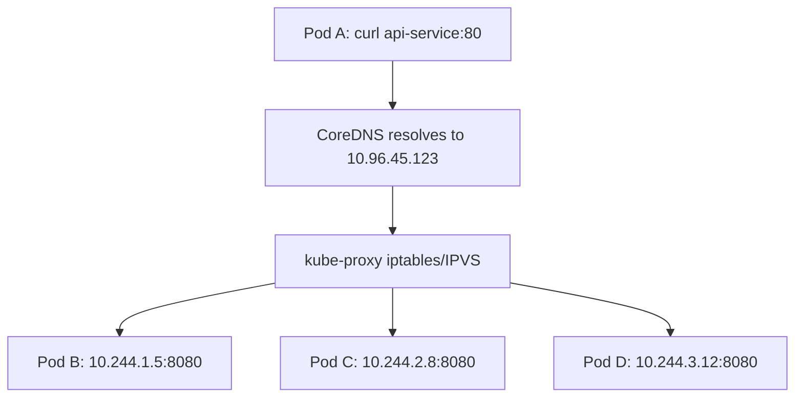

> 💡 **Quick Answer:** networking

## The Problem

This is one of the most searched Kubernetes topics with thousands of monthly searches. A comprehensive, production-ready guide prevents hours of trial and error.

## The Solution

### Create ClusterIP Service

```yaml
apiVersion: v1
kind: Service
metadata:
  name: api-service
spec:
  type: ClusterIP       # Default type (can be omitted)
  selector:
    app: api
  ports:
    - name: http
      port: 80           # Service port (what clients connect to)
      targetPort: 8080   # Container port
    - name: grpc
      port: 9090
      targetPort: 9090
```

### How It Works

```bash
# Service gets a virtual IP (ClusterIP)
kubectl get svc api-service
# NAME          TYPE        CLUSTER-IP     PORT(S)
# api-service   ClusterIP   10.96.45.123   80/TCP,9090/TCP

# DNS resolution (from any pod)
nslookup api-service.default.svc.cluster.local
# → 10.96.45.123

# Short DNS names work within same namespace
curl http://api-service/endpoint
curl http://api-service.default/endpoint           # Cross-namespace
curl http://api-service.default.svc.cluster.local  # Fully qualified

# kube-proxy creates iptables/IPVS rules
# ClusterIP → random backend pod (round-robin)
```

### Service Discovery

```yaml
# Environment variables (auto-injected)
# API_SERVICE_SERVICE_HOST=10.96.45.123
# API_SERVICE_SERVICE_PORT=80

# DNS (preferred — always works)
# api-service.namespace.svc.cluster.local
```

### Multi-Port Services

```yaml
spec:
  ports:
    - name: http       # Name required when multiple ports
      port: 80
      targetPort: 8080
    - name: metrics
      port: 9090
      targetPort: 9090
```



## Frequently Asked Questions

### ClusterIP vs headless?

ClusterIP gives you a virtual IP with kube-proxy load balancing. Headless (clusterIP: None) returns pod IPs directly — no load balancing, client chooses. Use headless for StatefulSets.

### Can I access ClusterIP from outside?

No — ClusterIP is internal only. Use `kubectl port-forward` for dev access, NodePort for basic external access, or LoadBalancer/Ingress for production.

## Best Practices

- Start with the simplest configuration that solves your problem
- Test in staging before production
- Use `kubectl describe` and events for troubleshooting
- Document team conventions for consistency

## Key Takeaways

- This is fundamental Kubernetes operational knowledge
- Follow established conventions and recommended labels
- Monitor and iterate based on real production behavior
- Automate repetitive tasks to reduce human error
