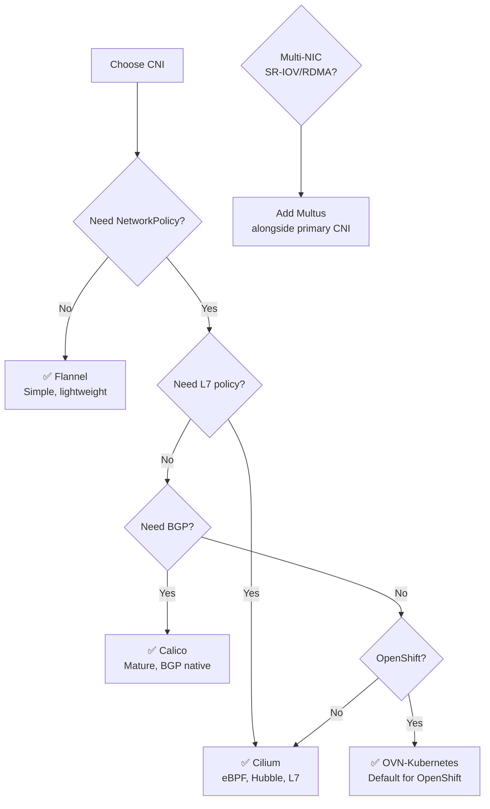

> 💡 **Quick Answer:** Use **Cilium** for eBPF-native networking with L7 policy and observability. Use **Calico** for mature BGP networking and wide platform support. Use **Flannel** for simplicity when you don't need NetworkPolicy. Use **Multus** alongside any primary CNI for multi-network pods (SR-IOV, RDMA).

## The Problem

Choosing a CNI plugin is one of the most impactful cluster decisions — it affects networking performance, security policy enforcement, observability, and multi-cluster connectivity. The wrong choice is hard to change later.

## The Solution

### CNI Feature Comparison

| Feature | Cilium | Calico | Flannel | OVN-K8s |
|---------|--------|--------|---------|---------|
| Technology | eBPF | iptables/eBPF | VXLAN | OVS/OVN |
| NetworkPolicy | L3/L4/L7 | L3/L4 | None | L3/L4 |
| Encryption | WireGuard/IPsec | WireGuard/IPsec | None | IPsec |
| Observability | Hubble (built-in) | Basic | None | Basic |
| Service mesh | Sidecarless (eBPF) | Envoy sidecar | None | None |
| BGP | Yes | Yes (native) | No | No |
| Multi-cluster | ClusterMesh | Federation | No | IC |
| Windows | Partial | Yes | Yes | Yes |
| Bandwidth | eBPF | tc/eBPF | tc | OVS QoS |
| Maturity | 5+ years | 8+ years | 8+ years | 5+ years |
| Platform | Any K8s | Any K8s | Any K8s | OpenShift |

### Performance Benchmarks (Typical)

| Metric | Cilium (eBPF) | Calico (eBPF) | Calico (iptables) | Flannel |
|--------|--------------|---------------|-------------------|---------|
| Pod-to-pod latency | ~0.05ms | ~0.06ms | ~0.1ms | ~0.08ms |
| Throughput (10GbE) | 9.8 Gbps | 9.5 Gbps | 8.5 Gbps | 8.0 Gbps |
| Connection rate | 180K/s | 160K/s | 80K/s | 90K/s |
| CPU overhead | Low | Low | High (>1000 rules) | Low |

### Decision Flowchart



### Install Examples

```bash
# Cilium
helm install cilium cilium/cilium --namespace kube-system \
  --set hubble.enabled=true --set hubble.relay.enabled=true

# Calico
kubectl apply -f https://raw.githubusercontent.com/projectcalico/calico/v3.28.0/manifests/calico.yaml

# Flannel
kubectl apply -f https://github.com/flannel-io/flannel/releases/latest/download/kube-flannel.yml
```

## Common Issues

**Can I change CNI after cluster creation?**: Technically yes, practically painful. It requires draining all nodes, removing the old CNI, and installing the new one. Plan ahead.

**Calico or Cilium for large clusters?**: Both handle 5000+ nodes. Cilium's eBPF dataplane scales better with many NetworkPolicies. Calico's BGP is better for on-premises with existing routing infrastructure.

## Best Practices

- **Cilium for greenfield clusters** — most features, best observability
- **Calico for existing BGP infrastructure** — native BGP support
- **Flannel for learning/homelab** — simplest setup, no NetworkPolicy
- **OVN-Kubernetes for OpenShift** — default and best integrated
- **Multus is an add-on, not a replacement** — runs alongside your primary CNI

## Key Takeaways

- CNI choice is one of the hardest-to-change cluster decisions — choose carefully
- Cilium leads in features: eBPF dataplane, L7 policy, Hubble observability, sidecarless mesh
- Calico is the most mature with native BGP — best for on-premises networking
- Flannel is simplest but has no NetworkPolicy support
- Multus enables multi-NIC pods (SR-IOV, RDMA) alongside any primary CNI
