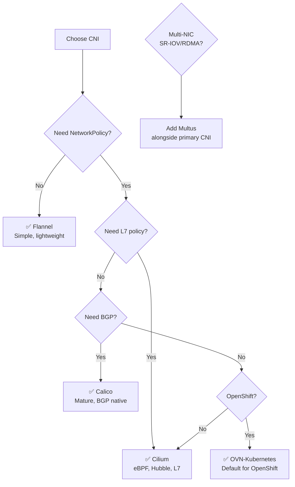

> 💡 **Quick Answer:** Use **Cilium** for eBPF-native networking with L7 policy and observability. Use **Calico** for mature BGP networking and wide platform support. Use **Flannel** for simplicity when you don't need NetworkPolicy. Use **Multus** alongside any primary CNI for multi-network pods (SR-IOV, RDMA).

## The Problem

Choosing a CNI plugin is one of the most impactful cluster decisions — it affects networking performance, security policy enforcement, observability, and multi-cluster connectivity. The wrong choice is hard to change later.

## The Solution

### CNI Feature Comparison

| Feature | Cilium | Calico | Flannel | OVN-K8s |
|---------|--------|--------|---------|---------|
| Technology | eBPF | iptables/eBPF | VXLAN | OVS/OVN |
| NetworkPolicy | L3/L4/L7 | L3/L4 | None | L3/L4 |
| Encryption | WireGuard/IPsec | WireGuard/IPsec | None | IPsec |
| Observability | Hubble (built-in) | Basic | None | Basic |
| Service mesh | Sidecarless (eBPF) | Envoy sidecar | None | None |
| BGP | Yes | Yes (native) | No | No |
| Multi-cluster | ClusterMesh | Federation | No | IC |
| Windows | Partial | Yes | Yes | Yes |
| Bandwidth | eBPF | tc/eBPF | tc | OVS QoS |
| Maturity | 5+ years | 8+ years | 8+ years | 5+ years |
| Platform | Any K8s | Any K8s | Any K8s | OpenShift default, any K8s |

**Multus** is not a primary CNI: it's a meta-plugin that delegates the default network to your primary CNI and attaches extra interfaces (SR-IOV, macvlan, RDMA) via `NetworkAttachmentDefinition`. It's the standard for GPU/RDMA nodes and ships by default on OpenShift.

### Performance: What Actually Differs

Published CNI benchmarks vary widely with kernel, NIC, MTU and encapsulation, so benchmark on your own hardware. Consistent patterns:

- **eBPF dataplanes** (Cilium, Calico eBPF) avoid iptables rule walks; the gap grows with thousands of Services/NetworkPolicies.
- **Native routing / BGP** (no VXLAN/Geneve encapsulation) saves ~50 bytes per packet and some CPU.
- **Encryption** (WireGuard/IPsec) costs throughput; WireGuard is usually cheaper than IPsec.
- For GPU/RDMA traffic the primary CNI barely matters: the data path is SR-IOV/RDMA via Multus.

### Decision Flowchart


```mermaid
graph TD
    START[Choose CNI] --> NP{Need NetworkPolicy?}
    NP -->|No| FLANNEL[✅ Flannel<br/>Simple, lightweight]
    NP -->|Yes| L7{Need L7 policy?}
    L7 -->|Yes| CILIUM[✅ Cilium<br/>eBPF, Hubble, L7]
    L7 -->|No| BGP{Need BGP?}
    BGP -->|Yes| CALICO[✅ Calico<br/>Mature, BGP native]
    BGP -->|No| OCP{OpenShift?}
    OCP -->|Yes| OVN[✅ OVN-Kubernetes<br/>Default for OpenShift]
    OCP -->|No| CILIUM
    
    MULTI{Multi-NIC<br/>SR-IOV/RDMA?} --> MULTUS[Add Multus<br/>alongside primary CNI]
```

### Install Examples

```bash
# Cilium (kube-proxy replacement + Hubble), then validate the dataplane
helm install cilium cilium/cilium --namespace kube-system \
  --set kubeProxyReplacement=true \
  --set hubble.enabled=true --set hubble.relay.enabled=true
cilium status --wait
cilium connectivity test

# Calico (operator install; replace vX.Y.Z with the current release)
kubectl create -f https://raw.githubusercontent.com/projectcalico/calico/vX.Y.Z/manifests/tigera-operator.yaml
kubectl create -f https://raw.githubusercontent.com/projectcalico/calico/vX.Y.Z/manifests/custom-resources.yaml

# Flannel
kubectl apply -f https://github.com/flannel-io/flannel/releases/latest/download/kube-flannel.yml
```

Whichever CNI you pick (except Flannel, which doesn't enforce policy), start with default-deny and open traffic explicitly:

```yaml
apiVersion: networking.k8s.io/v1
kind: NetworkPolicy
metadata:
  name: default-deny-ingress
spec:
  podSelector: {}
  policyTypes: ["Ingress"]
```

## Common Issues

**Can I change CNI after cluster creation?**: Technically yes, practically painful. It requires draining all nodes, removing the old CNI, and installing the new one. Plan ahead.

**Calico or Cilium for large clusters?**: Both handle 5000+ nodes. Cilium's eBPF dataplane scales better with many NetworkPolicies. Calico's BGP is better for on-premises with existing routing infrastructure.

**NetworkPolicy objects accepted but not enforced**: Flannel alone ignores NetworkPolicy. Use Canal (Flannel + Calico policy) or switch CNI.

## Frequently Asked Questions

### Which CNI is best for Kubernetes?
For a greenfield cluster, Cilium is the most complete choice (eBPF dataplane, L7 policy, Hubble, ClusterMesh). Calico is the safe choice where you already run BGP or need broad Windows support. On OpenShift, use the default OVN-Kubernetes.

### What is the difference between Cilium and Calico?
Cilium is eBPF-first with L7-aware policy and built-in flow observability (Hubble). Calico started on iptables with native BGP and now offers an eBPF dataplane too; its open-source policy is L3/L4. Both scale to thousands of nodes.

### Does Flannel support NetworkPolicy?
No. Flannel only provides the pod network. Pair it with Calico's policy engine (Canal) or choose a CNI that enforces policy.

### Do I need Multus?
Only if pods need more than one network interface — typically SR-IOV or RDMA NICs for GPU training, storage networks, or telco workloads. Multus runs alongside your primary CNI.

## Best Practices

- **Cilium for greenfield clusters** — most features, best observability
- **Calico for existing BGP infrastructure** — native BGP support
- **Flannel for learning/homelab** — simplest setup, no NetworkPolicy
- **OVN-Kubernetes for OpenShift** — default and best integrated
- **Multus is an add-on, not a replacement** — runs alongside your primary CNI

## Key Takeaways

- CNI choice is one of the hardest-to-change cluster decisions — choose carefully
- Cilium leads in features: eBPF dataplane, L7 policy, Hubble observability, sidecarless mesh
- Calico is the most mature with native BGP — best for on-premises networking
- Flannel is simplest but has no NetworkPolicy support
- Multus enables multi-NIC pods (SR-IOV, RDMA) alongside any primary CNI
