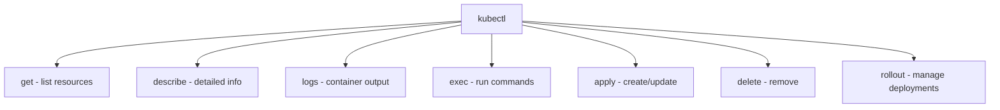

> 💡 **Quick Answer:** configuration

## The Problem

This is one of the most searched Kubernetes topics with thousands of monthly searches. A comprehensive, production-ready guide prevents hours of trial and error.

## The Solution

### Pod Commands

```bash
# List pods
kubectl get pods                    # Current namespace
kubectl get pods -A                 # All namespaces
kubectl get pods -o wide            # Show node, IP
kubectl get pods -w                 # Watch for changes

# Create / Delete
kubectl run nginx --image=nginx:1.27
kubectl delete pod nginx
kubectl delete pod nginx --grace-period=0 --force

# Logs
kubectl logs my-pod
kubectl logs my-pod -c sidecar      # Specific container
kubectl logs my-pod --previous       # Previous crash
kubectl logs my-pod -f --tail=100    # Follow, last 100 lines
kubectl logs -l app=web              # By label

# Execute
kubectl exec -it my-pod -- bash
kubectl exec my-pod -- cat /etc/config/app.yaml

# Copy files
kubectl cp my-pod:/tmp/dump.sql ./dump.sql
kubectl cp ./config.yaml my-pod:/etc/config/

# Port forward
kubectl port-forward my-pod 8080:80
kubectl port-forward svc/my-service 8080:80
```

### Deployment Commands

```bash
# Create
kubectl create deployment web --image=nginx --replicas=3

# Scale
kubectl scale deployment web --replicas=5

# Update image
kubectl set image deployment/web nginx=nginx:1.28

# Rollout
kubectl rollout status deployment/web
kubectl rollout history deployment/web
kubectl rollout undo deployment/web
kubectl rollout undo deployment/web --to-revision=2
kubectl rollout restart deployment/web

# Autoscale
kubectl autoscale deployment web --min=2 --max=10 --cpu-percent=80
```

### Resource Management

```bash
# Get resources
kubectl get all                     # Pods, services, deployments
kubectl get nodes
kubectl get namespaces
kubectl get events --sort-by='.lastTimestamp'

# Describe (detailed info + events)
kubectl describe pod my-pod
kubectl describe node worker-1

# Delete
kubectl delete -f manifest.yaml
kubectl delete deployment,svc,cm -l app=web

# Apply / Diff
kubectl apply -f manifest.yaml
kubectl diff -f manifest.yaml       # Preview changes

# Resource usage
kubectl top nodes
kubectl top pods --sort-by=memory
```

### Context & Config

```bash
# Switch namespace
kubectl config set-context --current --namespace=production

# Switch cluster
kubectl config use-context my-cluster

# View config
kubectl config view
kubectl config get-contexts
kubectl cluster-info
```

### Advanced

```bash
# JSON path
kubectl get pods -o jsonpath='{.items[*].metadata.name}'
kubectl get nodes -o jsonpath='{range .items[*]}{.metadata.name}{"	"}{.status.addresses[0].address}{"
"}{end}'

# Custom columns
kubectl get pods -o custom-columns=NAME:.metadata.name,STATUS:.status.phase,NODE:.spec.nodeName

# Label operations
kubectl label pod my-pod env=prod
kubectl get pods -l env=prod,tier=frontend

# Auth check
kubectl auth can-i create deployments
kubectl auth can-i --list --as=system:serviceaccount:default:my-sa

# API resources
kubectl api-resources                # List all resource types
kubectl explain pod.spec.containers  # Documentation
```



## Frequently Asked Questions

### kubectl get vs describe?

`get` shows a summary table. `describe` shows full details including events, conditions, and related resources. Use `describe` when troubleshooting.

### How to see all resources in a namespace?

`kubectl get all -n my-namespace` shows common resources. For everything: `kubectl api-resources --verbs=list -o name | xargs -n1 kubectl get -n my-namespace --ignore-not-found`

## Best Practices

- Start with the simplest configuration that solves your problem
- Test in staging before production
- Use `kubectl describe` and events for troubleshooting
- Document team conventions for consistency

## Key Takeaways

- This is fundamental Kubernetes operational knowledge
- Follow established conventions and recommended labels
- Monitor and iterate based on real production behavior
- Automate repetitive tasks to reduce human error
