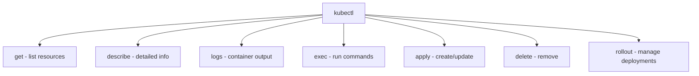

> 💡 **Quick Answer:** Start every debug session with `kubectl get pods` (status), `kubectl describe pod <name>` (events/errors), `kubectl logs <pod> [-c container] [--previous]` (why it crashed), and `kubectl exec -it <pod> -- sh` (shell access). For everything else — deployments, networking, storage, RBAC — this reference below.

## The Problem

Kubernetes troubleshooting means knowing which of dozens of `kubectl` subcommands surfaces the information you actually need — the wrong one (or the wrong flag) sends you searching instead of debugging.

## The Solution

### Pod Commands

```bash
# List pods
kubectl get pods                    # Current namespace
kubectl get pods -A                 # All namespaces
kubectl get pods -o wide            # Show node, IP
kubectl get pods -w                 # Watch for changes

# Create / Delete
kubectl run nginx --image=nginx:1.27
kubectl delete pod nginx
kubectl delete pod nginx --grace-period=0 --force

# Logs
kubectl logs my-pod
kubectl logs my-pod -c sidecar      # Specific container
kubectl logs my-pod --previous       # Previous crash
kubectl logs my-pod -f --tail=100    # Follow, last 100 lines
kubectl logs -l app=web              # By label

# Execute
kubectl exec -it my-pod -- bash
kubectl exec my-pod -- cat /etc/config/app.yaml

# Copy files
kubectl cp my-pod:/tmp/dump.sql ./dump.sql
kubectl cp ./config.yaml my-pod:/etc/config/

# Port forward
kubectl port-forward my-pod 8080:80
kubectl port-forward svc/my-service 8080:80
```

### Deployment Commands

```bash
# Create
kubectl create deployment web --image=nginx --replicas=3

# Scale
kubectl scale deployment web --replicas=5

# Update image
kubectl set image deployment/web nginx=nginx:1.28

# Rollout
kubectl rollout status deployment/web
kubectl rollout history deployment/web
kubectl rollout undo deployment/web
kubectl rollout undo deployment/web --to-revision=2
kubectl rollout restart deployment/web

# Autoscale
kubectl autoscale deployment web --min=2 --max=10 --cpu-percent=80
```

### Resource Management

```bash
# Get resources
kubectl get all                     # Pods, services, deployments
kubectl get nodes
kubectl get namespaces
kubectl get events --sort-by='.lastTimestamp'

# Describe (detailed info + events)
kubectl describe pod my-pod
kubectl describe node worker-1

# Delete
kubectl delete -f manifest.yaml
kubectl delete deployment,svc,cm -l app=web

# Apply / Diff
kubectl apply -f manifest.yaml
kubectl diff -f manifest.yaml       # Preview changes

# Resource usage
kubectl top nodes
kubectl top pods --sort-by=memory
```

### Context & Config

```bash
# Switch namespace
kubectl config set-context --current --namespace=production

# Switch cluster
kubectl config use-context my-cluster

# View config
kubectl config view
kubectl config get-contexts
kubectl cluster-info
```

### Advanced

```bash
# JSON path
kubectl get pods -o jsonpath='{.items[*].metadata.name}'
kubectl get nodes -o jsonpath='{range .items[*]}{.metadata.name}{"	"}{.status.addresses[0].address}{"
"}{end}'

# Custom columns
kubectl get pods -o custom-columns=NAME:.metadata.name,STATUS:.status.phase,NODE:.spec.nodeName

# Label operations
kubectl label pod my-pod env=prod
kubectl get pods -l env=prod,tier=frontend

# Auth check
kubectl auth can-i create deployments
kubectl auth can-i --list --as=system:serviceaccount:default:my-sa

# API resources
kubectl api-resources                # List all resource types
kubectl explain pod.spec.containers  # Documentation
```

### Debug with Ephemeral Containers

```bash
kubectl debug -it my-pod --image=busybox --target=my-container   # shares process namespace
kubectl debug -it my-pod --image=nicolaka/netshoot                # network debugging tools
kubectl debug node/my-node -it --image=busybox                    # debug a node directly
```

### Service, Ingress, and Storage Debugging

```bash
# Service DNS and connectivity
kubectl get endpoints my-service
kubectl run tmp --image=nicolaka/netshoot --rm -it -- \
  sh -c "curl http://my-service:8080; nslookup my-service"

# Ingress
kubectl describe ingress my-ingress
kubectl logs -n ingress-nginx -l app.kubernetes.io/component=controller

# PersistentVolumeClaims
kubectl describe pvc my-pvc
kubectl exec my-pod -- df -h
kubectl exec my-pod -- mount | grep my-volume
```

### RBAC Debugging

```bash
kubectl auth can-i get pods
kubectl auth can-i get pods --as=system:serviceaccount:default:my-sa
kubectl auth can-i --list --as=system:serviceaccount:default:my-sa
```

### Useful One-Liners

```bash
# All pods not Running/Succeeded, across every namespace
kubectl get pods -A --field-selector=status.phase!=Running,status.phase!=Succeeded

# Every image currently running in the cluster
kubectl get pods -A -o jsonpath='{range .items[*]}{.spec.containers[*].image}{"\n"}{end}' | sort -u

# Pods sorted by restart count — find what's flapping
kubectl get pods --sort-by='.status.containerStatuses[0].restartCount'

# Force-delete a pod stuck in Terminating
kubectl delete pod my-pod --grace-period=0 --force
```



## Frequently Asked Questions

### kubectl get vs describe?

`get` shows a summary table. `describe` shows full details including events, conditions, and related resources. Use `describe` when troubleshooting.

### How to see all resources in a namespace?

`kubectl get all -n my-namespace` shows common resources. For everything: `kubectl api-resources --verbs=list -o name | xargs -n1 kubectl get -n my-namespace --ignore-not-found`

## Best Practices

- **`describe` before `logs`** — events (ImagePullBackOff, FailedScheduling, OOMKilled) often explain the problem before you need a single log line
- **`--previous` on logs is easy to forget** — after a crash-restart, plain `kubectl logs` shows the *new* container's (empty) logs, not the crash
- **Use `--field-selector`/`-l` to filter at the server**, not `grep` on the client — cheaper on large clusters and works with `-w`/watch
- **`kubectl auth can-i --as=<sa>`** to debug RBAC as a specific ServiceAccount instead of guessing from the Role/RoleBinding YAML
- **Force-delete (`--grace-period=0 --force`) is a last resort** — it skips graceful termination, so reach for it only on pods genuinely stuck Terminating

## Key Takeaways

- `get` → `describe` → `logs` → `exec` is the standard debugging funnel, in that order
- `kubectl debug` (ephemeral containers) is the modern way to attach debugging tools to a pod or node without restarting it
- RBAC issues are fastest to confirm with `kubectl auth can-i --as=<serviceaccount>`, not by re-reading RoleBindings
- One-liners built on `--field-selector` and `jsonpath`/`custom-columns` turn ad-hoc `grep`-on-`get` into fast, reusable queries
- `kubectl explain <resource>.<field>` is built-in field-level API documentation — faster than searching docs for an obscure spec field
