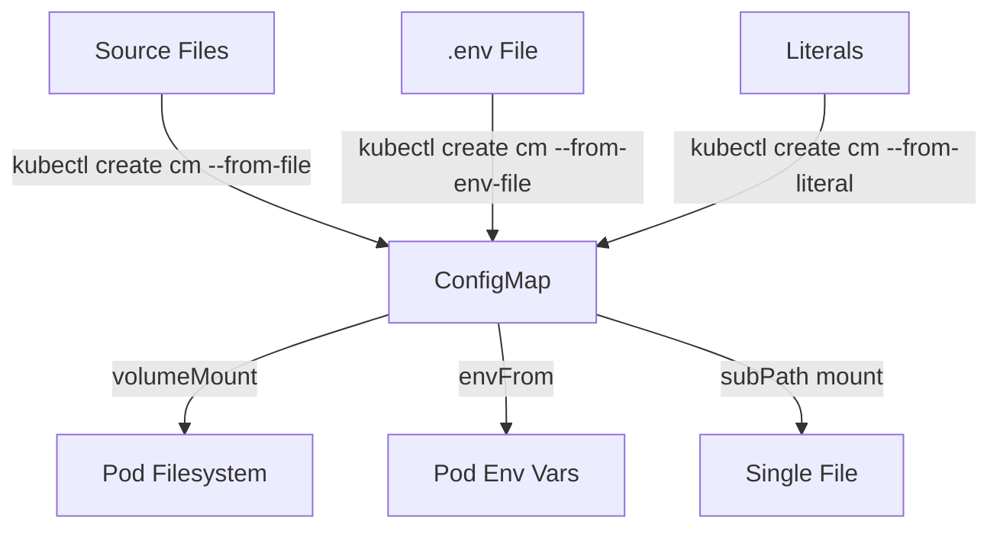

> 💡 **Quick Answer:** `kubectl create configmap myconfig --from-file=config.yaml` creates a ConfigMap with the file contents as a data key. Use `--from-file=dir/` for entire directories, `--from-env-file` for KEY=VALUE files.

## The Problem

You need to inject configuration files into pods but:
- Hardcoding config in container images breaks the build-once-deploy-anywhere principle
- Different environments (dev/staging/prod) need different configs
- Config files can be large (nginx.conf, application.properties) and don't fit in YAML strings
- Some apps expect files at specific paths

## The Solution

### Create from a Single File

```bash
# File becomes a key in the ConfigMap (key = filename)
kubectl create configmap nginx-config --from-file=nginx.conf

# Custom key name
kubectl create configmap nginx-config --from-file=site.conf=nginx.conf

# Verify
kubectl get configmap nginx-config -o yaml
# data:
#   nginx.conf: |
#     server {
#       listen 80;
#       ...
#     }
```

### Create from a Directory

```bash
# Every file in the directory becomes a key
kubectl create configmap app-config --from-file=./config/

# Example directory structure:
# config/
# ├── app.properties
# ├── logging.xml
# └── routes.json
#
# Result: ConfigMap with 3 keys (app.properties, logging.xml, routes.json)
```

### Create from ENV File

```bash
# .env format (KEY=VALUE per line)
cat <<EOF > app.env
DATABASE_HOST=postgres.default.svc
DATABASE_PORT=5432
LOG_LEVEL=info
CACHE_TTL=3600
EOF

kubectl create configmap app-env --from-env-file=app.env

# Result:
# data:
#   DATABASE_HOST: postgres.default.svc
#   DATABASE_PORT: "5432"
#   LOG_LEVEL: info
#   CACHE_TTL: "3600"
```

### Create from Literal Values

```bash
kubectl create configmap feature-flags \
  --from-literal=ENABLE_DARK_MODE=true \
  --from-literal=MAX_UPLOAD_SIZE=10485760 \
  --from-literal=API_VERSION=v2
```

### Declarative YAML (for GitOps)

```yaml
# configmap.yaml
apiVersion: v1
kind: ConfigMap
metadata:
  name: app-config
  namespace: production
data:
  # Inline values
  LOG_LEVEL: "info"
  WORKERS: "4"
  # Multi-line file content
  nginx.conf: |
    server {
      listen 80;
      location / {
        proxy_pass http://backend:8080;
      }
    }
  application.properties: |
    spring.datasource.url=jdbc:postgresql://db:5432/myapp
    spring.jpa.hibernate.ddl-auto=validate
    server.port=8080
```

### Mount as Volume

```yaml
apiVersion: apps/v1
kind: Deployment
metadata:
  name: myapp
spec:
  template:
    spec:
      containers:
        - name: app
          image: myapp:1.0.0
          volumeMounts:
            # Mount entire ConfigMap as directory
            - name: config-volume
              mountPath: /etc/app/config
            # Mount single key as specific file
            - name: nginx-volume
              mountPath: /etc/nginx/conf.d/site.conf
              subPath: site.conf
      volumes:
        - name: config-volume
          configMap:
            name: app-config
        - name: nginx-volume
          configMap:
            name: nginx-config
            items:
              - key: nginx.conf
                path: site.conf
```

### Inject as Environment Variables

```yaml
spec:
  containers:
    - name: app
      # All keys as env vars
      envFrom:
        - configMapRef:
            name: app-env
      # Or select specific keys
      env:
        - name: DB_HOST
          valueFrom:
            configMapKeyRef:
              name: app-config
              key: DATABASE_HOST
```

### Architecture



## Common Issues

| Issue | Cause | Fix |
|-------|-------|-----|
| Config not updating in pod | Volume-mounted ConfigMaps auto-update but subPath doesn't | Restart pod or avoid subPath |
| Binary file corrupted | ConfigMap is UTF-8 only | Use `binaryData` field or a Secret |
| Key name has dots/slashes | File path used as key | Use `--from-file=clean-name=./path/to/file` |
| ConfigMap too large | 1MB limit per ConfigMap | Split into multiple ConfigMaps |
| Env vars not refreshing | Env vars only read at container start | Restart pod to pick up changes |

## Best Practices

1. **Use `--dry-run=client -o yaml` for GitOps** — `kubectl create configmap x --from-file=f --dry-run=client -o yaml > cm.yaml`
2. **Avoid subPath for hot-reload** — subPath mounts don't receive updates
3. **Use Kustomize `configMapGenerator`** — auto-appends hash suffix for rollout on change
4. **Set `immutable: true` for static configs** — reduces API server watch load
5. **Split large configs** — one ConfigMap per concern (app config, nginx config, etc.)

## Key Takeaways

- `--from-file` creates one key per file (key = filename, value = content)
- `--from-env-file` creates one key per line (KEY=VALUE format)
- Volume mounts auto-update (~60s delay), but subPath and env vars don't
- ConfigMaps are limited to 1MB — use Secrets or external config for larger data
- Always generate declarative YAML for version control: `--dry-run=client -o yaml`
