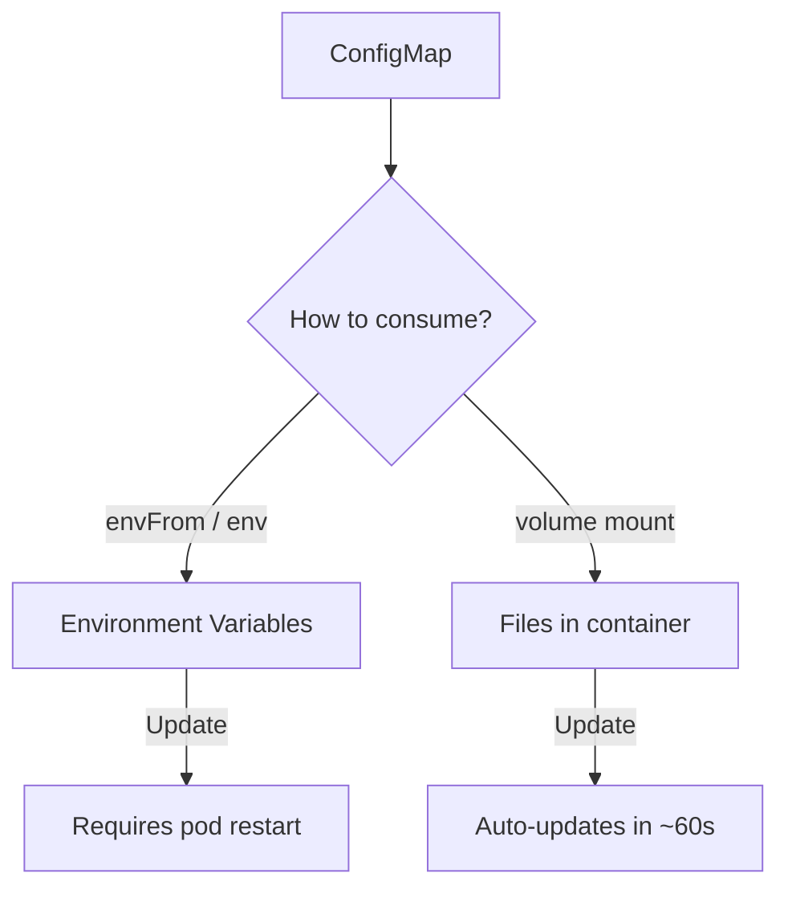

> 💡 **Quick Answer:** Create and use ConfigMaps in Kubernetes for application configuration. Mount as files, inject as environment variables, and hot-reload without restarting pods.

## The Problem

This is one of the most searched Kubernetes topics. Having a comprehensive, well-structured guide helps both beginners and experienced users quickly find what they need.

## The Solution

### Create a ConfigMap

```yaml
# From literal values
apiVersion: v1
kind: ConfigMap
metadata:
  name: app-config
data:
  DATABASE_HOST: "postgres.default.svc"
  DATABASE_PORT: "5432"
  LOG_LEVEL: "info"
  app.properties: |
    server.port=8080
    spring.datasource.url=jdbc:postgresql://postgres:5432/mydb
    logging.level.root=INFO
```

```bash
# Create from command line
kubectl create configmap app-config \
  --from-literal=DATABASE_HOST=postgres \
  --from-literal=LOG_LEVEL=info

# Create from file
kubectl create configmap nginx-config --from-file=nginx.conf
kubectl create configmap app-config --from-file=config/

# Create from env file
kubectl create configmap app-config --from-env-file=.env
```

### Use as Environment Variables

```yaml
apiVersion: apps/v1
kind: Deployment
metadata:
  name: my-app
spec:
  template:
    spec:
      containers:
        - name: app
          image: my-app:v1
          # Individual keys
          env:
            - name: DB_HOST
              valueFrom:
                configMapKeyRef:
                  name: app-config
                  key: DATABASE_HOST
          # All keys at once
          envFrom:
            - configMapRef:
                name: app-config
```

### Mount as Volume (Files)

```yaml
spec:
  containers:
    - name: app
      volumeMounts:
        - name: config-volume
          mountPath: /etc/config
          readOnly: true
        # Mount single key as file
        - name: config-volume
          mountPath: /etc/app/app.properties
          subPath: app.properties
  volumes:
    - name: config-volume
      configMap:
        name: app-config
```

### Hot-Reload ConfigMap (No Restart)

```bash
# Volume-mounted ConfigMaps auto-update (kubelet sync period ~60s)
# But envFrom does NOT auto-update — requires pod restart

# Force update
kubectl edit configmap app-config
# Volume mounts refresh automatically within ~1 minute

# For env vars, restart the deployment
kubectl rollout restart deployment my-app
```



## Frequently Asked Questions

### What is the size limit for ConfigMaps?

ConfigMaps are limited to 1MB of data. For larger configurations, use a PersistentVolume or external configuration service.

### Can I use ConfigMaps for binary data?

Use the `binaryData` field for binary content (base64-encoded). For text data, use the `data` field.

### How do I update a ConfigMap without downtime?

Volume-mounted ConfigMaps auto-update. For environment variable-based configs, use `kubectl rollout restart deployment` for a zero-downtime rolling restart.

## Best Practices

- **Start simple** — use the basic form first, add complexity as needed
- **Be consistent** — follow naming conventions across your cluster
- **Document your choices** — add annotations explaining why, not just what
- **Monitor and iterate** — review configurations regularly

## Key Takeaways

- This is fundamental Kubernetes knowledge every engineer needs
- Start with the simplest approach that solves your problem
- Use `kubectl explain` and `kubectl describe` when unsure
- Practice in a test cluster before applying to production
