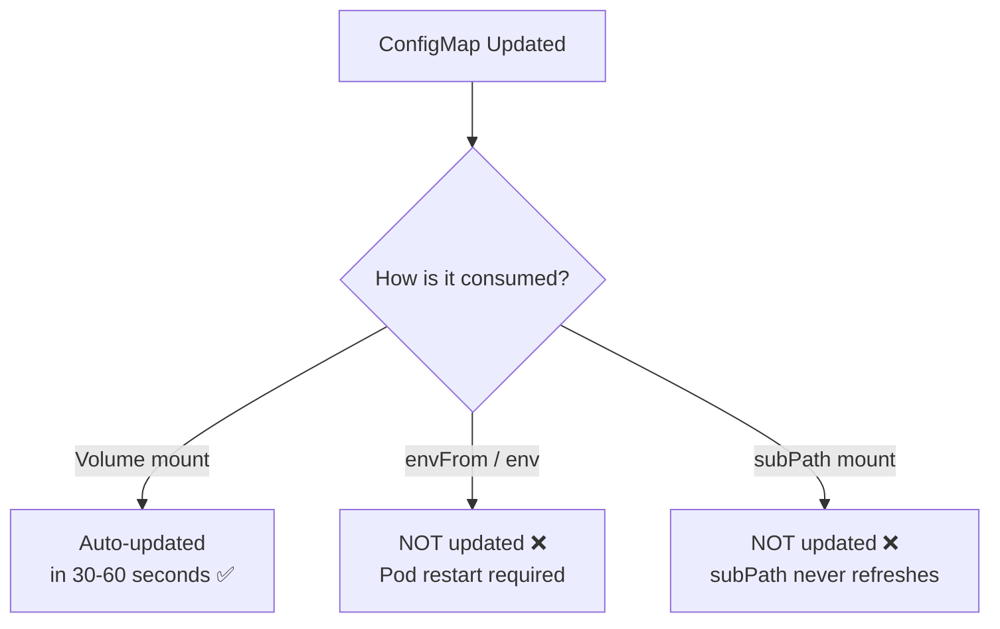

> 💡 **Quick Answer:** ConfigMaps mounted as volumes auto-update in pods (within 30-60 seconds) without restarts. ConfigMaps used as environment variables do NOT update — pods must be restarted. Use [Reloader](https://github.com/stakater/Reloader) to trigger rolling restarts automatically when ConfigMaps change.

## The Problem

You update a ConfigMap but your pods still use the old config. The behavior depends on how you consume the ConfigMap:



## The Solution

### Method 1: Volume Mount (Automatic Refresh)

```yaml
apiVersion: v1
kind: ConfigMap
metadata:
  name: app-config
data:
  config.yaml: |
    log_level: info
    max_connections: 100
---
apiVersion: apps/v1
kind: Deployment
metadata:
  name: my-app
spec:
  template:
    spec:
      containers:
        - name: app
          image: myapp:v1.0
          volumeMounts:
            - name: config
              mountPath: /etc/config    # ✅ Auto-updates!
              # Do NOT use subPath — it disables auto-update
      volumes:
        - name: config
          configMap:
            name: app-config
```

```bash
# Update ConfigMap
kubectl edit configmap app-config
# Change log_level: info → log_level: debug

# Wait ~60 seconds, then verify
kubectl exec my-app-xxx -- cat /etc/config/config.yaml
# log_level: debug    ← Updated automatically!
```

**Important:** Your application must watch the file for changes (inotify, polling, or SIGHUP).

### Method 2: Reloader Controller (Automatic Restart)

[Stakater Reloader](https://github.com/stakater/Reloader) watches ConfigMaps/Secrets and triggers rolling restarts:

```bash
# Install Reloader
helm repo add stakater https://stakater.github.io/stakater-charts
helm install reloader stakater/reloader -n kube-system
```

```yaml
apiVersion: apps/v1
kind: Deployment
metadata:
  name: my-app
  annotations:
    reloader.stakater.com/auto: "true"    # ← Watch ALL referenced ConfigMaps/Secrets
spec:
  template:
    spec:
      containers:
        - name: app
          envFrom:
            - configMapRef:
                name: app-config          # Reloader restarts on change
```

Or watch specific ConfigMaps:

```yaml
metadata:
  annotations:
    configmap.reloader.stakater.com/reload: "app-config,feature-flags"
    secret.reloader.stakater.com/reload: "db-credentials"
```

### Method 3: Checksum Annotation (Native Kubernetes)

Force rolling update when ConfigMap changes — no extra controller needed:

```yaml
apiVersion: apps/v1
kind: Deployment
metadata:
  name: my-app
spec:
  template:
    metadata:
      annotations:
        # Update this hash when ConfigMap changes
        checksum/config: {{ include (print $.Template.BasePath "/configmap.yaml") . | sha256sum }}
```

In CI/CD without Helm:

```bash
# Compute hash and patch deployment
HASH=$(kubectl get configmap app-config -o jsonpath='{.data}' | sha256sum | cut -d' ' -f1)
kubectl patch deployment my-app -p \
  "{\"spec\":{\"template\":{\"metadata\":{\"annotations\":{\"checksum/config\":\"$HASH\"}}}}}"
```

### Method 4: Application-Level File Watching

Make your app react to config file changes:

```python
# Python with watchdog
from watchdog.observers import Observer
from watchdog.events import FileSystemEventHandler

class ConfigHandler(FileSystemEventHandler):
    def on_modified(self, event):
        if event.src_path.endswith("config.yaml"):
            print("Config changed, reloading...")
            reload_config()

observer = Observer()
observer.schedule(ConfigHandler(), "/etc/config", recursive=False)
observer.start()
```

```go
// Go with fsnotify
watcher, _ := fsnotify.NewWatcher()
watcher.Add("/etc/config")

for event := range watcher.Events {
    if event.Op&fsnotify.Write == fsnotify.Write {
        log.Println("Config modified, reloading...")
        reloadConfig()
    }
}
```

### ⚠️ subPath Disables Auto-Update

```yaml
# ❌ subPath — NEVER auto-updates
volumeMounts:
  - name: config
    mountPath: /etc/config/config.yaml
    subPath: config.yaml               # This BREAKS auto-update!

# ✅ Directory mount — auto-updates
volumeMounts:
  - name: config
    mountPath: /etc/config              # Whole directory, auto-updates
```

### Comparison

| Method | Auto? | Restart? | Delay | Complexity |
|--------|:-----:|:--------:|:-----:|:----------:|
| Volume mount | ✅ | No | 30-60s | App must watch files |
| Reloader | ✅ | Rolling restart | ~seconds | Install controller |
| Checksum annotation | Manual | Rolling restart | Immediate | CI/CD integration |
| Environment vars | ❌ | Manual restart | N/A | Simplest |

## Common Issues

| Issue | Cause | Fix |
|-------|-------|-----|
| Volume not updating | Using \`subPath\` | Remove subPath, mount whole directory |
| Env vars not updating | Env vars never hot-reload | Use Reloader or restart pods |
| Long update delay | Kubelet sync period | Default 60s — configurable but not recommended to lower |
| App not picking up changes | App doesn't watch files | Add file watcher or use SIGHUP pattern |
| Symlink confusion | ConfigMap uses symlinks internally | Read the file, not the symlink |

## Best Practices

- **Prefer volume mounts over env vars** when hot-reload is needed
- **Never use subPath** if you need auto-update
- **Install Reloader** for env-var-based configs — simple, reliable
- **Add file watching** in your application — most production apps support SIGHUP
- **Test config changes in staging** — malformed config can crash apps

## Key Takeaways

- Volume-mounted ConfigMaps auto-update in 30-60 seconds — no restart needed
- Environment variables from ConfigMaps NEVER auto-update — restart required
- \`subPath\` mounts NEVER auto-update — avoid for dynamic configs
- Reloader controller triggers rolling restarts on ConfigMap/Secret changes
- Checksum annotations in Helm force restart on config changes natively
- Your app must actively watch config files to use hot-reload
