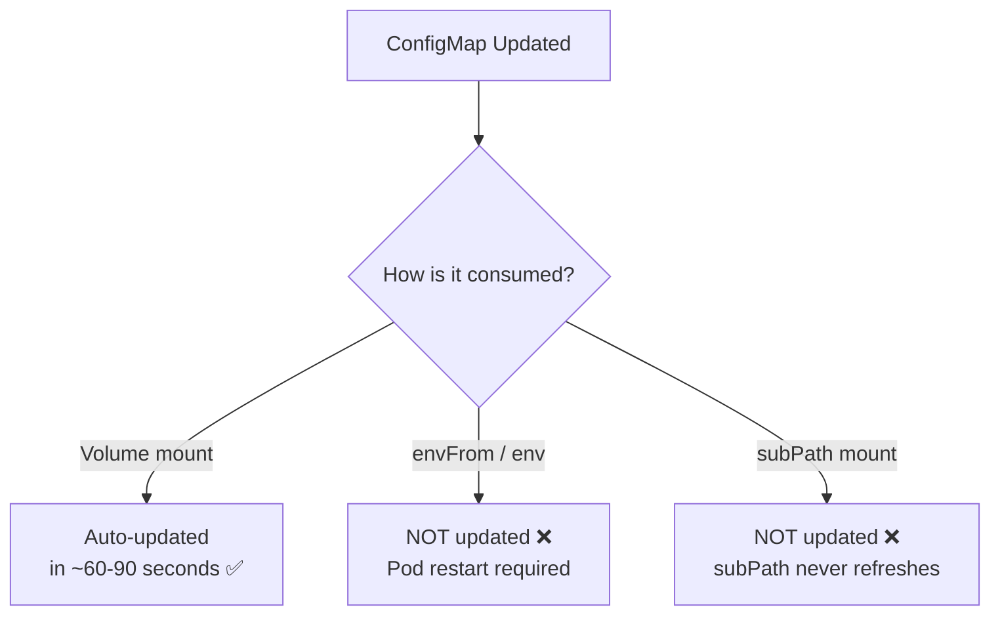

> 💡 **Quick Answer:** ConfigMaps mounted as volumes auto-update in pods (typically within 60–90 seconds: kubelet sync period + cache delay) without restarts. ConfigMaps used as environment variables do NOT update — pods must be restarted. Use [Reloader](https://github.com/stakater/Reloader) to trigger rolling restarts automatically when ConfigMaps change.
>
> **Gotcha:** `subPath` mounts never update, and the app itself must re-read the file — Kubernetes only swaps the file on disk.

## The Problem

You update a ConfigMap but your pods still use the old config. The behavior depends on how you consume the ConfigMap:


```mermaid
flowchart TB
    CM["ConfigMap Updated"] --> VOL{"How is it consumed?"}
    VOL -->|"Volume mount"| AUTO["Auto-updated<br/>in ~60-90 seconds ✅"]
    VOL -->|"envFrom / env"| STUCK["NOT updated ❌<br/>Pod restart required"]
    VOL -->|"subPath mount"| STUCK2["NOT updated ❌<br/>subPath never refreshes"]
```

## The Solution

### Method 1: Volume Mount (Automatic Refresh)

```yaml
apiVersion: v1
kind: ConfigMap
metadata:
  name: app-config
data:
  config.yaml: |
    log_level: info
    max_connections: 100
---
apiVersion: apps/v1
kind: Deployment
metadata:
  name: my-app
spec:
  template:
    spec:
      containers:
        - name: app
          image: myapp:v1.0
          volumeMounts:
            - name: config
              mountPath: /etc/config    # ✅ Auto-updates!
              # Do NOT use subPath — it disables auto-update
      volumes:
        - name: config
          configMap:
            name: app-config
```

```bash
# Update ConfigMap
kubectl edit configmap app-config
# Change log_level: info → log_level: debug

# Wait ~60 seconds, then verify
kubectl exec my-app-xxx -- cat /etc/config/config.yaml
# log_level: debug    ← Updated automatically!
```

**Important:** Your application must watch the file for changes (inotify, polling, or SIGHUP).

To skip the wait, touching the pod object makes the kubelet resync its volumes immediately:

```bash
kubectl annotate pod my-app-xxx config-resync=$(date +%s) --overwrite
```

### Method 2: Reloader Controller (Automatic Restart)

[Stakater Reloader](https://github.com/stakater/Reloader) watches ConfigMaps/Secrets and triggers rolling restarts:

```bash
# Install Reloader
helm repo add stakater https://stakater.github.io/stakater-charts
helm install reloader stakater/reloader -n kube-system
```

```yaml
apiVersion: apps/v1
kind: Deployment
metadata:
  name: my-app
  annotations:
    reloader.stakater.com/auto: "true"    # ← Watch ALL referenced ConfigMaps/Secrets
spec:
  template:
    spec:
      containers:
        - name: app
          envFrom:
            - configMapRef:
                name: app-config          # Reloader restarts on change
```

Or watch specific ConfigMaps:

```yaml
metadata:
  annotations:
    configmap.reloader.stakater.com/reload: "app-config,feature-flags"
    secret.reloader.stakater.com/reload: "db-credentials"
```

### Method 3: Checksum Annotation (Native Kubernetes)

Force rolling update when ConfigMap changes — no extra controller needed:

```yaml
apiVersion: apps/v1
kind: Deployment
metadata:
  name: my-app
spec:
  template:
    metadata:
      annotations:
        # Update this hash when ConfigMap changes
        checksum/config: {{ include (print $.Template.BasePath "/configmap.yaml") . | sha256sum }}
```

In CI/CD without Helm:

```bash
# Compute hash and patch deployment
HASH=$(kubectl get configmap app-config -o jsonpath='{.data}' | sha256sum | cut -d' ' -f1)
kubectl patch deployment my-app -p \
  "{\"spec\":{\"template\":{\"metadata\":{\"annotations\":{\"checksum/config\":\"$HASH\"}}}}}"
```

### Method 4: Application-Level File Watching

The kubelet doesn't rewrite `config.yaml` in place. It writes a new timestamped directory and atomically swaps the `..data` symlink, so the visible file is replaced rather than modified. Watch the **directory** for create/rename events (a plain "modified" watch on the file never fires):

```python
# Python with watchdog - react to the ..data symlink swap
from watchdog.observers import Observer
from watchdog.events import FileSystemEventHandler

class ConfigHandler(FileSystemEventHandler):
    def on_any_event(self, event):
        paths = event.src_path + getattr(event, "dest_path", "")
        if event.event_type in ("created", "moved") and "..data" in paths:
            print("Config changed, reloading...")
            reload_config()

observer = Observer()
observer.schedule(ConfigHandler(), "/etc/config", recursive=False)
observer.start()
```

```go
// Go with fsnotify - watch the dir, filter on the ..data swap
watcher, _ := fsnotify.NewWatcher()
watcher.Add("/etc/config")

for event := range watcher.Events {
    if filepath.Base(event.Name) == "..data" && event.Op&fsnotify.Create == fsnotify.Create {
        log.Println("Config swapped, reloading...")
        reloadConfig()
    }
}
```

### Method 5: Reload Sidecar (Apps with a Reload Endpoint)

For apps that expose a reload hook (Prometheus, Alertmanager, many proxies), a sidecar watches the mount and calls it:

```yaml
containers:
  - name: myapp
    # ...
  - name: config-reloader
    image: ghcr.io/jimmidyson/configmap-reload:v0.14.0
    args:
      - --volume-dir=/config
      - --webhook-url=http://localhost:8080/-/reload
    volumeMounts:
      - name: config
        mountPath: /config
        readOnly: true
```

For apps that reload on SIGHUP, set `shareProcessNamespace: true` and have the sidecar `kill -HUP` the main process.

### ⚠️ subPath Disables Auto-Update

```yaml
# ❌ subPath — NEVER auto-updates
volumeMounts:
  - name: config
    mountPath: /etc/config/config.yaml
    subPath: config.yaml               # This BREAKS auto-update!

# ✅ Directory mount — auto-updates
volumeMounts:
  - name: config
    mountPath: /etc/config              # Whole directory, auto-updates
```

### Comparison

| Method | Auto? | Restart? | Delay | Complexity |
|--------|:-----:|:--------:|:-----:|:----------:|
| Volume mount | ✅ | No | ~60-90s | App must watch files |
| Reload sidecar | ✅ | No | ~60-90s | App needs reload endpoint/SIGHUP |
| Reloader | ✅ | Rolling restart | ~seconds | Install controller |
| Checksum annotation | Manual | Rolling restart | Immediate | CI/CD integration |
| Environment vars | ❌ | Manual restart | N/A | Simplest |

## Troubleshooting: ConfigMap Changes Not Applied to Pods

| Consumed as | Auto-updates? | Delay |
|-------------|---------------|-------|
| Volume mount | Yes | Kubelet sync period + cache TTL (~60–90s) |
| Projected volume | Yes | Same as volume |
| `subPath` volume | **No** | Never — restart required |
| `env` / `envFrom` | **No** | Never — restart required |

```bash
# 1. Is the ConfigMap actually updated?
kubectl get cm app-config -o yaml | head -20

# 2. How does the pod consume it?
kubectl get pod my-app-xxx -o jsonpath='{.spec.containers[*].volumeMounts}' | jq
kubectl get pod my-app-xxx -o jsonpath='{.spec.containers[*].envFrom}'

# 3. What's on disk right now?
kubectl exec my-app-xxx -- ls -la /etc/config/     # ..data -> ..2026_09_27_...
kubectl exec my-app-xxx -- cat /etc/config/config.yaml

# 4. Immutable? Then it can't be edited at all - create a new name
kubectl get cm app-config -o jsonpath='{.immutable}'
```

If the file on disk is new but behavior isn't, the app isn't reloading — that's Methods 2–5, not Kubernetes.

## Common Issues

| Issue | Cause | Fix |
|-------|-------|-----|
| Volume not updating | Using `subPath` | Remove subPath, mount whole directory |
| Env vars not updating | Env vars never hot-reload | Use Reloader or restart pods |
| Long update delay | Kubelet sync period | Default 60s — annotate the pod to force a resync, or use Reloader |
| App not picking up changes | App doesn't watch files | Add file watcher or use SIGHUP pattern |
| Symlink confusion | ConfigMap uses symlinks internally | Read the file, not the symlink |

## Best Practices

- **Prefer volume mounts over env vars** when hot-reload is needed
- **Never use subPath** if you need auto-update
- **Install Reloader** for env-var-based configs — simple, reliable
- **Add file watching** in your application — most production apps support SIGHUP
- **Test config changes in staging** — malformed config can crash apps

## Frequently Asked Questions

### Why are my ConfigMap changes not reflected in the pod?

Either the pod consumes the ConfigMap as environment variables (which never change in a running container), mounts it with `subPath` (never updated), or the file did update but the application only reads config at startup. Check with `kubectl exec ... cat` on the mounted path.

### How long does it take for a ConfigMap update to reach a pod?

For volume mounts, up to the kubelet sync period (1 minute by default) plus the kubelet's ConfigMap cache delay, so typically 60–90 seconds. Env vars and `subPath` mounts never update.

### How do I restart pods when a ConfigMap changes?

Run `kubectl rollout restart deployment/<name>`, add a checksum annotation of the ConfigMap to the pod template (Helm, Kustomize hashed names), or install Stakater Reloader and annotate the Deployment with `reloader.stakater.com/auto: "true"`.

### Does a subPath ConfigMap mount update?

No. `subPath` bind-mounts a single resolved file at container start, so later symlink swaps aren't visible. Mount the whole directory, or restart the pod.

## Key Takeaways

- Volume-mounted ConfigMaps auto-update in ~60-90 seconds — no restart needed
- Environment variables from ConfigMaps NEVER auto-update — restart required
- `subPath` mounts NEVER auto-update — avoid for dynamic configs
- Reloader controller triggers rolling restarts on ConfigMap/Secret changes
- Checksum annotations in Helm force restart on config changes natively
- Your app must actively watch config files to use hot-reload
