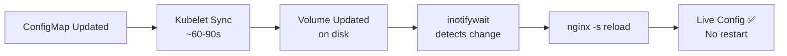

> 💡 **Quick Answer:** Use the Reloader operator (`stakater/Reloader`) for automatic rolling restarts on ConfigMap changes, or use volume-mounted ConfigMaps with inotify-based reload for zero-downtime config updates without pod restarts.

## The Problem

When you update a ConfigMap, Kubernetes does NOT automatically restart pods that reference it. Environment variables from ConfigMaps are injected at pod creation and never updated. Volume-mounted ConfigMaps do update (after kubelet sync, ~60-90s), but the application must detect and reload the file.

## The Solution

### Pattern 1: Reloader Operator (Recommended)

```bash
helm install reloader stakater/reloader --namespace kube-system
```

Annotate your Deployment:
```yaml
apiVersion: apps/v1
kind: Deployment
metadata:
  name: my-app
  annotations:
    reloader.stakater.com/auto: "true"
spec:
  template:
    spec:
      containers:
        - name: app
          envFrom:
            - configMapRef:
                name: app-config
```

When `app-config` ConfigMap changes, Reloader triggers a rolling restart automatically.

### Pattern 2: Checksum Annotation

```yaml
apiVersion: apps/v1
kind: Deployment
metadata:
  name: my-app
spec:
  template:
    metadata:
      annotations:
        checksum/config: {{ include (print .Template.BasePath "/configmap.yaml") . | sha256sum }}
    spec:
      containers:
        - name: app
          envFrom:
            - configMapRef:
                name: app-config
```

Helm recalculates the checksum on `helm upgrade` — changed checksum triggers rolling restart.

### Pattern 3: Volume Mount + Inotify Sidecar

```yaml
apiVersion: apps/v1
kind: Deployment
metadata:
  name: nginx-live-reload
spec:
  template:
    spec:
      containers:
        - name: nginx
          image: nginx:1.27
          volumeMounts:
            - name: config
              mountPath: /etc/nginx/conf.d
        - name: reloader
          image: registry.example.com/inotify-reloader:1.0
          command: ["/bin/sh", "-c"]
          args:
            - |
              while true; do
                inotifywait -e modify,create /etc/nginx/conf.d/
                nginx -s reload
              done
          volumeMounts:
            - name: config
              mountPath: /etc/nginx/conf.d
      volumes:
        - name: config
          configMap:
            name: nginx-config
```



## Common Issues

**ConfigMap update not reflected in env vars**

Environment variables are set at pod creation only. You MUST restart the pod (or use Reloader) to pick up env var changes from ConfigMaps.

**Volume-mounted ConfigMap takes minutes to update**

Kubelet sync period is configurable but defaults to 60s + cache TTL. For faster updates, reduce `--sync-frequency` (not recommended in production).

## Best Practices

- **Reloader for env-var ConfigMaps** — automatic rolling restarts on change
- **Volume mounts for file-based configs** — apps that support reload (nginx, Prometheus, Grafana)
- **Checksum annotation in Helm** — ensures deploys pick up config changes
- **Never assume instant propagation** — volume updates take 60-90 seconds

## Key Takeaways

- Env var ConfigMaps never auto-update — pods must restart
- Volume-mounted ConfigMaps update in-place after kubelet sync (~60-90s)
- Reloader operator automates rolling restarts on ConfigMap/Secret changes
- Helm checksum annotations tie config changes to deployment rollouts
- inotify sidecars enable true zero-downtime config reload
