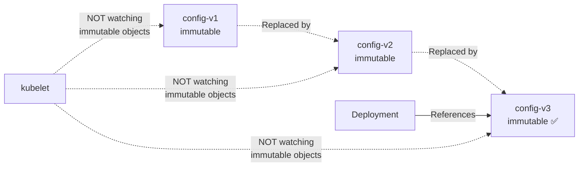

> 💡 **Quick Answer:** Set `immutable: true` on ConfigMaps and Secrets that shouldn't change after creation. This reduces API server watch load (kubelet stops watching immutable objects) and prevents accidental modifications. Use name-based versioning (`config-v2`) for updates.

## The Problem

A production outage caused by someone accidentally modifying a ConfigMap. Or API server under pressure from thousands of pods watching ConfigMaps for changes that will never come. Immutable objects solve both problems.

## The Solution

### Immutable ConfigMap

```yaml
apiVersion: v1
kind: ConfigMap
metadata:
  name: app-config-v3
  namespace: production
immutable: true
data:
  database.host: "db.example.com"
  database.port: "5432"
  feature.flags: '{"newUI": true, "darkMode": false}'
```

Once created with `immutable: true`:
- Cannot be modified (kubectl edit/patch fails)
- kubelet stops watching it — reduces API server load
- Must create a new ConfigMap (e.g., `app-config-v4`) for changes

### Versioned Configuration Pattern

```yaml
# Step 1: Create new version
apiVersion: v1
kind: ConfigMap
metadata:
  name: app-config-v4
immutable: true
data:
  database.host: "db-new.example.com"
---
# Step 2: Update Deployment to reference new version
apiVersion: apps/v1
kind: Deployment
metadata:
  name: my-app
spec:
  template:
    spec:
      volumes:
        - name: config
          configMap:
            name: app-config-v4
```

### Immutable Secret

```yaml
apiVersion: v1
kind: Secret
metadata:
  name: api-keys-v2
  namespace: production
immutable: true
type: Opaque
data:
  api-key: BASE64_ENCODED_VALUE
```



## Common Issues

**"ConfigMap is immutable, cannot be updated"**

Expected behavior. Create a new ConfigMap with a new name and update the Deployment reference.

**Old immutable ConfigMaps accumulating**

Clean up old versions: `kubectl get configmap | grep 'app-config-v' | head -n -2 | awk '{print $1}' | xargs kubectl delete configmap`

## Best Practices

- **Use immutable for production configs** — prevents accidental changes
- **Name-based versioning** (`config-v1`, `config-v2`) for updates
- **Cleanup old versions** after confirming new version works
- **Especially valuable at scale** — 1000 pods watching one ConfigMap = significant API server load
- **Pair with GitOps** — ConfigMap versions tracked in git

## Key Takeaways

- `immutable: true` prevents modifications and stops kubelet from watching the object
- Reduces API server load significantly at scale (1000+ pods)
- Use name-based versioning for updates — create new, update reference, delete old
- Works for both ConfigMaps and Secrets
- Cannot be reverted — once immutable, always immutable (delete and recreate if needed)
