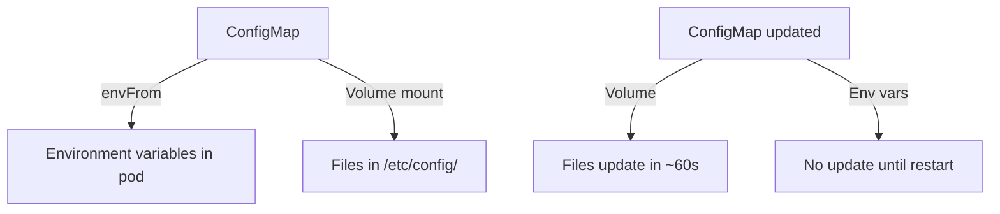

> 💡 **Quick Answer:** configuration

## The Problem

This is one of the most searched Kubernetes topics with thousands of monthly searches. A comprehensive, production-ready guide prevents hours of trial and error.

## The Solution

### Create ConfigMaps

```bash
# From literal values
kubectl create configmap app-config \
  --from-literal=DATABASE_HOST=postgres \
  --from-literal=LOG_LEVEL=info

# From file
kubectl create configmap nginx-config --from-file=nginx.conf

# From directory (each file becomes a key)
kubectl create configmap configs --from-file=./config-dir/

# From env file
kubectl create configmap env-config --from-env-file=.env
```

```yaml
apiVersion: v1
kind: ConfigMap
metadata:
  name: app-config
data:
  DATABASE_HOST: "postgres.default"
  DATABASE_PORT: "5432"
  LOG_LEVEL: "info"
  app.properties: |
    server.port=8080
    server.host=0.0.0.0
    cache.ttl=300
  nginx.conf: |
    server {
      listen 80;
      location / {
        proxy_pass http://localhost:8080;
      }
    }
```

### Use as Environment Variables

```yaml
spec:
  containers:
    - name: app
      image: my-app:v1
      # Individual keys
      env:
        - name: DB_HOST
          valueFrom:
            configMapKeyRef:
              name: app-config
              key: DATABASE_HOST
      # All keys as env vars
      envFrom:
        - configMapRef:
            name: app-config
          prefix: APP_      # Optional prefix: APP_DATABASE_HOST
```

### Mount as Files

```yaml
spec:
  containers:
    - name: app
      image: my-app:v1
      volumeMounts:
        - name: config
          mountPath: /etc/config
          readOnly: true
        # Mount single key as specific file
        - name: nginx
          mountPath: /etc/nginx/nginx.conf
          subPath: nginx.conf
  volumes:
    - name: config
      configMap:
        name: app-config
    - name: nginx
      configMap:
        name: app-config
        items:
          - key: nginx.conf
            path: nginx.conf
```

### Auto-Update on Change

```bash
# Volume-mounted ConfigMaps auto-update (kubelet sync ~60s)
# Environment variables do NOT auto-update — requires pod restart

# Trigger rolling restart after ConfigMap change
kubectl rollout restart deployment/my-app

# Or use a hash annotation for automatic rollouts
# checksum/config: {{ sha256sum of configmap }}
```

| Method | Auto-updates? | Use when |
|--------|-------------|----------|
| `env` / `envFrom` | ❌ (needs restart) | Simple key-value config |
| Volume mount | ✅ (~60s delay) | Config files (nginx, properties) |
| `subPath` mount | ❌ (needs restart) | Single file without overwriting dir |



## Frequently Asked Questions

### ConfigMap vs Secret?

ConfigMaps are for non-sensitive configuration. Secrets are for passwords, tokens, certificates. Secrets are base64-encoded (not encrypted by default) and can be encrypted at rest with KMS.

### Max ConfigMap size?

1MB per ConfigMap. For larger configs, use a PersistentVolume or external config store (Consul, etcd).

## Best Practices

- Start with the simplest configuration that solves your problem
- Test in staging before production
- Use `kubectl describe` and events for troubleshooting
- Document team conventions for consistency

## Key Takeaways

- This is fundamental Kubernetes operational knowledge
- Follow established conventions and recommended labels
- Monitor and iterate based on real production behavior
- Automate repetitive tasks to reduce human error
