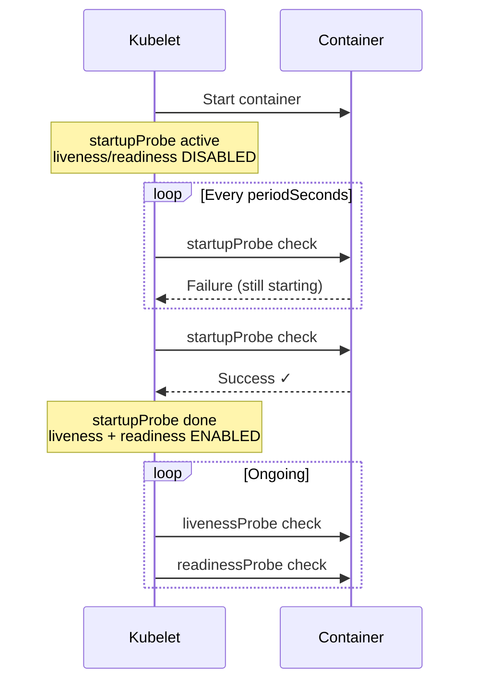

> 💡 **Quick Answer:** `startupProbe` disables liveness/readiness checks until the container is fully initialized. Set `failureThreshold × periodSeconds` to cover your app's maximum startup time.

## The Problem

Java apps, ML models, and legacy services can take 60-300 seconds to start. Without a startupProbe:
- Liveness probe kills the container before it's ready → CrashLoopBackOff
- Setting high `initialDelaySeconds` on liveness is fragile and slows restart detection

## The Solution

### Basic startupProbe

```yaml
apiVersion: v1
kind: Pod
metadata:
  name: java-app
spec:
  containers:
    - name: app
      image: spring-boot-app:3.0
      ports:
        - containerPort: 8080
      startupProbe:
        httpGet:
          path: /actuator/health/started
          port: 8080
        failureThreshold: 30
        periodSeconds: 10
        # Total startup budget: 30 × 10 = 300 seconds
      livenessProbe:
        httpGet:
          path: /actuator/health/liveness
          port: 8080
        periodSeconds: 10
        failureThreshold: 3
      readinessProbe:
        httpGet:
          path: /actuator/health/readiness
          port: 8080
        periodSeconds: 5
        failureThreshold: 3
```

### TCP startupProbe (databases)

```yaml
startupProbe:
  tcpSocket:
    port: 5432
  failureThreshold: 30
  periodSeconds: 5
  # Budget: 150 seconds for DB initialization
```

### Exec startupProbe (custom check)

```yaml
startupProbe:
  exec:
    command:
      - /bin/sh
      - -c
      - "test -f /app/ready.flag"
  failureThreshold: 60
  periodSeconds: 5
  # Budget: 300 seconds for model loading
```



## Common Issues

**Container killed during startup**
Increase `failureThreshold`:
```yaml
startupProbe:
  failureThreshold: 60  # 60 × 10s = 10 minutes
  periodSeconds: 10
```

**startupProbe succeeds but app not fully ready**
Use separate endpoints: startup = "process is alive", readiness = "can serve traffic":
```yaml
startupProbe:
  httpGet:
    path: /started   # Returns 200 once JVM is up
readinessProbe:
  httpGet:
    path: /ready     # Returns 200 once connections are warmed
```

**Probe timeout too short**
Default `timeoutSeconds` is 1. Slow health endpoints need more:
```yaml
startupProbe:
  httpGet:
    path: /health
    port: 8080
  timeoutSeconds: 5
```

## Best Practices

- Set startup budget = max observed startup time × 1.5
- Use HTTP probes when possible (more informative than TCP)
- Liveness probe should NEVER check external dependencies (causes cascading restarts)
- Readiness probe CAN check dependencies (removes from Service endpoints)
- Keep `periodSeconds` low (5-10s) for faster startup detection
- Use separate health endpoints: `/started`, `/live`, `/ready`

## Key Takeaways

- startupProbe runs first — liveness and readiness are paused until it succeeds
- Max startup time = `failureThreshold × periodSeconds`
- After startupProbe succeeds, it never runs again for that container
- If startupProbe exhausts retries, container is killed (like liveness failure)
- Replaces the anti-pattern of high `initialDelaySeconds` on liveness
- Available since Kubernetes 1.20 (GA)
