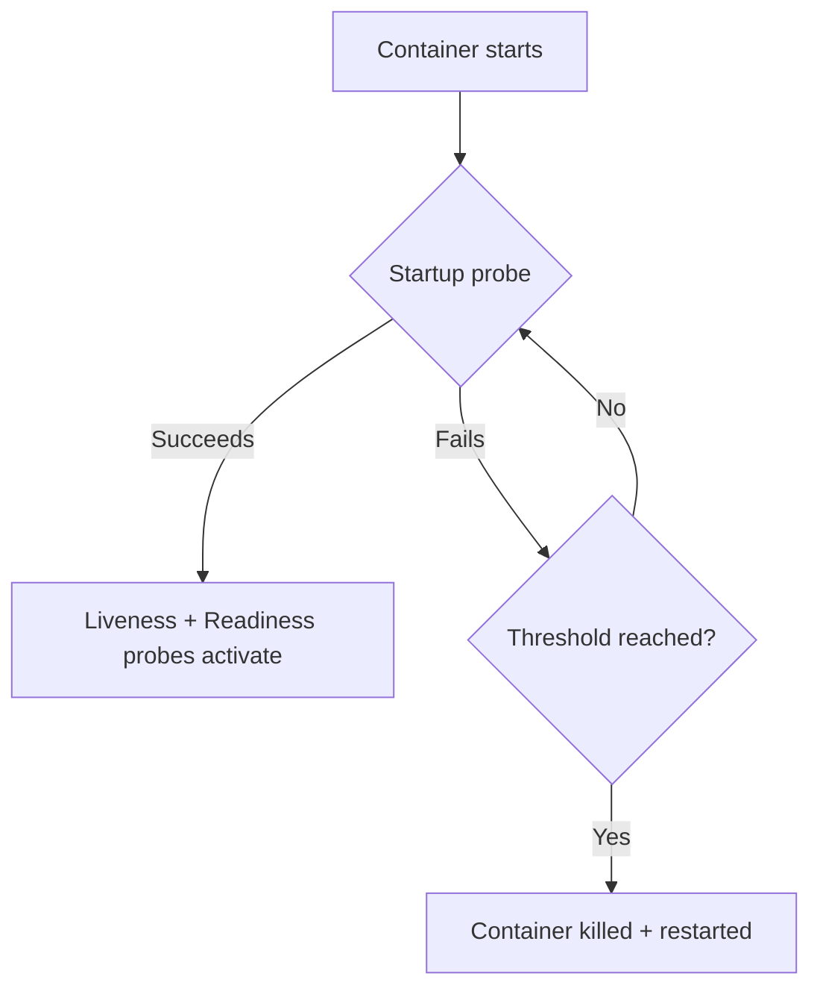

> 💡 **Quick Answer:** configuration

## The Problem

This is a fundamental Kubernetes topic that engineers search for frequently. A comprehensive reference with production-ready examples saves hours of trial and error.

## The Solution

### Why Startup Probes Exist

```yaml
# WITHOUT startup probe — liveness kills slow-starting app!
# App needs 2 minutes to load ML model
# Liveness probe: failureThreshold=3, periodSeconds=10 → kills after 30s
# Result: CrashLoopBackOff

# WITH startup probe — liveness waits until startup succeeds
spec:
  containers:
    - name: ml-server
      image: ml-server:v1
      startupProbe:
        httpGet:
          path: /healthz
          port: 8080
        failureThreshold: 30       # 30 × 10s = 5 minutes max startup
        periodSeconds: 10
      livenessProbe:
        httpGet:
          path: /healthz
          port: 8080
        periodSeconds: 10
        failureThreshold: 3
      readinessProbe:
        httpGet:
          path: /ready
          port: 8080
        periodSeconds: 5
```

### How They Work Together

| Phase | Active Probe | If Fails |
|-------|-------------|----------|
| Starting up | Startup probe only | Keep trying until failureThreshold |
| Startup succeeded | Liveness + Readiness | Liveness → restart, Readiness → remove from Service |
| Startup failed (exceeded threshold) | N/A | Container killed and restarted |

### Common Startup Times

| Application | Typical Startup | Suggested failureThreshold × period |
|-------------|----------------|-------------------------------------|
| Node.js / Go | 1-5s | No startup probe needed |
| Spring Boot | 30-90s | 12 × 10s = 120s |
| ML model loading | 1-5 min | 30 × 10s = 300s |
| Database initialization | 1-3 min | 18 × 10s = 180s |
| Large Java EE | 2-10 min | 60 × 10s = 600s |



## Frequently Asked Questions

### Startup probe vs initialDelaySeconds on liveness?

`initialDelaySeconds` is a fixed delay — if your app sometimes takes 30s and sometimes 2min, you waste time or risk kills. Startup probes actively check and transition as soon as the app is ready.

### Can I use startup probe without liveness?

Yes, but you lose the "restart if deadlocked" safety net. Best practice: use startup + liveness + readiness together.

## Best Practices

- Start with the simplest configuration that meets your needs
- Test changes in staging before production
- Use `kubectl describe` and events for troubleshooting
- Document your decisions for the team

## Key Takeaways

- This is essential Kubernetes knowledge for production operations
- Follow the principle of least privilege and minimal configuration
- Monitor and iterate based on real-world behavior
- Automation reduces human error and improves consistency
