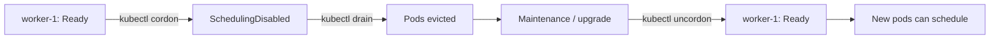

> 💡 **Quick Answer:** configuration

## The Problem

This is a fundamental Kubernetes topic that engineers search for frequently. A comprehensive reference with production-ready examples saves hours of trial and error.

## The Solution

### Node Management Commands

```bash
# Cordon — mark node as unschedulable (existing pods stay)
kubectl cordon worker-1
# worker-1   Ready,SchedulingDisabled

# Drain — cordon + evict all pods (respects PDBs)
kubectl drain worker-1 \
  --ignore-daemonsets \
  --delete-emptydir-data \
  --grace-period=60 \
  --timeout=300s

# Uncordon — allow scheduling again
kubectl uncordon worker-1
# worker-1   Ready
```

### Drain Flags Explained

| Flag | Purpose |
|------|---------|
| `--ignore-daemonsets` | Skip DaemonSet pods (they belong on every node) |
| `--delete-emptydir-data` | Allow eviction of pods with emptyDir volumes |
| `--grace-period=60` | Give pods 60s to shut down gracefully |
| `--timeout=300s` | Abort drain if it takes >5 minutes |
| `--force` | Force delete pods without controllers (DANGEROUS) |
| `--pod-selector=app=web` | Only drain specific pods |
| `--dry-run=client` | Preview what would be evicted |

### Safe Maintenance Procedure

```bash
# 1. Check what's running on the node
kubectl get pods --field-selector spec.nodeName=worker-1 -A

# 2. Check PDBs won't block drain
kubectl get pdb -A

# 3. Drain (preview first)
kubectl drain worker-1 --ignore-daemonsets --delete-emptydir-data --dry-run=client

# 4. Actually drain
kubectl drain worker-1 --ignore-daemonsets --delete-emptydir-data

# 5. Do maintenance (upgrade, reboot, etc.)

# 6. Uncordon when done
kubectl uncordon worker-1

# 7. Verify pods are scheduling back
kubectl get pods -A --field-selector spec.nodeName=worker-1
```



## Frequently Asked Questions

### What if drain hangs?

Usually a PDB is blocking eviction (can't maintain minAvailable). Check `kubectl get pdb -A`. Scale up the deployment first so drain can proceed.

### Cordon vs drain?

**Cordon** prevents new pods from scheduling but doesn't touch existing pods. **Drain** does cordon + evicts all existing pods. Use cordon for soft maintenance windows, drain for full node maintenance.

## Best Practices

- Start with the simplest configuration that meets your needs
- Test changes in staging before production
- Use `kubectl describe` and events for troubleshooting
- Document your decisions for the team

## Key Takeaways

- This is essential Kubernetes knowledge for production operations
- Follow the principle of least privilege and minimal configuration
- Monitor and iterate based on real-world behavior
- Automation reduces human error and improves consistency
