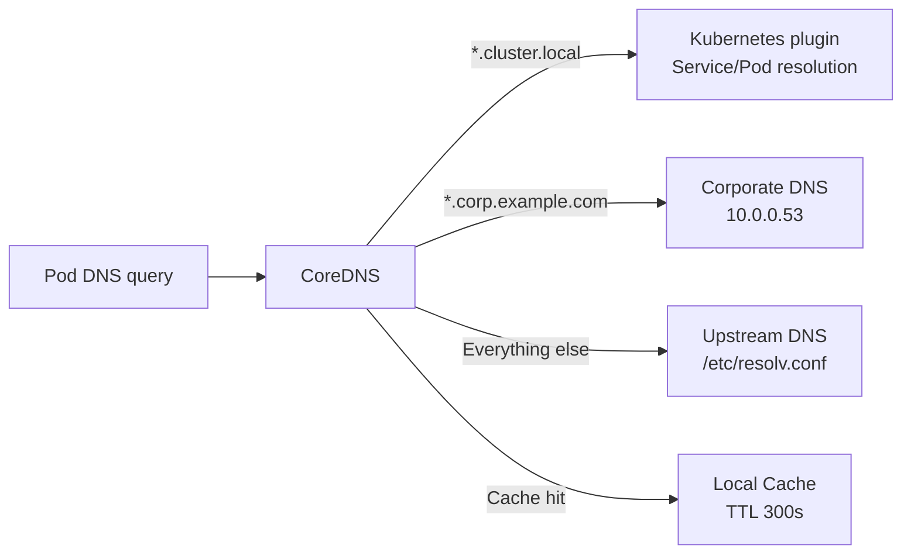

> 💡 **Quick Answer:** Edit the `coredns` ConfigMap in `kube-system` to add forward zones, rewrite rules, and cache settings. Use `forward . /etc/resolv.conf` for external DNS and `forward corp.example.com 10.0.0.53` for internal domains.

## The Problem

Default CoreDNS configuration resolves cluster services and forwards everything else to the node's upstream DNS. Production clusters need custom forward zones for internal domains, split-horizon DNS, cache tuning for performance, and rewrite rules for service migration.

## The Solution

### CoreDNS ConfigMap

```yaml
apiVersion: v1
kind: ConfigMap
metadata:
  name: coredns
  namespace: kube-system
data:
  Corefile: |
    .:53 {
        errors
        health {
            lameduck 5s
        }
        ready
        kubernetes cluster.local in-addr.arpa ip6.arpa {
            pods insecure
            fallthrough in-addr.arpa ip6.arpa
            ttl 30
        }
        # Forward internal domains to corporate DNS
        forward corp.example.com 10.0.0.53 10.0.0.54 {
            policy round_robin
        }
        # Rewrite old service names to new ones
        rewrite name old-api.production.svc.cluster.local new-api.production.svc.cluster.local
        # Tune cache for performance
        cache 300 {
            success 9984 300
            denial 9984 30
        }
        # External DNS resolution
        forward . /etc/resolv.conf {
            max_concurrent 1000
        }
        prometheus :9153
        loop
        reload
        loadbalance
    }
```

### Verify DNS Resolution

```bash
# Test from a debug pod
kubectl run dnstest --image=busybox:1.36 --rm -it -- nslookup kubernetes.default.svc.cluster.local

# Test external resolution
kubectl run dnstest --image=busybox:1.36 --rm -it -- nslookup example.com

# Test custom forward zone
kubectl run dnstest --image=busybox:1.36 --rm -it -- nslookup app.corp.example.com
```



## Common Issues

**DNS resolution timeout (5-second delays)**

Check for conntrack race condition (`dnat` races). Enable `autopath` plugin or switch to NodeLocal DNS Cache.

**Custom forward zone not working**

Ensure the `forward` directive is inside the correct server block. Restart CoreDNS pods after ConfigMap changes: `kubectl rollout restart deployment coredns -n kube-system`.

## Best Practices

- **Cache TTL 300s** for external queries — reduces upstream DNS load
- **Separate forward blocks** for internal domains — don't mix with default forwarder
- **`max_concurrent 1000`** on forward — prevents DNS queue buildup under load
- **Monitor with Prometheus** — CoreDNS exposes request/error/cache metrics on :9153
- **Use `autopath`** to reduce search domain lookups — 4-5x fewer DNS queries per pod

## Key Takeaways

- CoreDNS is configured via ConfigMap in kube-system — edit and restart to apply
- Forward zones send specific domains to corporate/internal DNS servers
- Cache tuning (300s success, 30s denial) significantly reduces DNS latency
- Rewrite rules enable transparent service migration without client changes
- Monitor CoreDNS metrics via Prometheus — DNS is the most common silent failure point
