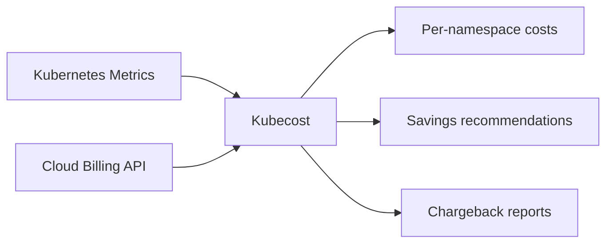

> 💡 **Quick Answer:** Monitor and optimize Kubernetes costs with Kubecost. Track per-namespace and per-deployment spend with cloud billing integration and savings tips.

## The Problem

Engineers frequently search for this topic but find scattered, incomplete guides. This recipe provides a comprehensive, production-ready reference.

## The Solution

### Install Kubecost

```bash
helm repo add kubecost https://kubecost.github.io/cost-analyzer
helm install kubecost kubecost/cost-analyzer \
  --namespace kubecost --create-namespace \
  --set kubecostToken="<free-token-from-kubecost.com>"
```

### Access Dashboard

```bash
kubectl port-forward -n kubecost svc/kubecost-cost-analyzer 9090:9090
# Open http://localhost:9090
```

### Key Cost Views

| View | Shows | Use for |
|------|-------|---------|
| Allocation | Cost per namespace/deployment/label | Chargeback to teams |
| Assets | Cost per node/disk/LB | Infrastructure optimization |
| Savings | Right-sizing + idle resources | Quick wins |
| Health | Cluster efficiency score | Executive reporting |

### Cost Optimization Quick Wins

```bash
# 1. Find over-provisioned workloads (Kubecost Savings page)
# Shows: "Reduce web-app CPU request from 1000m to 200m → save $45/mo"

# 2. Find idle namespaces
# Namespaces with <5% CPU utilization for 7+ days

# 3. Spot instance candidates
# Stateless workloads that can tolerate interruption
```

```yaml
# Add cost allocation labels
metadata:
  labels:
    team: platform
    environment: production
    cost-center: engineering
```



## Frequently Asked Questions

### Is Kubecost free?

The open-source version is free for a single cluster with 15 days of data. The commercial version adds multi-cluster, longer retention, SSO, and cloud integration.


## Best Practices

- Start with the simplest approach that solves your problem
- Test thoroughly in staging before production
- Monitor and iterate based on real metrics
- Document decisions for your team

## Key Takeaways

- This is essential Kubernetes operational knowledge
- Production-readiness requires proper configuration and monitoring
- Use `kubectl describe` and logs for troubleshooting
- Automate where possible to reduce human error
