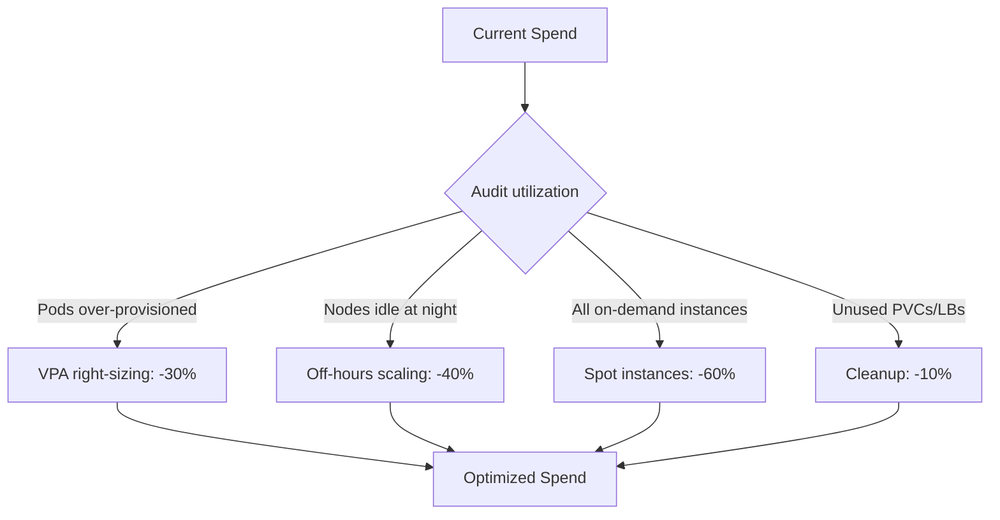

> 💡 **Quick Answer:** Reduce Kubernetes cloud costs by 30-60 percent. Covers right-sizing, spot instances, cluster autoscaler tuning, resource quotas, and FinOps practices.

## The Problem

Most Kubernetes clusters are 30-60% over-provisioned. Developers request more resources than needed, nodes sit idle during off-hours, and nobody reviews actual utilization.

## The Solution

### Step 1: Measure Current Waste

```bash
# Compare requested vs actual usage
kubectl top pods -A --sort-by=cpu | head -20

# Find over-provisioned pods (requests >> actual)
kubectl top pods -A --no-headers | awk '{
  split($3,cpu,"m"); split($4,mem,"Mi");
  if (cpu[1] < 10 && mem[1] < 50) print $1"/"$2" - barely using resources"
}'

# Node-level utilization
kubectl top nodes
# If nodes are <40% utilized, you're overpaying
```

### Step 2: Right-Size with VPA

```yaml
apiVersion: autoscaling.k8s.io/v1
kind: VerticalPodAutoscaler
metadata:
  name: myapp-vpa
spec:
  targetRef:
    apiVersion: apps/v1
    kind: Deployment
    name: myapp
  updatePolicy:
    updateMode: "Off"    # Start with recommendations only
  resourcePolicy:
    containerPolicies:
      - containerName: myapp
        controlledResources: ["cpu", "memory"]
        minAllowed:
          cpu: 10m
          memory: 32Mi
        maxAllowed:
          cpu: "2"
          memory: 4Gi
```

```bash
# Check VPA recommendations
kubectl describe vpa myapp-vpa
# Recommendation:
#   Container: myapp
#     Lower Bound:   10m CPU, 64Mi memory
#     Target:        50m CPU, 128Mi memory    ← Use this
#     Upper Bound:   200m CPU, 512Mi memory
#     Uncapped Target: 50m CPU, 128Mi memory
```

### Step 3: Spot/Preemptible Instances

```yaml
# Node pool for spot instances (70% cheaper)
apiVersion: cluster.x-k8s.io/v1beta1
kind: MachineDeployment
metadata:
  name: spot-workers
spec:
  replicas: 10
  template:
    spec:
      infrastructureRef:
        kind: AWSMachineTemplate
        name: spot-template
---
# Schedule tolerant workloads to spot nodes
apiVersion: apps/v1
kind: Deployment
metadata:
  name: batch-processor
spec:
  template:
    spec:
      nodeSelector:
        node.kubernetes.io/instance-type: spot
      tolerations:
        - key: kubernetes.io/spot
          operator: Exists
      topologySpreadConstraints:
        - maxSkew: 1
          topologyKey: topology.kubernetes.io/zone
          whenUnsatisfiable: ScheduleAnyway
```

### Step 4: Scale Down Off-Hours

```yaml
# CronJob to scale down at night
apiVersion: batch/v1
kind: CronJob
metadata:
  name: scale-down-night
spec:
  schedule: "0 20 * * 1-5"    # 8PM weekdays
  jobTemplate:
    spec:
      template:
        spec:
          containers:
            - name: scaler
              image: bitnami/kubectl:latest
              command:
                - /bin/sh
                - -c
                - |
                  kubectl scale deployment -n staging --all --replicas=0
                  kubectl scale deployment -n dev --all --replicas=0
          restartPolicy: OnFailure
---
apiVersion: batch/v1
kind: CronJob
metadata:
  name: scale-up-morning
spec:
  schedule: "0 7 * * 1-5"     # 7AM weekdays
  jobTemplate:
    spec:
      template:
        spec:
          containers:
            - name: scaler
              image: bitnami/kubectl:latest
              command:
                - /bin/sh
                - -c
                - |
                  kubectl scale deployment -n staging --all --replicas=1
                  kubectl scale deployment -n dev --all --replicas=1
          restartPolicy: OnFailure
```

### Cost Optimization Checklist

| Action | Typical Savings | Effort |
|--------|----------------|--------|
| Right-size pods (VPA) | 20-40% | Low |
| Use spot instances | 60-70% on those nodes | Medium |
| Scale down off-hours | 30-50% on dev/staging | Low |
| Cluster autoscaler tuning | 10-20% | Low |
| Delete unused PVCs | 5-10% on storage | Low |
| Use ARM instances | 20-30% | Medium |



## Best Practices

- **Start with observation** — measure before optimizing
- **Automate** — manual processes don't scale
- **Iterate** — implement changes gradually and measure impact
- **Document** — keep runbooks for your team

## Key Takeaways

- This is a critical capability for production Kubernetes clusters
- Start with the simplest approach and evolve as needed
- Monitor and measure the impact of every change
- Share knowledge across your team with internal documentation
