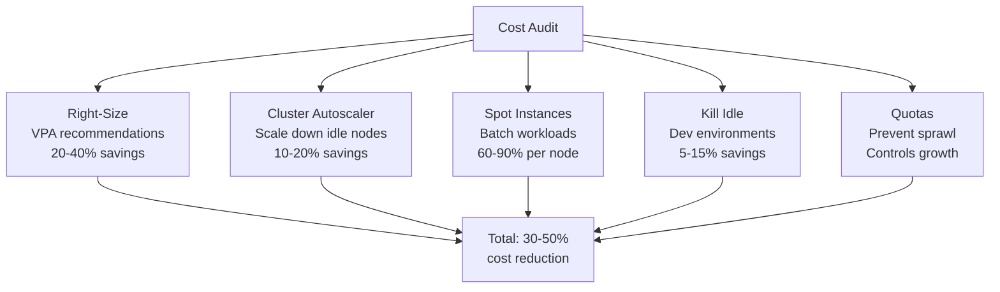

> 💡 **Quick Answer:** Start with VPA recommendations to right-size requests (30% savings typical), enable cluster autoscaler with `--scale-down-unneeded-time=10m`, use spot/preemptible nodes for batch workloads (60-90% cheaper), and set ResourceQuotas per namespace to prevent sprawl.

## The Problem

Kubernetes clusters are typically 30-60% over-provisioned: developers request more resources than needed, nodes sit idle overnight, and no one tracks actual utilization. Cloud bills grow linearly with cluster size, but actual utilization stays flat.

## The Solution

### 1. Right-Size with VPA Recommendations

```bash
# Install VPA in recommendation mode
# Then check recommendations for all deployments
kubectl get vpa -A -o custom-columns=\
  'NAMESPACE:.metadata.namespace,NAME:.metadata.name,CONTAINER:.status.recommendation.containerRecommendations[0].containerName,CPU_TARGET:.status.recommendation.containerRecommendations[0].target.cpu,MEM_TARGET:.status.recommendation.containerRecommendations[0].target.memory'
```

Typical findings: services requesting 1 CPU / 1Gi are actually using 50m / 128Mi.

### 2. Cluster Autoscaler Tuning

```yaml
# Cluster Autoscaler ConfigMap
apiVersion: v1
kind: ConfigMap
metadata:
  name: cluster-autoscaler-config
data:
  scale-down-enabled: "true"
  scale-down-unneeded-time: "10m"
  scale-down-utilization-threshold: "0.5"
  skip-nodes-with-local-storage: "false"
  skip-nodes-with-system-pods: "true"
  max-graceful-termination-sec: "600"
```

Key: `scale-down-utilization-threshold: 0.5` — scale down nodes below 50% utilization. Default is 0.5, but many clusters set it too high.

### 3. Spot/Preemptible Node Pools

```yaml
# Separate node pool for batch workloads
apiVersion: v1
kind: Node
metadata:
  labels:
    node.kubernetes.io/instance-type: spot
    workload-type: batch
  annotations:
    cluster-autoscaler.kubernetes.io/safe-to-evict: "true"
```

Use taints + tolerations to direct batch workloads to spot nodes:
```yaml
# On spot nodes
taints:
  - key: workload-type
    value: spot
    effect: NoSchedule

# On batch workload pods
tolerations:
  - key: workload-type
    value: spot
    effect: NoSchedule
```

### 4. Idle Workload Detection

```bash
# Find pods using <10% of requested CPU
kubectl top pods -A --sort-by=cpu | awk 'NR>1 {
  split($3, cpu, "m");
  if (cpu[1] < 10) print $1, $2, $3, $4
}'

# Find deployments with 0 traffic (no network I/O)
kubectl get pods -A -o json | jq -r '
  .items[] | select(.status.phase=="Running") |
  "\(.metadata.namespace)/\(.metadata.name)"
' | while read pod; do
  RX=$(kubectl exec -n ${pod%/*} ${pod#*/} -- cat /sys/class/net/eth0/statistics/rx_bytes 2>/dev/null || echo 0)
  echo "$pod: $RX bytes received"
done
```

### 5. Namespace Cost Allocation

```yaml
# ResourceQuota with cost awareness
apiVersion: v1
kind: ResourceQuota
metadata:
  name: team-budget
  namespace: team-alpha
  labels:
    cost-center: "engineering"
spec:
  hard:
    requests.cpu: "16"
    requests.memory: 32Gi
    requests.nvidia.com/gpu: "4"
```

### Cost Savings Summary

| Strategy | Typical Savings | Effort |
|----------|----------------|--------|
| Right-sizing (VPA) | 20-40% | Low |
| Cluster autoscaler tuning | 10-20% | Low |
| Spot instances (batch) | 60-90% per node | Medium |
| Idle workload cleanup | 5-15% | Low |
| Namespace quotas | Prevents growth | Medium |
| Reserved instances (steady state) | 30-40% | Low |



## Common Issues

**Cluster autoscaler won't scale down**

Check: PDBs blocking eviction, pods with local storage, system pods on the node, or pods without owner references.

**Spot instance interruption kills long-running jobs**

Use checkpointing for training jobs. For inference, maintain min replicas on on-demand nodes.

## Best Practices

- **VPA in `Off` mode first** — get recommendations before changing anything
- **Right-size before autoscaling** — over-provisioned pods make autoscaler add unnecessary nodes
- **Spot for batch, on-demand for serving** — separate node pools with taints
- **Monthly cost reviews** — Kubernetes resource usage drifts over time
- **Labels for cost allocation** — `cost-center`, `team`, `environment` on all resources

## Key Takeaways

- Right-sizing with VPA recommendations is the highest-impact, lowest-effort optimization
- Cluster autoscaler needs tuning — default settings are conservative
- Spot instances save 60-90% for fault-tolerant workloads
- Namespace quotas prevent unchecked resource growth
- Combine all strategies for 30-50% total cloud cost reduction
