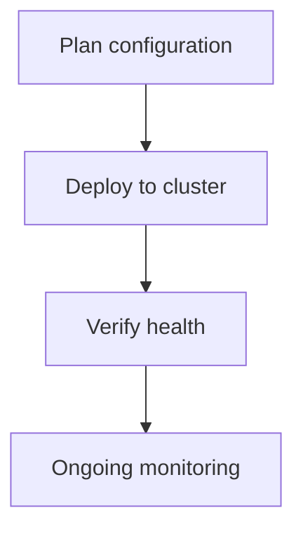

> 💡 **Quick Answer:** Design and implement Kubernetes Custom Resource Definitions. Schema validation, status subresource, printer columns, conversion webhooks, and versioning strategies.

## The Problem

Production Kubernetes environments need crd development best practices for reliability, security, and operational efficiency. Without proper configuration, teams face downtime, security gaps, or operational overhead.

## The Solution

### Configuration

```yaml
# CRD Development Best Practices configuration
apiVersion: v1
kind: ConfigMap
metadata:
  name: kubernetes-crd-development-guide-config
data:
  config.yaml: |
    enabled: true
```

### Deployment Steps

```bash
# Apply configuration
kubectl apply -f kubernetes-crd-development-guide.yaml

# Verify
kubectl get all -l app=crd-development-guide
```



## Common Issues

**Resources not created**

Check RBAC permissions and namespace exists. Use `kubectl auth can-i create <resource>` to verify.

**Configuration drift**

Use GitOps (ArgoCD/Flux) to prevent manual changes from diverging from desired state.

## Best Practices

- Test in staging before production
- Version all configuration in Git
- Monitor metrics after deployment
- Document operational procedures
- Automate with CI/CD pipelines

## Key Takeaways

- CRD Development Best Practices improves Kubernetes operational maturity
- Start simple, iterate based on real-world experience
- Combine with observability for full visibility
- Automate repetitive operations
- Keep security as a first-class concern
