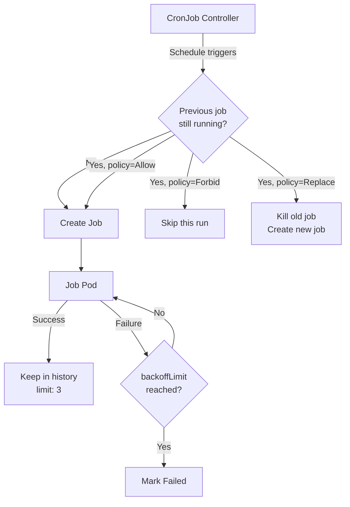

> 💡 **Quick Answer:** Set `concurrencyPolicy: Forbid` to prevent overlapping runs, `startingDeadlineSeconds: 200` to handle missed schedules, `successfulJobsHistoryLimit: 3`, and always define resource requests/limits on job pods.

## The Problem

CronJobs in Kubernetes can silently fail, overlap, or accumulate stale pods without proper configuration. Common issues include jobs piling up when previous runs haven't finished, missed schedules after controller restarts, and unbounded resource consumption from forgotten jobs.

## The Solution

```yaml
apiVersion: batch/v1
kind: CronJob
metadata:
  name: database-backup
  namespace: production
spec:
  schedule: "0 2 * * *"
  timeZone: "Europe/Rome"
  concurrencyPolicy: Forbid
  startingDeadlineSeconds: 200
  successfulJobsHistoryLimit: 3
  failedJobsHistoryLimit: 3
  suspend: false
  jobTemplate:
    spec:
      backoffLimit: 3
      activeDeadlineSeconds: 3600
      ttlSecondsAfterFinished: 86400
      template:
        spec:
          restartPolicy: OnFailure
          containers:
            - name: backup
              image: registry.example.com/backup-tool:1.2.0
              resources:
                requests:
                  cpu: 100m
                  memory: 256Mi
                limits:
                  cpu: 500m
                  memory: 512Mi
              env:
                - name: BACKUP_TARGET
                  value: "s3://backups/daily"
```

### Concurrency Policies

| Policy | Behavior | Use Case |
|--------|----------|----------|
| `Allow` | Multiple jobs run simultaneously | Idempotent tasks (metrics collection) |
| `Forbid` | Skip new run if previous is still active | Database backups, reports |
| `Replace` | Kill previous job, start new one | Cache warming, data refresh |

### Key Fields

- **`startingDeadlineSeconds: 200`** — If the scheduler misses a run (controller restart, node pressure), it will still start the job if less than 200 seconds have passed. Without this, missed jobs are silently dropped.
- **`activeDeadlineSeconds: 3600`** — Kill the job after 1 hour regardless of status. Prevents runaway jobs.
- **`ttlSecondsAfterFinished: 86400`** — Auto-cleanup completed job pods after 24 hours.
- **`timeZone`** — Requires K8s 1.27+. Without it, schedules use the kube-controller-manager timezone (usually UTC).



## Common Issues

**Jobs pile up — dozens of completed pods**

Set `successfulJobsHistoryLimit: 3` and `ttlSecondsAfterFinished`. Without these, completed pods accumulate forever.

**CronJob never runs after cluster upgrade**

Check `startingDeadlineSeconds`. If the controller was down longer than this value, all missed schedules are dropped. Set to at least 2× your schedule interval.

**Job runs at wrong time**

Use `timeZone` field (K8s 1.27+) or verify kube-controller-manager timezone. DST transitions can shift UTC-based schedules.

## Best Practices

- **Always set `concurrencyPolicy`** — default `Allow` is rarely what you want
- **Set `activeDeadlineSeconds`** as a safety net — no job should run forever
- **Use `ttlSecondsAfterFinished`** to auto-cleanup — don't rely on history limits alone
- **Define resource requests/limits** on job pods — prevent noisy-neighbor issues
- **Set `backoffLimit: 3`** — default is 6, which can waste resources on unrecoverable failures
- **Monitor with `kubectl get cronjobs`** — check LAST SCHEDULE and ACTIVE columns

## Key Takeaways

- `concurrencyPolicy: Forbid` prevents overlapping runs — essential for non-idempotent tasks
- `startingDeadlineSeconds` recovers from missed schedules — always set it
- `timeZone` field (K8s 1.27+) avoids UTC confusion
- `ttlSecondsAfterFinished` + history limits prevent pod accumulation
- `activeDeadlineSeconds` is your safety net against runaway jobs
