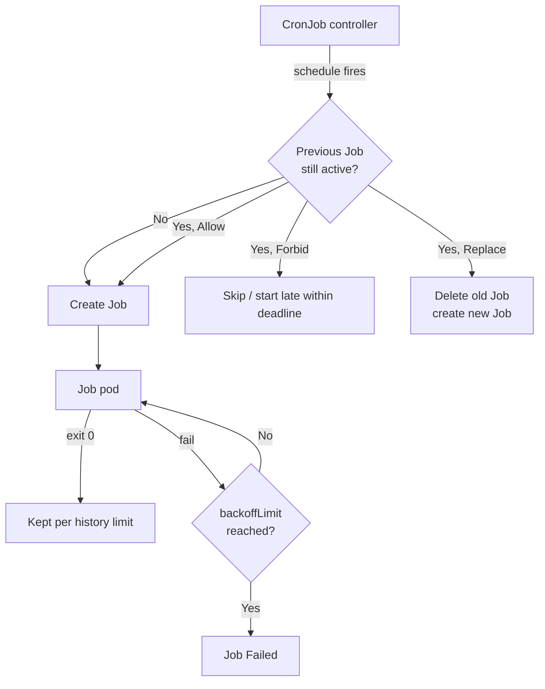

> 💡 **Quick Answer:** A CronJob creates a Job on a cron schedule: `schedule: "0 2 * * *"` (02:00 daily) with `timeZone: "Europe/Rome"` (GA 1.27). Production defaults: `concurrencyPolicy: Forbid` (no overlapping runs), `startingDeadlineSeconds` (cap how late a missed run may start), `successfulJobsHistoryLimit: 3` / `failedJobsHistoryLimit: 3`, `activeDeadlineSeconds` and `backoffLimit` on the Job, and resource requests. Run it now: `kubectl create job --from=cronjob/<name> manual-1`. Pause: `spec.suspend: true`.

## Production CronJob

```yaml
apiVersion: batch/v1
kind: CronJob
metadata:
  name: database-backup
  namespace: production
spec:
  schedule: "0 2 * * *"              # 02:00 daily
  timeZone: "Europe/Rome"            # IANA name; GA since 1.27
  concurrencyPolicy: Forbid          # skip if the previous run is still active
  startingDeadlineSeconds: 600       # a missed run may start up to 10 min late, else skipped
  suspend: false
  successfulJobsHistoryLimit: 3      # default 3
  failedJobsHistoryLimit: 3          # default 1
  jobTemplate:
    metadata:
      labels:
        cronjob: database-backup     # makes the Jobs easy to select
    spec:
      backoffLimit: 3                # default 6
      activeDeadlineSeconds: 3600    # kill the whole Job after 1h
      template:
        metadata:
          labels:
            cronjob: database-backup
        spec:
          restartPolicy: OnFailure
          serviceAccountName: backup-sa
          containers:
            - name: backup
              image: registry.example.com/backup-tool:1.2.0
              command: ["/backup.sh"]
              env:
                - name: S3_BUCKET
                  valueFrom:
                    secretKeyRef:
                      name: backup-secrets
                      key: bucket
              resources:
                requests: {cpu: 100m, memory: 256Mi}
                limits: {memory: 512Mi}
```

Don't set `ttlSecondsAfterFinished` on CronJob-managed Jobs unless you want them deleted before the history limits apply — TTL deletes the Job, and history limits then have nothing to keep. Pick one mechanism (history limits for CronJobs, TTL for standalone Jobs).

## Cron Schedule Syntax

```text
┌───────── minute (0-59)
│ ┌─────── hour (0-23)
│ │ ┌───── day of month (1-31)
│ │ │ ┌─── month (1-12)
│ │ │ │ ┌─ day of week (0-6, Sun=0; 7 also Sun)
│ │ │ │ │
* * * * *
```

| Schedule | Meaning |
|---------|---------|
| `*/5 * * * *` | Every 5 minutes |
| `0 * * * *` | Every hour |
| `0 */6 * * *` | Every 6 hours |
| `0 2 * * *` | Daily at 02:00 |
| `30 8 * * 1-5` | Weekdays at 08:30 |
| `0 9,17 * * 1-5` | 09:00 and 17:00 on weekdays |
| `0 0 1,15 * *` | 1st and 15th of the month |
| `0 0 1 * *` | Midnight on the 1st |
| `@hourly` / `@daily` / `@weekly` / `@monthly` | Shorthands |

`CRON_TZ=` / `TZ=` prefixes in `schedule` were never supported and are rejected by validation since 1.29 — use `spec.timeZone`. Without `timeZone`, the schedule is interpreted in the kube-controller-manager's time zone (UTC on almost every distribution, including OpenShift and managed clouds). With `timeZone`, DST is handled: a 02:30 job may be skipped or run twice on DST change days in zones that shift at 02:00.

## Concurrency Policy

| Policy | Previous run still active when the schedule fires | Use for |
|--------|----------|----------|
| `Allow` (default) | New Job starts alongside it | Idempotent, independent runs |
| `Forbid` | New run skipped (or started late within `startingDeadlineSeconds`) | Backups, reports, anything holding locks |
| `Replace` | Running Job deleted, new one started | Cache refresh, "latest wins" syncs |

Details, event names and failure modes: [CronJob concurrencyPolicy](/recipes/deployments/cronjob-concurrency-policy/).


```mermaid
graph TD
    CRON[CronJob controller] -->|schedule fires| CHECK{Previous Job<br/>still active?}
    CHECK -->|No| CREATE[Create Job]
    CHECK -->|Yes, Forbid| SKIP[Skip / start late within deadline]
    CHECK -->|Yes, Replace| KILL[Delete old Job<br/>create new Job]
    CHECK -->|Yes, Allow| CREATE
    CREATE --> POD[Job pod]
    POD -->|exit 0| HIST[Kept per history limit]
    POD -->|fail| RETRY{backoffLimit<br/>reached?}
    RETRY -->|No| POD
    RETRY -->|Yes| FAIL[Job Failed]
```

## startingDeadlineSeconds and Missed Runs

- **Not set** (default): after a controller outage or a `Forbid` block, the controller starts the **most recent** missed run as soon as it can — potentially hours late. If it counts more than 100 missed schedules it logs "too many missed start times" and doesn't start the Job.
- **Set**: a missed run is started only if it's less than `startingDeadlineSeconds` late; otherwise it's skipped with a `MissSchedule` event. It also bounds the 100-missed-schedules check to that window.
- Don't set it below ~10 s — the controller syncs roughly every 10 s and may never start the Job.

Pick a value that matches "how late is still useful": a nightly backup can start 1 h late; a 5-minute metrics push shouldn't.

## Manage CronJobs

```bash
kubectl get cronjobs -n production
# NAME              SCHEDULE    TIMEZONE      SUSPEND   ACTIVE   LAST SCHEDULE   AGE
# database-backup   0 2 * * *   Europe/Rome   False     0        8h              30d

kubectl describe cronjob database-backup -n production     # events: SuccessfulCreate, SawCompletedJob, JobAlreadyActive, MissSchedule

# Run now, outside the schedule
kubectl create job --from=cronjob/database-backup manual-backup-$(date +%s) -n production

# Pause / resume without deleting
kubectl patch cronjob database-backup -n production -p '{"spec":{"suspend":true}}'
kubectl patch cronjob database-backup -n production -p '{"spec":{"suspend":false}}'

# Jobs created by this CronJob (label from jobTemplate.metadata)
kubectl get jobs -n production -l cronjob=database-backup --sort-by=.metadata.creationTimestamp
kubectl logs -n production job/<job-name>

# Create one imperatively
kubectl create cronjob hourly-cleanup --image=busybox:1.36 --schedule="0 * * * *" -- /bin/sh -c "echo cleanup"

# Deleting the CronJob also deletes the Jobs and pods it owns
kubectl delete cronjob database-backup -n production
```

Resuming a suspended CronJob counts the schedules missed while suspended as missed runs — with no `startingDeadlineSeconds` the most recent one starts immediately.

## Monitoring

Alert on outcomes, not just pod failures. With kube-state-metrics:

```yaml
# Last successful run older than 26h for a daily job
- alert: CronJobNotSucceeding
  expr: time() - max by (namespace, cronjob) (kube_cronjob_status_last_successful_time) > 26 * 3600
  for: 10m
# Any failed Job
- alert: KubeJobFailed
  expr: kube_job_status_failed > 0
  for: 5m
```

`kube_cronjob_status_last_successful_time` needs Kubernetes 1.25+ and a recent kube-state-metrics.

## Patterns

```yaml
# Database cleanup — never overlap
apiVersion: batch/v1
kind: CronJob
metadata:
  name: db-cleanup
spec:
  schedule: "0 3 * * *"
  concurrencyPolicy: Forbid
  jobTemplate:
    spec:
      activeDeadlineSeconds: 1800
      template:
        spec:
          restartPolicy: Never
          containers:
            - name: cleanup
              image: postgres:16
              env:
                - name: PGHOST
                  value: postgres.production.svc
                - name: PGUSER
                  valueFrom: {secretKeyRef: {name: db-credentials, key: username}}
                - name: PGPASSWORD
                  valueFrom: {secretKeyRef: {name: db-credentials, key: password}}
              command: ["psql", "-d", "app", "-c", "DELETE FROM logs WHERE created_at < NOW() - INTERVAL '30 days'"]
---
# Weekly report in local time
apiVersion: batch/v1
kind: CronJob
metadata:
  name: weekly-report
spec:
  schedule: "0 9 * * 1"
  timeZone: "Europe/Rome"
  jobTemplate:
    spec:
      backoffLimit: 2
      template:
        spec:
          restartPolicy: OnFailure
          containers:
            - name: report
              image: report-gen:v3
              env:
                - name: REPORT_TYPE
                  value: weekly
```

## Common Issues

**CronJob never ran** — `suspend: true`; `startingDeadlineSeconds` too small; schedule in UTC when you meant local time; or a `Forbid` Job stuck active. Check `kubectl describe cronjob` events and `ACTIVE`.

**Two runs at the same time** — default `Allow`. Set `Forbid` or `Replace`.

**Run started hours late after an outage** — no `startingDeadlineSeconds`; the most recent missed run was caught up. Set a deadline.

**Hundreds of completed Jobs/pods** — history limits raised or TTL missing on standalone Jobs. Keep limits at 1–5.

**Job runs at the wrong hour** — no `timeZone`, controller runs in UTC. Add `timeZone` (1.27+).

**Job retries forever** — `backoffLimit` default is 6 with exponential backoff (10 s, 20 s, 40 s … capped at 6 min). Lower it and add `activeDeadlineSeconds`.

## Best Practices

- **Set `concurrencyPolicy` explicitly** — the `Allow` default is rarely what you want
- **Set `activeDeadlineSeconds`** — no scheduled job should run forever or block the next `Forbid` run
- **Set `startingDeadlineSeconds`** to the latest start that is still useful
- **Make jobs idempotent** — retries, manual runs and late starts all re-execute
- **Requests on every job pod** — batch spikes are the classic noisy neighbour
- **`restartPolicy: Never`** when you need failed pods kept for logs; `OnFailure` for in-place retries
- **Label `jobTemplate.metadata`** so Jobs are selectable
- **Alert on last successful time**, not only on failures

## Frequently Asked Questions

### How do I set a timezone for a Kubernetes CronJob?

Set `spec.timeZone` to an IANA name such as `America/New_York` or `Europe/London` (stable since 1.27). Without it, the schedule uses the kube-controller-manager's time zone, normally UTC.

### Why did my CronJob miss a run?

The run was later than `startingDeadlineSeconds`, a previous Job was still active with `concurrencyPolicy: Forbid`, the CronJob was suspended, or the controller counted more than 100 missed schedules. `kubectl describe cronjob` shows `MissSchedule` or `JobAlreadyActive` events.

### How do I trigger a CronJob manually?

`kubectl create job --from=cronjob/<cronjob-name> <new-job-name>`. It creates a one-off Job from the CronJob's `jobTemplate` and doesn't affect the schedule.

### How do I pause or disable a CronJob?

`kubectl patch cronjob <name> -p '{"spec":{"suspend":true}}'`. Running Jobs continue; no new ones are created until you set `suspend: false`.

### What's the default history limit?

`successfulJobsHistoryLimit: 3` and `failedJobsHistoryLimit: 1`. Older finished Jobs (and their pods) are deleted automatically.
