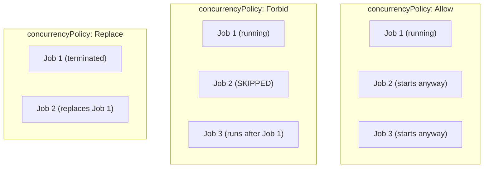

> 💡 **Quick Answer:** \`concurrencyPolicy\` controls what happens when a CronJob triggers while a previous run is still active. \`Allow\` (default) lets jobs overlap. \`Forbid\` skips the new run. \`Replace\` terminates the old run and starts a new one.

## The Problem

CronJobs that take longer than their schedule interval create overlapping runs. A backup job scheduled every 5 minutes that takes 7 minutes will pile up concurrent instances, competing for resources and potentially corrupting data. The \`concurrencyPolicy\` field controls this behavior.



## The Solution

### Allow (Default)

Multiple jobs can run simultaneously:

```yaml
apiVersion: batch/v1
kind: CronJob
metadata:
  name: data-sync
spec:
  schedule: "*/5 * * * *"         # Every 5 minutes
  concurrencyPolicy: Allow        # Default — jobs can overlap
  jobTemplate:
    spec:
      template:
        spec:
          containers:
            - name: sync
              image: busybox
              command: ["sh", "-c", "echo syncing; sleep 600"]
          restartPolicy: Never
```

**Use when:** Each job run is independent and idempotent (e.g., sending notifications, collecting metrics).

### Forbid

Skip the new run if the previous one is still active:

```yaml
apiVersion: batch/v1
kind: CronJob
metadata:
  name: database-backup
spec:
  schedule: "0 * * * *"           # Every hour
  concurrencyPolicy: Forbid       # Skip if previous still running
  startingDeadlineSeconds: 300    # Allow 5-min late start
  jobTemplate:
    spec:
      activeDeadlineSeconds: 3600  # Kill if running > 1 hour
      template:
        spec:
          containers:
            - name: backup
              image: postgres:16
              command: ["pg_dump", "-h", "db", "-U", "admin", "mydb"]
          restartPolicy: Never
```

**Use when:** Only one instance should ever run (backups, migrations, cleanup jobs).

### Replace

Terminate the running job and start a new one:

```yaml
apiVersion: batch/v1
kind: CronJob
metadata:
  name: cache-refresh
spec:
  schedule: "*/10 * * * *"        # Every 10 minutes
  concurrencyPolicy: Replace      # Kill old, start new
  jobTemplate:
    spec:
      template:
        spec:
          containers:
            - name: refresh
              image: redis:7
              command: ["redis-cli", "BGSAVE"]
          restartPolicy: Never
```

**Use when:** Only the latest run matters and old runs are stale (cache refresh, report generation).

### Comparison Table

| Policy | Overlap? | Old Job | New Job | Use Case |
|--------|:--------:|---------|---------|----------|
| **Allow** | ✅ Yes | Keeps running | Starts | Independent, idempotent tasks |
| **Forbid** | ❌ No | Keeps running | Skipped | Mutual exclusion (backups, locks) |
| **Replace** | ❌ No | Terminated | Starts | Latest-wins (cache refresh) |

### Related CronJob Fields

```yaml
spec:
  schedule: "*/5 * * * *"
  concurrencyPolicy: Forbid

  # How many seconds late a job can start (from scheduled time)
  startingDeadlineSeconds: 200

  # Keep N successful/failed job history
  successfulJobsHistoryLimit: 3
  failedJobsHistoryLimit: 1

  # Suspend scheduling (pause without deleting)
  suspend: false

  jobTemplate:
    spec:
      # Kill job if running longer than this
      activeDeadlineSeconds: 3600

      # Retry failed pods up to N times
      backoffLimit: 3

      # Time-to-live cleanup after completion
      ttlSecondsAfterFinished: 300
```

### Monitor CronJob Behavior

```bash
# Check CronJob status
kubectl get cronjobs
# NAME              SCHEDULE      SUSPEND   ACTIVE   LAST SCHEDULE
# database-backup   0 * * * *     False     1        35m

# Check active jobs
kubectl get jobs --selector=job-name=database-backup

# Check if jobs were skipped (Forbid policy)
kubectl describe cronjob database-backup
# Events:
#   Warning  MissSchedule  Missed scheduled time ... because concurrencyPolicy is Forbid

# Watch job execution
kubectl get jobs -w
```

## Common Issues

| Issue | Cause | Fix |
|-------|-------|-----|
| Jobs piling up | \`Allow\` policy with slow jobs | Switch to \`Forbid\` or \`Replace\` |
| Jobs never start | Previous job stuck, policy is \`Forbid\` | Add \`activeDeadlineSeconds\` to kill stuck jobs |
| Data corruption | Concurrent jobs writing same resource | Use \`Forbid\` policy |
| Missing runs with \`Forbid\` | Jobs consistently exceed schedule | Increase interval or optimize job |
| CronJob stopped scheduling | >100 missed starts | Set \`startingDeadlineSeconds\` |

## Best Practices

- **Use \`Forbid\` for stateful operations** — backups, migrations, writes to shared resources
- **Use \`Replace\` for cache/report jobs** — latest run is the only one that matters
- **Set \`activeDeadlineSeconds\`** — prevents stuck jobs from blocking \`Forbid\` forever
- **Set \`startingDeadlineSeconds\`** — avoids CronJob controller giving up after 100 missed starts
- **Clean up history** — \`successfulJobsHistoryLimit: 3\` prevents orphaned job objects
- **Monitor with \`kubectl describe cronjob\`** — check for MissSchedule events

## Key Takeaways

- \`concurrencyPolicy\` controls overlapping CronJob runs: Allow, Forbid, or Replace
- \`Forbid\` skips new runs while old is active — safest for stateful operations
- \`Replace\` kills old run and starts new — ideal for latest-wins scenarios
- Always pair \`Forbid\` with \`activeDeadlineSeconds\` to prevent permanent blocking
- Default is \`Allow\` — explicitly set the policy for production CronJobs
