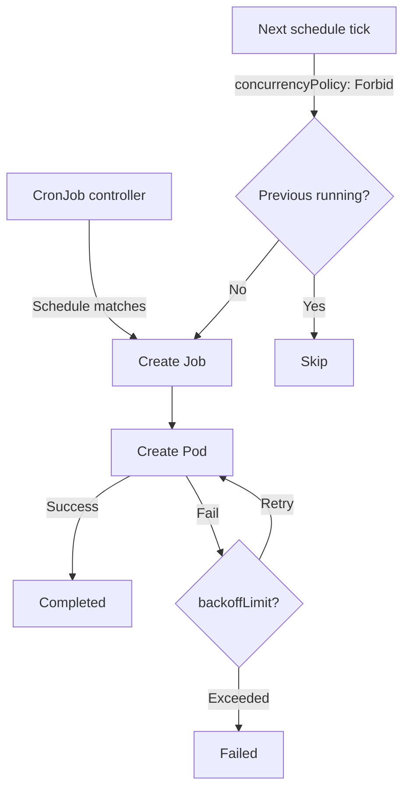

> 💡 **Quick Answer:** deployments

## The Problem

This is one of the most searched Kubernetes topics with thousands of monthly searches. A comprehensive, production-ready guide prevents hours of trial and error.

## The Solution

### CronJob Basics

```yaml
apiVersion: batch/v1
kind: CronJob
metadata:
  name: report-generator
spec:
  schedule: "30 8 * * 1"          # 8:30 AM every Monday
  timeZone: "America/New_York"    # K8s 1.27+
  concurrencyPolicy: Forbid
  suspend: false                   # Set true to pause
  successfulJobsHistoryLimit: 5
  failedJobsHistoryLimit: 3
  startingDeadlineSeconds: 600
  jobTemplate:
    spec:
      backoffLimit: 2
      activeDeadlineSeconds: 1800  # 30 min timeout
      template:
        spec:
          restartPolicy: OnFailure
          containers:
            - name: report
              image: report-gen:v1
              resources:
                requests:
                  cpu: 500m
                  memory: 512Mi
```

### Concurrency Policies

| Policy | Behavior |
|--------|----------|
| `Allow` (default) | Multiple jobs can run simultaneously |
| `Forbid` | Skip new job if previous still running |
| `Replace` | Kill running job, start new one |

```bash
# Manage CronJobs
kubectl get cronjobs
kubectl describe cronjob report-generator

# Manual trigger (bypass schedule)
kubectl create job --from=cronjob/report-generator manual-report

# Suspend / Resume
kubectl patch cronjob report-generator -p '{"spec":{"suspend":true}}'
kubectl patch cronjob report-generator -p '{"spec":{"suspend":false}}'

# Check recent jobs
kubectl get jobs --sort-by=.metadata.creationTimestamp
```

### Cron Syntax

```
┌───────── minute (0-59)
│ ┌─────── hour (0-23)
│ │ ┌───── day of month (1-31)
│ │ │ ┌─── month (1-12)
│ │ │ │ ┌─ day of week (0-6, Sun=0)
│ │ │ │ │
* * * * *
```

| Example | Meaning |
|---------|---------|
| `0 0 * * *` | Midnight daily |
| `*/15 * * * *` | Every 15 minutes |
| `0 9,17 * * 1-5` | 9AM and 5PM weekdays |
| `0 0 1,15 * *` | 1st and 15th of month |
| `@hourly` | Every hour (shorthand) |
| `@daily` | Once a day |
| `@weekly` | Once a week |



## Frequently Asked Questions

### Why did my CronJob miss a run?

Common causes: `startingDeadlineSeconds` exceeded, `concurrencyPolicy: Forbid` with still-running job, or `suspend: true`. Check with `kubectl describe cronjob`.

### CronJob timezone support?

Available since K8s 1.27 (stable). Use `spec.timeZone` with IANA timezone names like `Europe/London`, `America/New_York`. Without it, schedule uses kube-controller-manager's timezone (usually UTC).

## Best Practices

- Start with the simplest configuration that solves your problem
- Test in staging before production
- Use `kubectl describe` and events for troubleshooting
- Document team conventions for consistency

## Key Takeaways

- This is fundamental Kubernetes operational knowledge
- Follow established conventions and recommended labels
- Monitor and iterate based on real production behavior
- Automate repetitive tasks to reduce human error
