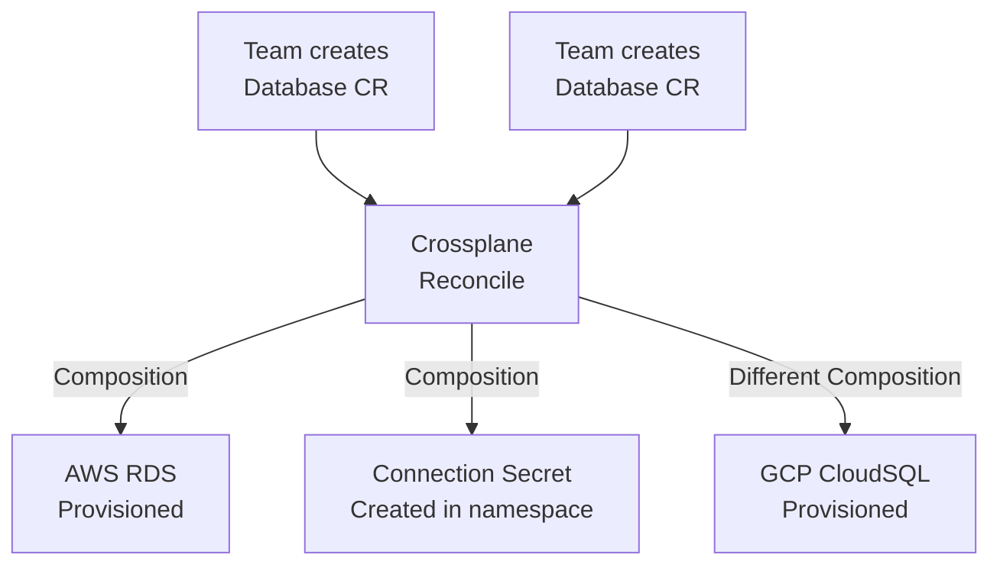

> 💡 **Quick Answer:** Install Crossplane and cloud providers (AWS, GCP, Azure). Define `CompositeResourceDefinitions` (XRDs) for your infrastructure API, and `Compositions` for implementation. Teams request infrastructure via standard Kubernetes CRs — Crossplane provisions cloud resources.

## The Problem

Terraform manages infrastructure but runs outside Kubernetes. Teams need to context-switch between kubectl and terraform, maintain separate CI/CD pipelines, and reconciliation is manual (terraform apply). Crossplane brings infrastructure management INTO Kubernetes — same API, same GitOps, same reconciliation loop.

## The Solution

### Install Crossplane

```bash
helm repo add crossplane-stable https://charts.crossplane.io/stable
helm install crossplane crossplane-stable/crossplane \
  --namespace crossplane-system --create-namespace

# Install AWS provider
kubectl apply -f - <<EOF
apiVersion: pkg.crossplane.io/v1
kind: Provider
metadata:
  name: provider-aws-s3
spec:
  package: xpkg.upbound.io/upbound/provider-aws-s3:v1.14.0
EOF
```

### Define Your API (XRD)

```yaml
apiVersion: apiextensions.crossplane.io/v1
kind: CompositeResourceDefinition
metadata:
  name: databases.platform.example.com
spec:
  group: platform.example.com
  names:
    kind: Database
    plural: databases
  versions:
    - name: v1alpha1
      served: true
      referenceable: true
      schema:
        openAPIV3Schema:
          type: object
          properties:
            spec:
              type: object
              properties:
                size:
                  type: string
                  enum: [small, medium, large]
                engine:
                  type: string
                  enum: [postgres, mysql]
```

### Composition (Implementation)

```yaml
apiVersion: apiextensions.crossplane.io/v1
kind: Composition
metadata:
  name: database-aws
spec:
  compositeTypeRef:
    apiVersion: platform.example.com/v1alpha1
    kind: Database
  resources:
    - name: rds-instance
      base:
        apiVersion: rds.aws.upbound.io/v1beta2
        kind: Instance
        spec:
          forProvider:
            engine: postgres
            engineVersion: "16"
            instanceClass: db.t3.medium
            allocatedStorage: 20
```

### Teams Request Infrastructure

```yaml
apiVersion: platform.example.com/v1alpha1
kind: Database
metadata:
  name: orders-db
  namespace: team-alpha
spec:
  size: medium
  engine: postgres
```



## Common Issues

**Provider not ready**: Check provider pod: `kubectl get pods -n crossplane-system`. Cloud credentials likely missing — create a `ProviderConfig` with credentials Secret.

**Composition not matching**: Verify `compositeTypeRef` in Composition matches XRD's `group` and `kind` exactly.

## Best Practices

- **XRDs as your platform API** — abstract cloud complexity for teams
- **Compositions per cloud provider** — same API, different implementations
- **GitOps integration** — Crossplane CRs are just Kubernetes YAML
- **Composition Functions** for complex logic — Golang/Python transformations
- **`deletionPolicy: Orphan`** for production — prevent accidental cloud resource deletion

## Key Takeaways

- Crossplane manages cloud infrastructure from within Kubernetes
- XRDs define your platform API; Compositions implement it per cloud
- Teams request infrastructure via standard Kubernetes CRs
- Same GitOps workflow for apps and infrastructure
- Continuous reconciliation — Crossplane detects and corrects drift automatically
