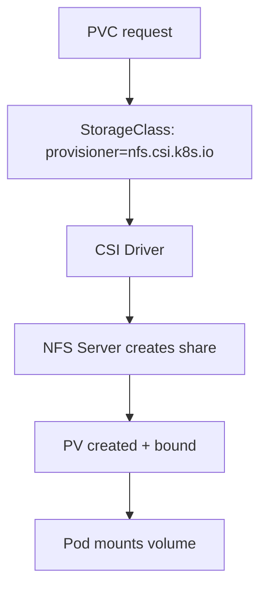

> 💡 **Quick Answer:** Understand Container Storage Interface (CSI) drivers in Kubernetes. Install and configure CSI drivers for AWS EBS, Azure Disk, NFS, and Ceph storage backends.

## The Problem

Engineers frequently search for this topic but find scattered, incomplete guides. This recipe provides a comprehensive, production-ready reference.

## The Solution

### What Is CSI?

Container Storage Interface (CSI) is the standard for exposing storage systems to Kubernetes. Each storage backend has its own CSI driver.

### Popular CSI Drivers

| Driver | Storage | Install |
|--------|---------|---------|
| aws-ebs-csi-driver | AWS EBS volumes | `helm install aws-ebs-csi-driver aws-ebs-csi-driver/aws-ebs-csi-driver` |
| azuredisk-csi-driver | Azure Managed Disks | Included in AKS |
| csi-driver-nfs | NFS shares | `helm install csi-driver-nfs csi-driver-nfs/csi-driver-nfs` |
| rook-ceph | Ceph distributed storage | `helm install rook-ceph rook-release/rook-ceph` |
| longhorn | Lightweight distributed | `helm install longhorn longhorn/longhorn` |
| local-path-provisioner | Local node storage | `kubectl apply -f rancher/local-path-provisioner` |

### Install NFS CSI Driver

```bash
helm repo add csi-driver-nfs https://raw.githubusercontent.com/kubernetes-csi/csi-driver-nfs/master/charts
helm install csi-driver-nfs csi-driver-nfs/csi-driver-nfs --namespace kube-system
```

```yaml
# StorageClass using NFS CSI
apiVersion: storage.k8s.io/v1
kind: StorageClass
metadata:
  name: nfs-csi
provisioner: nfs.csi.k8s.io
parameters:
  server: nfs.example.com
  share: /exports/k8s
reclaimPolicy: Delete
volumeBindingMode: Immediate
mountOptions:
  - nfsvers=4.1
```

### CSI Volume Snapshots

```yaml
# Create snapshot
apiVersion: snapshot.storage.k8s.io/v1
kind: VolumeSnapshot
metadata:
  name: db-snapshot
spec:
  volumeSnapshotClassName: csi-snapclass
  source:
    persistentVolumeClaimName: postgres-data
---
# Restore from snapshot
apiVersion: v1
kind: PersistentVolumeClaim
metadata:
  name: postgres-restored
spec:
  dataSource:
    name: db-snapshot
    kind: VolumeSnapshot
    apiGroup: snapshot.storage.k8s.io
  accessModes: [ReadWriteOnce]
  resources:
    requests:
      storage: 50Gi
```



## Frequently Asked Questions

### In-tree vs CSI drivers?

In-tree drivers (built into Kubernetes) are deprecated. All new storage integrations use CSI. Existing in-tree drivers are being migrated to CSI.


## Best Practices

- Start with the simplest approach that solves your problem
- Test thoroughly in staging before production
- Monitor and iterate based on real metrics
- Document decisions for your team

## Key Takeaways

- This is essential Kubernetes operational knowledge
- Production-readiness requires proper configuration and monitoring
- Use `kubectl describe` and logs for troubleshooting
- Automate where possible to reduce human error
