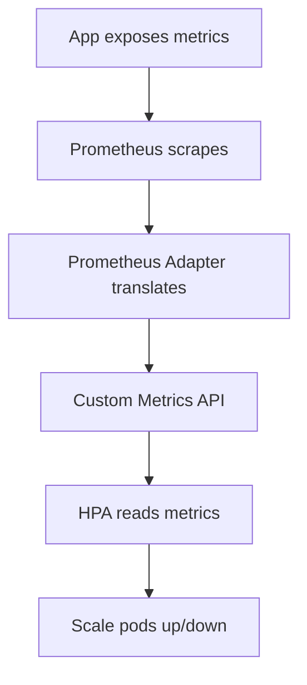

> 💡 **Quick Answer:** Scale Kubernetes pods on custom application metrics with Prometheus Adapter. Configure HPA with custom and external metrics beyond CPU and memory.

## The Problem

Engineers frequently search for this topic but find scattered, incomplete guides. This recipe provides a comprehensive, production-ready reference.

## The Solution

### Install Prometheus Adapter

```bash
helm repo add prometheus-community https://prometheus-community.github.io/helm-charts
helm install prometheus-adapter prometheus-community/prometheus-adapter \
  --namespace monitoring \
  --set prometheus.url=http://prometheus.monitoring.svc \
  --set prometheus.port=9090
```

### Configure Custom Metric Rules

```yaml
# Prometheus Adapter ConfigMap
rules:
  - seriesQuery: 'http_requests_total{namespace!="",pod!=""}'
    resources:
      overrides:
        namespace: {resource: "namespace"}
        pod: {resource: "pod"}
    name:
      matches: "^(.*)_total$"
      as: "${1}_per_second"
    metricsQuery: 'sum(rate(<<.Series>>{<<.LabelMatchers>>}[2m])) by (<<.GroupBy>>)'
```

### HPA with Custom Metrics

```yaml
apiVersion: autoscaling/v2
kind: HorizontalPodAutoscaler
metadata:
  name: api-hpa
spec:
  scaleTargetRef:
    apiVersion: apps/v1
    kind: Deployment
    name: api-server
  minReplicas: 2
  maxReplicas: 20
  metrics:
    # Custom metric: requests per second per pod
    - type: Pods
      pods:
        metric:
          name: http_requests_per_second
        target:
          type: AverageValue
          averageValue: "100"     # Scale at 100 req/s per pod
    # External metric: queue depth
    - type: External
      external:
        metric:
          name: rabbitmq_queue_messages
          selector:
            matchLabels:
              queue: tasks
        target:
          type: AverageValue
          averageValue: "10"
  behavior:
    scaleUp:
      stabilizationWindowSeconds: 30
      policies:
        - type: Percent
          value: 100
          periodSeconds: 60
    scaleDown:
      stabilizationWindowSeconds: 300
      policies:
        - type: Percent
          value: 10
          periodSeconds: 60
```

```bash
# Verify custom metrics are available
kubectl get --raw /apis/custom.metrics.k8s.io/v1beta1 | jq '.resources[].name'
kubectl get --raw "/apis/custom.metrics.k8s.io/v1beta1/namespaces/default/pods/*/http_requests_per_second"
```



## Frequently Asked Questions

### Custom metrics vs KEDA?

Prometheus Adapter + HPA is native Kubernetes. KEDA is simpler for event-driven scaling (queues, cron) and supports scale-to-zero. Use Prometheus Adapter for Prometheus-based metrics, KEDA for external event sources.

## Best Practices

- Start with the simplest approach that solves your problem
- Test thoroughly in staging before production
- Monitor and iterate based on real metrics
- Document decisions for your team

## Key Takeaways

- This is essential Kubernetes operational knowledge
- Production-readiness requires proper configuration and monitoring
- Use `kubectl describe` and logs for troubleshooting
- Automate where possible to reduce human error
