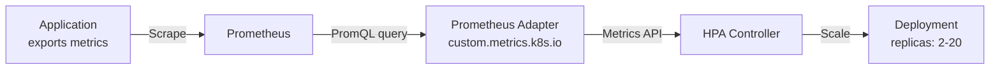

> 💡 **Quick Answer:** Deploy Prometheus Adapter, configure metric rules to map Prometheus queries to the `custom.metrics.k8s.io` API, then create an HPA targeting your custom metric (e.g., `http_requests_per_second`). The adapter bridges Prometheus and the Kubernetes metrics API.

## The Problem

HPA's built-in CPU/memory metrics don't reflect application-level load. An API server might be at 20% CPU but have 1000 queued requests. GPU inference services need to scale on request concurrency, not CPU. Custom metrics from Prometheus enable HPA to scale on what actually matters.

## The Solution

### Install Prometheus Adapter

```bash
helm install prometheus-adapter prometheus-community/prometheus-adapter \
  --namespace monitoring \
  --set prometheus.url=http://prometheus-server.monitoring.svc \
  --set prometheus.port=9090
```

### Configure Metric Rules

```yaml
# values.yaml for prometheus-adapter
rules:
  custom:
    - seriesQuery: 'http_requests_total{namespace!="",pod!=""}'
      resources:
        overrides:
          namespace: {resource: "namespace"}
          pod: {resource: "pod"}
      name:
        matches: "^(.*)_total$"
        as: "${1}_per_second"
      metricsQuery: 'rate(<<.Series>>{<<.LabelMatchers>>}[2m])'
    
    - seriesQuery: 'gpu_utilization_percent{namespace!="",pod!=""}'
      resources:
        overrides:
          namespace: {resource: "namespace"}
          pod: {resource: "pod"}
      name:
        as: "gpu_utilization"
      metricsQuery: 'avg(<<.Series>>{<<.LabelMatchers>>})'
    
    - seriesQuery: 'request_queue_depth{namespace!="",pod!=""}'
      resources:
        overrides:
          namespace: {resource: "namespace"}
          pod: {resource: "pod"}
      name:
        as: "request_queue_depth"
      metricsQuery: 'avg(<<.Series>>{<<.LabelMatchers>>})'
```

### Verify Custom Metrics API

```bash
# List available custom metrics
kubectl get --raw "/apis/custom.metrics.k8s.io/v1beta1" | jq '.resources[].name'

# Query specific metric
kubectl get --raw "/apis/custom.metrics.k8s.io/v1beta1/namespaces/production/pods/*/http_requests_per_second" | jq .
```

### HPA with Custom Metrics

```yaml
apiVersion: autoscaling/v2
kind: HorizontalPodAutoscaler
metadata:
  name: api-server-hpa
  namespace: production
spec:
  scaleTargetRef:
    apiVersion: apps/v1
    kind: Deployment
    name: api-server
  minReplicas: 2
  maxReplicas: 20
  metrics:
    - type: Pods
      pods:
        metric:
          name: http_requests_per_second
        target:
          type: AverageValue
          averageValue: "100"
  behavior:
    scaleUp:
      stabilizationWindowSeconds: 60
      policies:
        - type: Percent
          value: 50
          periodSeconds: 60
    scaleDown:
      stabilizationWindowSeconds: 300
      policies:
        - type: Pods
          value: 1
          periodSeconds: 120
```

### GPU Inference Scaling

```yaml
apiVersion: autoscaling/v2
kind: HorizontalPodAutoscaler
metadata:
  name: inference-hpa
spec:
  scaleTargetRef:
    apiVersion: apps/v1
    kind: Deployment
    name: inference-server
  minReplicas: 1
  maxReplicas: 8
  metrics:
    - type: Pods
      pods:
        metric:
          name: request_queue_depth
        target:
          type: AverageValue
          averageValue: "5"
    - type: Pods
      pods:
        metric:
          name: gpu_utilization
        target:
          type: AverageValue
          averageValue: "80"
```



## Common Issues

**Custom metric returns "not found"**

Check that Prometheus has the metric: `curl prometheus:9090/api/v1/query?query=http_requests_total`. Then verify adapter rules match the series name.

**HPA shows "unable to fetch metrics"**

The adapter might not be running or the APIService isn't registered:
```bash
kubectl get apiservice v1beta1.custom.metrics.k8s.io
```

## Best Practices

- **Use `rate()` for counter metrics** — raw counters always increase; rate gives meaningful per-second values
- **Set `stabilizationWindowSeconds`** — prevents flapping (scale-down should be slower than scale-up)
- **Multiple metrics in HPA** — HPA uses the metric that recommends the HIGHEST replica count
- **Test with `kubectl get --raw`** — verify metrics are available before creating HPA

## Key Takeaways

- Prometheus Adapter bridges Prometheus metrics to Kubernetes custom metrics API
- HPA can scale on any Prometheus metric — HTTP RPS, queue depth, GPU utilization
- Metric rules transform Prometheus queries into the `custom.metrics.k8s.io` format
- Multiple metrics per HPA: highest recommendation wins
- Scale-down should be slower than scale-up to prevent flapping
