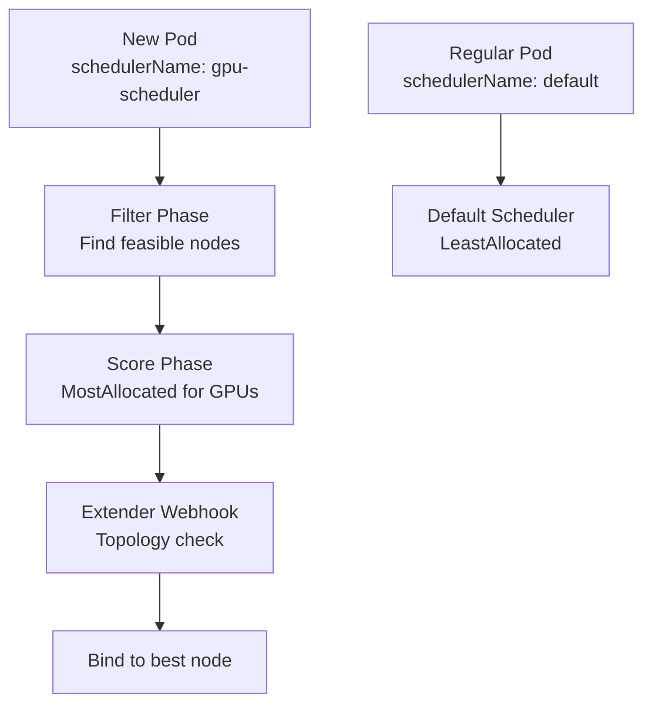

> 💡 **Quick Answer:** Deploy a custom scheduler alongside the default scheduler using `schedulerName` in pod specs. Use scheduler profiles for lightweight customization (scoring weights, filters) or a full custom scheduler for complex logic like topology-aware GPU placement.

## The Problem

The default scheduler optimizes for general-purpose workloads, but AI/ML workloads need topology-aware GPU placement, gang scheduling, and bin-packing. Rather than replacing the default scheduler, you can run multiple schedulers and assign workloads to the appropriate one.

## The Solution

### Scheduler Profiles (Lightweight Customization)

```yaml
apiVersion: kubescheduler.config.k8s.io/v1
kind: KubeSchedulerConfiguration
profiles:
  - schedulerName: default-scheduler
    pluginConfig:
      - name: NodeResourcesFit
        args:
          scoringStrategy:
            type: LeastAllocated
  - schedulerName: gpu-scheduler
    pluginConfig:
      - name: NodeResourcesFit
        args:
          scoringStrategy:
            type: MostAllocated
            resources:
              - name: nvidia.com/gpu
                weight: 10
              - name: cpu
                weight: 1
```

### Using a Specific Scheduler

```yaml
apiVersion: apps/v1
kind: Deployment
metadata:
  name: gpu-workload
spec:
  template:
    spec:
      schedulerName: gpu-scheduler
      containers:
        - name: training
          resources:
            limits:
              nvidia.com/gpu: 4
```

### Scheduler Extender Webhook

```yaml
apiVersion: kubescheduler.config.k8s.io/v1
kind: KubeSchedulerConfiguration
extenders:
  - urlPrefix: "https://scheduler-extender.kube-system:8443"
    filterVerb: "filter"
    prioritizeVerb: "prioritize"
    weight: 5
    enableHTTPS: true
    httpTimeout: 10s
    managedResources:
      - name: nvidia.com/gpu
        ignoredByScheduler: false
```



## Common Issues

**Pods stuck Pending with custom scheduler**

Check the custom scheduler is running: `kubectl get pods -n kube-system | grep scheduler`. Verify `schedulerName` matches exactly.

**Two schedulers race — both schedule to same node**

Use resource requests properly. Kubernetes API server handles resource accounting — schedulers that respect node allocatable won't over-commit.

## Best Practices

- **Scheduler profiles for simple changes** — scoring weights, filter configuration
- **Separate scheduler for complex logic** — GPU topology, gang scheduling
- **`schedulerName` in pod spec** — explicitly assign pods to the right scheduler
- **Extender webhooks** for external scheduling logic without building a full scheduler
- **Default scheduler for general workloads** — don't customize what works

## Key Takeaways

- Multiple schedulers can run simultaneously — assign via `schedulerName`
- Scheduler profiles customize scoring and filtering without a separate binary
- MostAllocated scoring packs GPUs onto fewer nodes (bin-packing)
- Scheduler extenders add external logic via webhooks (topology, custom constraints)
- GPU workloads benefit from custom scheduling — topology awareness and bin-packing
