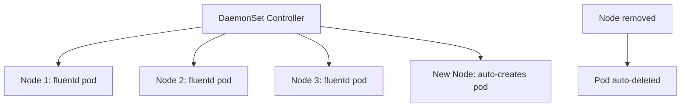

> 💡 **Quick Answer:** Deploy DaemonSets in Kubernetes to run exactly one pod per node. Covers logging agents, monitoring, CNI plugins, node-level operations, and rolling updates.

## The Problem

This is one of the most searched Kubernetes topics. Having a comprehensive, well-structured guide helps both beginners and experienced users quickly find what they need.

## The Solution

### Create a DaemonSet

```yaml
apiVersion: apps/v1
kind: DaemonSet
metadata:
  name: fluentd
  namespace: logging
spec:
  selector:
    matchLabels:
      app: fluentd
  template:
    metadata:
      labels:
        app: fluentd
    spec:
      tolerations:
        - key: node-role.kubernetes.io/control-plane
          operator: Exists
          effect: NoSchedule    # Run on control plane too
      containers:
        - name: fluentd
          image: fluent/fluentd:v1.16
          resources:
            requests:
              cpu: 100m
              memory: 200Mi
            limits:
              memory: 500Mi
          volumeMounts:
            - name: varlog
              mountPath: /var/log
              readOnly: true
            - name: containers
              mountPath: /var/lib/docker/containers
              readOnly: true
      volumes:
        - name: varlog
          hostPath:
            path: /var/log
        - name: containers
          hostPath:
            path: /var/lib/docker/containers
  updateStrategy:
    type: RollingUpdate
    rollingUpdate:
      maxUnavailable: 1       # Update one node at a time
```

### Run on Specific Nodes Only

```yaml
spec:
  template:
    spec:
      nodeSelector:
        node-type: gpu        # Only GPU nodes
      # Or use affinity
      affinity:
        nodeAffinity:
          requiredDuringSchedulingIgnoredDuringExecution:
            nodeSelectorTerms:
              - matchExpressions:
                  - key: kubernetes.io/os
                    operator: In
                    values: ["linux"]
```

### Common DaemonSet Use Cases

| Use Case | Image | Purpose |
|----------|-------|---------|
| Log collection | fluent/fluentd | Ship node logs to central store |
| Monitoring | prom/node-exporter | Export node metrics |
| CNI plugin | calico-node | Network per node |
| Storage | csi-node-driver | CSI plugin per node |
| Security | falco | Runtime threat detection |

```bash
# Check DaemonSet status
kubectl get ds -A
kubectl rollout status ds/fluentd -n logging

# Restart DaemonSet
kubectl rollout restart ds/fluentd -n logging
```



## Frequently Asked Questions

### What is the difference between DaemonSet and Deployment?

A **Deployment** runs N replicas scheduled wherever Kubernetes decides. A **DaemonSet** runs exactly one pod on every (or selected) node. Use DaemonSets for node-level agents (logging, monitoring, CNI).

### Can I run a DaemonSet on specific nodes only?

Yes, use `nodeSelector`, node affinity, or tolerations to target specific nodes.

## Best Practices

- **Start simple** — use the basic form first, add complexity as needed
- **Be consistent** — follow naming conventions across your cluster
- **Document your choices** — add annotations explaining why, not just what
- **Monitor and iterate** — review configurations regularly

## Key Takeaways

- This is fundamental Kubernetes knowledge every engineer needs
- Start with the simplest approach that solves your problem
- Use `kubectl explain` and `kubectl describe` when unsure
- Practice in a test cluster before applying to production
