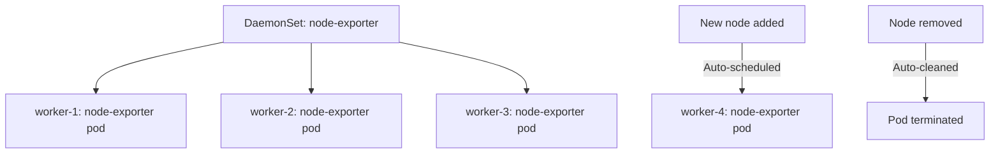

> 💡 **Quick Answer:** deployments

## The Problem

This is one of the most searched Kubernetes topics with thousands of monthly searches. A comprehensive, production-ready guide prevents hours of trial and error.

## The Solution

### Create a DaemonSet

```yaml
apiVersion: apps/v1
kind: DaemonSet
metadata:
  name: node-exporter
  namespace: monitoring
spec:
  selector:
    matchLabels:
      app: node-exporter
  updateStrategy:
    type: RollingUpdate
    rollingUpdate:
      maxUnavailable: 1      # Update 1 node at a time
  template:
    metadata:
      labels:
        app: node-exporter
    spec:
      tolerations:
        # Run on ALL nodes including control plane
        - operator: Exists
      hostNetwork: true       # Access node network
      hostPID: true           # Access node processes
      containers:
        - name: node-exporter
          image: prom/node-exporter:v1.7.0
          ports:
            - containerPort: 9100
              hostPort: 9100
          resources:
            requests:
              cpu: 50m
              memory: 64Mi
            limits:
              cpu: 200m
              memory: 128Mi
          volumeMounts:
            - name: proc
              mountPath: /host/proc
              readOnly: true
            - name: sys
              mountPath: /host/sys
              readOnly: true
      volumes:
        - name: proc
          hostPath:
            path: /proc
        - name: sys
          hostPath:
            path: /sys
```

### Target Specific Nodes

```yaml
spec:
  template:
    spec:
      # Only run on GPU nodes
      nodeSelector:
        accelerator: nvidia-gpu
      # Or use affinity for more control
      affinity:
        nodeAffinity:
          requiredDuringSchedulingIgnoredDuringExecution:
            nodeSelectorTerms:
              - matchExpressions:
                  - key: node-role.kubernetes.io/worker
                    operator: Exists
```

### Common DaemonSet Use Cases

| Use Case | Example |
|----------|---------|
| Monitoring | Prometheus node-exporter, Datadog agent |
| Logging | Fluent Bit, Fluentd, Filebeat |
| Networking | Calico, Cilium, kube-proxy |
| Storage | CSI node plugins, Longhorn |
| Security | Falco, Twistlock defenders |

```bash
# Check DaemonSet status
kubectl get ds -n monitoring
# NAME            DESIRED   CURRENT   READY   UP-TO-DATE   AVAILABLE
# node-exporter   5         5         5       5            5

kubectl rollout status ds/node-exporter -n monitoring
```



## Frequently Asked Questions

### DaemonSet vs Deployment with anti-affinity?

DaemonSet guarantees exactly one pod per matching node, auto-scales with node count, and respects node selectors. Using Deployment + anti-affinity is a hack — use DaemonSets for per-node workloads.

### How to skip certain nodes?

Use `nodeSelector` or `nodeAffinity` to target specific nodes. Or add taints to nodes you want to skip and don't include matching tolerations in the DaemonSet.

## Best Practices

- Start with the simplest configuration that solves your problem
- Test in staging before production
- Use `kubectl describe` and events for troubleshooting
- Document team conventions for consistency

## Key Takeaways

- This is fundamental Kubernetes operational knowledge
- Follow established conventions and recommended labels
- Monitor and iterate based on real production behavior
- Automate repetitive tasks to reduce human error
