> 💡 **Quick Answer:** Kubernetes day 1 is painful (cluster setup, networking, storage). Day 2 is where you win: every new service automatically gets autoscaling, self-healing, rolling updates, observability, and security — with zero additional infrastructure work. The investment pays off exponentially as you scale from 1 to 100 services.

## The Problem

Critics focus on Kubernetes' setup complexity and miss the compounding returns. Day 1 is a one-time cost. Day 2 is ongoing leverage that multiplies with every service you run.

```mermaid
flowchart LR
    subgraph DAY1["Day 1: Setup (One-Time Cost)"]
        CLUSTER["Cluster<br/>provisioning"]
        NET["Networking<br/>(CNI, LB)"]
        STORAGE["Storage<br/>(CSI drivers)"]
        SEC["Security<br/>(RBAC, PSA)"]
        OBS["Observability<br/>(Prometheus, Grafana)"]
    end
    
    subgraph DAY2["Day 2+: Leverage (Ongoing Returns)"]
        AS["Auto-scaling<br/>every service"]
        SH["Self-healing<br/>every pod"]
        RU["Rolling updates<br/>zero-downtime"]
        MON["Monitoring<br/>automatic"]
        SEC2["Security<br/>inherited"]
    end
    
    DAY1 -->|"Paid once"| DAY2
    DAY2 -->|"Free for<br/>100 services"| PROFIT["🚀 Scale"]
```



## What You Get "For Free" on Day 2

### 1. Self-Healing (Automatic)

```yaml
# You write this ONCE in your deployment:
livenessProbe:
  httpGet:
    path: /healthz
    port: 8080

# What Kubernetes does for you FOREVER:
# - Restarts crashed containers (CrashLoopBackOff → healthy)
# - Reschedules pods when nodes die
# - Replaces failed pods to maintain replica count
# - No pager alerts at 3 AM for OOM kills — it just restarts
```

**On VMs:** You'd need: systemd watchdog + health check scripts + monitoring + alerting + manual restart procedures + runbooks. Per service. Per server.

### 2. Autoscaling (Built-In)

```yaml
# 8 lines. Every service scales automatically.
apiVersion: autoscaling/v2
kind: HorizontalPodAutoscaler
metadata:
  name: my-app
spec:
  scaleTargetRef:
    apiVersion: apps/v1
    kind: Deployment
    name: my-app
  minReplicas: 3
  maxReplicas: 50
  metrics:
    - type: Resource
      resource:
        name: cpu
        target:
          type: Utilization
          averageUtilization: 70
```

**On VMs:** You'd need: cloud ASG configuration + AMI management + load balancer integration + health checks + cooldown tuning + capacity planning. Per service.

### 3. Zero-Downtime Deployments (Default)

```bash
# Update an image. Zero downtime. No user impact.
kubectl set image deployment/my-app app=my-app:v2.0

# Kubernetes automatically:
# 1. Starts new pods with v2.0
# 2. Waits for readiness probes to pass
# 3. Routes traffic to new pods
# 4. Drains traffic from old pods
# 5. Terminates old pods
# Total downtime: 0
```

**On VMs:** Blue-green infrastructure + load balancer manipulation + DNS switching + rollback scripts + manual verification. Every single deploy.

### 4. Service Discovery (Automatic)

```yaml
# Create a Service. That's it.
apiVersion: v1
kind: Service
metadata:
  name: payments-api
spec:
  selector:
    app: payments-api
  ports:
    - port: 80
      targetPort: 8080

# Now ANY service in the cluster can call:
# http://payments-api.payments.svc.cluster.local
# DNS resolves automatically. Load balances automatically.
# New replicas? Registered automatically. Dead pods? Removed automatically.
```

**On VMs:** Consul/etcd + DNS configuration + load balancer updates + health check registration + deregistration on failure. Per service.

### 5. Consistent Environments (Guaranteed)

```bash
# Dev, staging, production — identical behavior
kubectl apply -f app.yaml -n dev
kubectl apply -f app.yaml -n staging
kubectl apply -f app.yaml -n production

# Same container, same config structure, same networking model
# "Works in staging but not production" becomes rare
```

**On VMs:** Ansible/Chef/Puppet + environment-specific configs + snowflake servers + configuration drift + "it worked on my machine."

## The Compounding Effect

| Services | VM Infrastructure Work | K8s Platform Work |
|----------|----------------------|-------------------|
| 1 | 40h setup + ongoing maintenance | 80h cluster setup |
| 5 | 200h + 5× maintenance | 80h + 5× `kubectl apply` |
| 20 | 800h + 20× maintenance | 80h + 20× `kubectl apply` |
| 50 | 2000h + 50× maintenance | 80h + 50× `kubectl apply` |

The VM approach scales linearly. K8s scales logarithmically.

### Real Numbers

```
Year 1: 
  - Cluster setup: 2 months
  - Platform templates: 1 month
  - 10 services deployed: 2 weeks total
  - NET: "K8s was expensive to set up"

Year 2:
  - 40 more services: 4 weeks total (1 day each including CI/CD)
  - Zero infrastructure provisioning
  - Autoscaling handles Black Friday without intervention
  - Self-healing handles 3 AM node failures
  - NET: "K8s is printing time savings"
```

## The "Scam" Rebuttal in Numbers

| Claim | Reality |
|-------|---------|
| "Too complex" | Complex once; simple forever after |
| "Over-engineered for small teams" | True for 1-3 services; break-even at 5+ |
| "VMs are simpler" | Simpler per-server; worse at fleet scale |
| "Vendor lock-in" | K8s runs everywhere: cloud, on-prem, edge |
| "Too expensive" | Platform + 50 services < 50× individual infra |
| "Nobody needs autoscaling" | Until your first traffic spike at 2 AM |

## When K8s is Actually NOT Worth It

Be honest — Kubernetes isn't always the answer:

- **Single service, low traffic** → Use a PaaS (Railway, Fly.io, Heroku)
- **Proof of concept** → Just deploy to a VM
- **Team of 1-2 with no ops experience** → Managed K8s (EKS/GKE/AKS) at minimum
- **Monolith with no plans to grow** → VMs are fine

Kubernetes shines when: **multiple services + multiple teams + need for standardization + scale ambitions.**

## Common Issues

| Issue | Cause | Fix |
|-------|-------|-----|
| "We set up K8s but it's still hard" | No platform layer built | Invest in templates, golden paths, self-service |
| "Debugging is harder than VMs" | No observability stack | Deploy Prometheus + Grafana + Loki day 1 |
| "Networking is confusing" | CNI complexity | Abstract behind Services + Ingress, don't expose CNI details to devs |
| "Storage is a pain" | CSI driver issues | Pick one StorageClass per use case, make it the default |

## Best Practices

- **Invest in day 1 properly** — the platform quality determines day 2+ experience
- **Build golden paths immediately** — don't make every team learn raw K8s
- **Measure developer time saved** — quantify the leverage to justify the investment
- **Start with managed K8s** — EKS/GKE/AKS eliminates control plane ops
- **Hire (or train) platform engineers** — the cluster is a product, not a project

## Key Takeaways

- Day 1 cost is real: weeks/months of setup. That's the investment.
- Day 2+ returns are compounding: every service gets autoscaling, self-healing, rolling updates for free
- Break-even: ~5 services. After that, K8s saves more time than it cost.
- The "K8s is a scam" crowd stopped at day 1. The leverage is on day 2+.
- Kubernetes isn't about reducing complexity — it's about **paying for complexity once** and reusing it forever.
