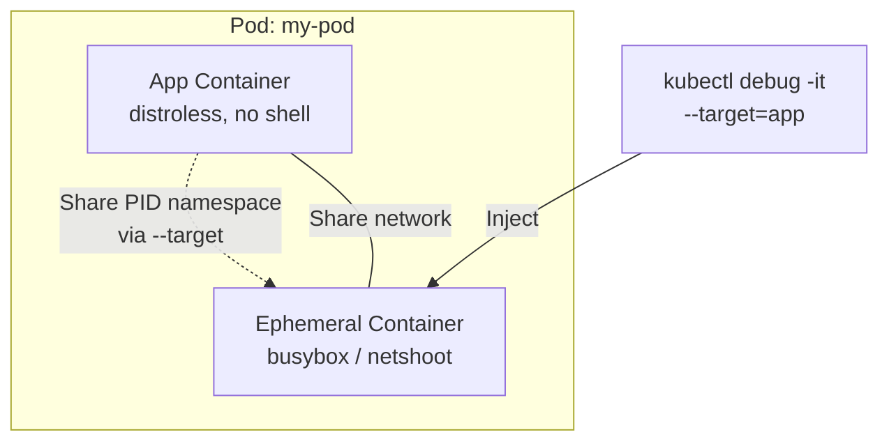

> 💡 **Quick Answer:** Use `kubectl debug -it my-pod --image=busybox --target=my-container` to attach an ephemeral debug container to a running pod. It shares the process namespace and network of the target container — perfect for debugging distroless or minimal images.

## The Problem

Modern containers use distroless or scratch-based images with no shell, no package manager, and no debugging tools. You can't `kubectl exec` into them. Redeploying with a debug image changes the environment. Ephemeral containers let you attach a debug container to a running pod without restarting it.

## The Solution

### Debug a Running Pod

```bash
# Attach ephemeral container sharing the target's process namespace
kubectl debug -it my-pod --image=busybox:1.36 --target=my-container

# With a full debug toolkit
kubectl debug -it my-pod --image=nicolaka/netshoot --target=my-container

# Check network from inside the pod
kubectl debug -it my-pod --image=nicolaka/netshoot -- \
  curl -v http://backend-svc:8080/health
```

### Debug a Node

```bash
# Get a shell on the node (mounts host filesystem at /host)
kubectl debug node/worker-1 -it --image=busybox:1.36

# Inside the debug pod:
chroot /host
systemctl status kubelet
journalctl -u kubelet --since "10 minutes ago"
crictl ps
```

### Debug by Copying a Pod

```bash
# Create a copy with a different image (for CrashLoopBackOff debugging)
kubectl debug my-pod -it --copy-to=my-pod-debug \
  --container=my-container --image=busybox:1.36 -- sh

# Copy pod with all containers replaced
kubectl debug my-pod -it --copy-to=my-pod-debug \
  --set-image=*=busybox:1.36
```

### Common Debug Commands

```bash
# Network debugging (netshoot)
kubectl debug -it my-pod --image=nicolaka/netshoot --target=app -- bash
> tcpdump -i eth0 -w /tmp/capture.pcap
> nslookup backend-svc.production.svc.cluster.local
> curl -k https://kubernetes.default.svc/healthz
> ss -tlnp

# Process debugging (shares PID namespace with --target)
kubectl debug -it my-pod --image=busybox --target=app -- sh
> ps aux          # See target container's processes
> cat /proc/1/environ | tr '\0' '\n'  # Environment variables
> ls /proc/1/root/  # Target container's filesystem
```



## Common Issues

**"ephemeral containers are disabled"**

Ephemeral containers require K8s 1.25+ (GA). On older clusters, enable the `EphemeralContainers` feature gate.

**Can't see target process with `ps`**

You must use `--target=<container-name>` to share PID namespace. Without it, you only see the debug container's processes.

**Debug container can't access target's filesystem**

Use `/proc/1/root/` to access the target container's filesystem when PID namespace is shared.

## Best Practices

- **`nicolaka/netshoot`** for network debugging — includes curl, dig, tcpdump, iperf, etc.
- **`busybox:1.36`** for lightweight debugging — shell, basic tools
- **Always use `--target`** to share PID namespace with the container you're debugging
- **Node debug for kubelet/CRI issues** — `kubectl debug node/` gives host access
- **Copy-pod for CrashLoopBackOff** — debug a copy without affecting the original

## Key Takeaways

- `kubectl debug` injects ephemeral containers into running pods — no restart needed
- `--target=<container>` shares PID namespace — see processes and filesystem of the target
- Node debug mounts host filesystem at `/host` — access kubelet logs, crictl, systemctl
- Copy-pod pattern creates a clone for debugging CrashLoopBackOff without affecting production
- Ephemeral containers cannot be removed once added — they stay until the pod is deleted
