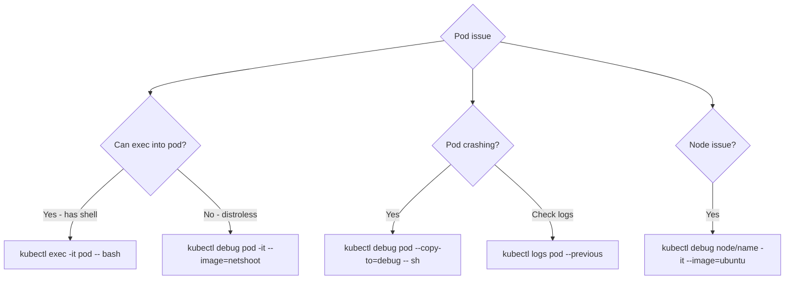

> 💡 **Quick Answer:** troubleshooting

## The Problem

This is a fundamental Kubernetes topic that engineers search for frequently. A comprehensive reference with production-ready examples saves hours of trial and error.

## The Solution

### kubectl debug

```bash
# Attach debug container to running pod (shares network + PID namespace)
kubectl debug my-pod -it --image=nicolaka/netshoot --target=my-container
# Now you can: curl, dig, tcpdump, ss, iftop, etc.

# Debug a CrashLoopBackOff pod (copy with overridden command)
kubectl debug my-pod -it --copy-to=debug-pod --container=my-container -- /bin/sh
# Starts a copy of the pod with shell instead of the crashing entrypoint

# Debug a node
kubectl debug node/worker-1 -it --image=ubuntu
# chroot /host    ← access node filesystem
# systemctl status kubelet
# journalctl -u kubelet --since '5 min ago'

# Debug with specific profile
kubectl debug my-pod -it --image=busybox --profile=netadmin
```

### Debugging Without Shell (Distroless Images)

```bash
# Can't exec into distroless/scratch images — no shell!
# Use ephemeral debug container instead:
kubectl debug my-pod -it --image=nicolaka/netshoot --target=app

# Inside the debug container:
# - Process list: ps aux (sees main container processes)
# - Network: curl localhost:8080, ss -tlnp
# - DNS: dig my-service.default.svc.cluster.local
# - Files: ls /proc/1/root/  (main container filesystem)
```

### Common Debug Scenarios

```bash
# Network connectivity
kubectl debug my-pod -it --image=nicolaka/netshoot
> curl -v http://other-service:8080/health
> dig other-service.default.svc.cluster.local
> traceroute other-service
> tcpdump -i any port 8080 -w /tmp/capture.pcap

# DNS issues
> cat /etc/resolv.conf
> nslookup kubernetes.default
> dig +short my-service.my-namespace.svc.cluster.local

# Memory/CPU analysis
kubectl top pod my-pod --containers
kubectl exec my-pod -- cat /sys/fs/cgroup/memory/memory.usage_in_bytes

# Check previous crash logs
kubectl logs my-pod --previous
kubectl describe pod my-pod | tail -20    # Events section
```



## Frequently Asked Questions

### What is nicolaka/netshoot?

A Docker image packed with networking tools: curl, dig, tcpdump, iperf, traceroute, ss, nmap, and more. The standard image for debugging Kubernetes networking.

## Best Practices

- Start with the simplest configuration that meets your needs
- Test changes in staging before production
- Use `kubectl describe` and events for troubleshooting
- Document your decisions for the team

## Key Takeaways

- This is essential Kubernetes knowledge for production operations
- Follow the principle of least privilege and minimal configuration
- Monitor and iterate based on real-world behavior
- Automation reduces human error and improves consistency
