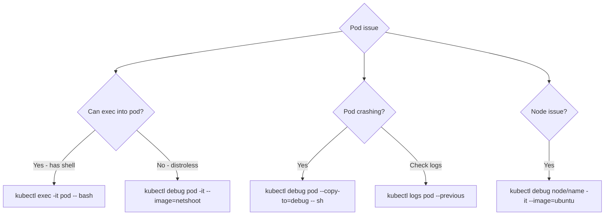

> 💡 **Quick Answer:** Attach an ephemeral debug container to a running pod without restarting it: `kubectl debug -it <pod> --image=nicolaka/netshoot --target=<container>`. The `--target` flag shares the process namespace so you can `ps aux`, `curl localhost:PORT`, and inspect `/proc/1/root/` for the target container's filesystem — essential for distroless/scratch images that have no shell to `exec` into.

## The Problem

Production images are increasingly distroless or scratch-based — no shell, no `curl`, no `ps` — which makes `kubectl exec` useless for debugging. Restarting the pod with a debug image loses the exact failing state you're trying to inspect. Ephemeral containers solve both: they attach a full-featured debug image to an *already-running* pod without restarting it.

## The Solution

### kubectl debug

```bash
# Attach debug container to running pod (shares network + PID namespace)
kubectl debug my-pod -it --image=nicolaka/netshoot --target=my-container
# Now you can: curl, dig, tcpdump, ss, iftop, etc.

# Debug a CrashLoopBackOff pod (copy with overridden command)
kubectl debug my-pod -it --copy-to=debug-pod --container=my-container -- /bin/sh
# Starts a copy of the pod with shell instead of the crashing entrypoint

# Debug a node
kubectl debug node/worker-1 -it --image=ubuntu
# chroot /host    ← access node filesystem
# systemctl status kubelet
# journalctl -u kubelet --since '5 min ago'

# Debug with specific profile
kubectl debug my-pod -it --image=busybox --profile=netadmin
```

### Debugging Without Shell (Distroless Images)

```bash
# Can't exec into distroless/scratch images — no shell!
# Use ephemeral debug container instead:
kubectl debug my-pod -it --image=nicolaka/netshoot --target=app

# Inside the debug container:
# - Process list: ps aux (sees main container processes)
# - Network: curl localhost:8080, ss -tlnp
# - DNS: dig my-service.default.svc.cluster.local
# - Files: ls /proc/1/root/  (main container filesystem)
```

### Common Debug Scenarios

```bash
# Network connectivity
kubectl debug my-pod -it --image=nicolaka/netshoot
> curl -v http://other-service:8080/health
> dig other-service.default.svc.cluster.local
> traceroute other-service
> tcpdump -i any port 8080 -w /tmp/capture.pcap

# DNS issues
> cat /etc/resolv.conf
> nslookup kubernetes.default
> dig +short my-service.my-namespace.svc.cluster.local

# Memory/CPU analysis
kubectl top pod my-pod --containers
kubectl exec my-pod -- cat /sys/fs/cgroup/memory/memory.usage_in_bytes

# Check previous crash logs
kubectl logs my-pod --previous
kubectl describe pod my-pod | tail -20    # Events section
```



### Debugging Profiles and Capabilities

`kubectl debug` ships built-in security profiles instead of making you hand-write a `securityContext` each time:

```bash
kubectl debug my-pod -it --image=nicolaka/netshoot --target=app --profile=netadmin
# general    — default, no extra privileges
# baseline   — restricted security context
# restricted — highly restricted, minimal capabilities
# netadmin   — adds NET_ADMIN/NET_RAW for tcpdump, traffic shaping
# sysadmin   — broad host-level system administration capabilities
```

For anything the profiles don't cover, patch the ephemeral container spec directly:

```bash
kubectl patch pod my-pod --subresource=ephemeralcontainers -p '{
  "spec": {
    "ephemeralContainers": [{
      "name": "debug",
      "image": "nicolaka/netshoot",
      "command": ["sleep", "infinity"],
      "stdin": true,
      "tty": true,
      "targetContainerName": "app",
      "securityContext": {"capabilities": {"add": ["NET_ADMIN", "SYS_PTRACE"]}}
    }]
  }
}'
kubectl attach -it my-pod -c debug
```

### Node-Level Debugging

The same `kubectl debug` mechanism works on nodes, not just pods:

```bash
kubectl debug node/worker-1 -it --image=ubuntu
chroot /host                       # access the node's real filesystem
systemctl status kubelet
journalctl -u kubelet --since '5 min ago'
df -h                              # check disk pressure
```

## Frequently Asked Questions

### What is nicolaka/netshoot?

A Docker image packed with networking tools: curl, dig, tcpdump, iperf, traceroute, ss, nmap, and more. The standard image for debugging Kubernetes networking.

### Can I remove an ephemeral container once I'm done?

No — ephemeral containers can't be removed from a running pod once added; they persist until the pod itself is deleted. If you used `--copy-to` to create a throwaway debug copy, delete that copy pod instead of leaving it running: `kubectl delete pod <copy-name>`.

## Best Practices

- **Use `--target` to share the process namespace** — without it, the debug container can't see the app's processes or `/proc/1/root/` filesystem
- **Reach for a profile before hand-writing a securityContext** — `netadmin`/`sysadmin` cover the common cases without a manual patch
- **Use `--copy-to` for CrashLoopBackOff pods** — a live pod that keeps restarting can't hold a debug session; a copy with the command overridden can
- **Clean up copy pods when done** — they don't get garbage collected automatically, unlike ephemeral containers which just persist harmlessly
- **Prefer ephemeral containers over redeploying with a debug image** — you keep the exact failing state instead of losing it on restart

## Key Takeaways

- `kubectl debug --target=<container>` shares the process namespace, letting you `ps aux` and browse `/proc/1/root/` for a container with no shell of its own
- Ephemeral containers require Kubernetes 1.25+ and can never be removed — only the whole pod's deletion clears them
- Use `--copy-to` instead of `--target` when the pod itself is crash-looping and can't hold a live debug session
- Built-in profiles (`netadmin`, `sysadmin`, `restricted`) cover most capability needs without a manual `securityContext` patch
- The same `kubectl debug node/<name>` mechanism debugs nodes directly, with `chroot /host` for the real node filesystem
