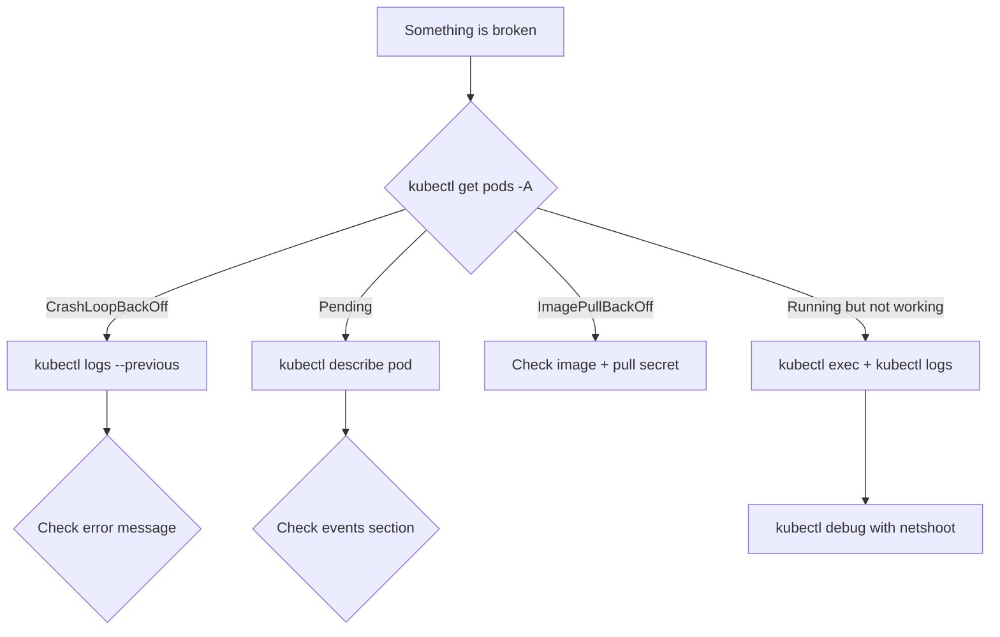

> 💡 **Quick Answer:** Essential kubectl debugging commands and tools for Kubernetes troubleshooting. Covers ephemeral containers, debug pods, network debugging, and log analysis.

## The Problem

When things break in Kubernetes, you need the right debugging tools and commands. This is your field reference for the most useful debugging techniques.

## The Solution

### Essential kubectl Debug Commands

```bash
# === POD DEBUGGING ===
# Get all info about a pod
kubectl describe pod <name>

# Logs (current and previous crash)
kubectl logs <pod>
kubectl logs <pod> --previous
kubectl logs <pod> -c <container>     # Specific container
kubectl logs <pod> --all-containers
kubectl logs -l app=myapp --tail=100  # By label

# Exec into a running container
kubectl exec -it <pod> -- /bin/sh
kubectl exec -it <pod> -c <container> -- bash

# Ephemeral debug container (K8s 1.23+)
kubectl debug <pod> -it --image=nicolaka/netshoot --target=<container>
kubectl debug <pod> -it --image=busybox --share-processes

# Copy files from/to pod
kubectl cp <pod>:/path/file ./local-file
kubectl cp ./local-file <pod>:/path/file

# === NODE DEBUGGING ===
# Debug a node
kubectl debug node/<node-name> -it --image=ubuntu
# Inside: chroot /host for full node access

# OpenShift node debugging
oc debug node/<node-name>
# chroot /host
# journalctl -u kubelet --no-pager -n 100

# === NETWORK DEBUGGING ===
# Test DNS
kubectl run dns-test --rm -it --image=busybox -- nslookup kubernetes.default

# Test connectivity
kubectl run netshoot --rm -it --image=nicolaka/netshoot -- bash
# Inside: curl, dig, ping, traceroute, tcpdump, iperf3

# Check service endpoints
kubectl get endpoints <service>
kubectl describe service <service>

# Port-forward for local debugging
kubectl port-forward svc/<service> 8080:80
kubectl port-forward pod/<pod> 5432:5432

# === RESOURCE DEBUGGING ===
# Resource usage
kubectl top pods --sort-by=memory
kubectl top nodes
kubectl top pods -A --sort-by=cpu | head -20

# Events (most recent)
kubectl get events --sort-by='.lastTimestamp' -n <namespace>
kubectl get events --field-selector type=Warning

# API resources
kubectl api-resources | grep -i <resource>
kubectl explain pod.spec.containers.resources
```

### Advanced: JSON Queries with jsonpath/jq

```bash
# Find pods not in Running state
kubectl get pods -A -o json | jq -r '.items[] | select(.status.phase != "Running") | "\(.metadata.namespace)/\(.metadata.name): \(.status.phase)"'

# Find pods without resource limits
kubectl get pods -A -o json | jq -r '.items[] | select(.spec.containers[].resources.limits == null) | "\(.metadata.namespace)/\(.metadata.name)"'

# Get restart counts
kubectl get pods -A -o json | jq -r '.items[] | select(.status.containerStatuses[]?.restartCount > 5) | "\(.metadata.namespace)/\(.metadata.name): \(.status.containerStatuses[].restartCount) restarts"'

# Find pods on a specific node
kubectl get pods -A --field-selector spec.nodeName=worker-1

# Get all images running in cluster
kubectl get pods -A -o jsonpath='{range .items[*]}{range .spec.containers[*]}{.image}{"\n"}{end}{end}' | sort -u
```

### Emergency Playbook

```bash
# 1. Cluster overview
kubectl get nodes
kubectl get pods -A | grep -v Running | grep -v Completed
kubectl get events -A --sort-by='.lastTimestamp' | tail -20

# 2. Find the problem area
kubectl top nodes            # Resource pressure?
kubectl get cs               # Control plane healthy?
kubectl cluster-info         # API server accessible?

# 3. Investigate failing pods
kubectl describe pod <failing-pod>
kubectl logs <failing-pod> --previous

# 4. Check node health
kubectl describe node <node> | grep -A10 Conditions
```



## Best Practices

- **Start small and iterate** — don't over-engineer on day one
- **Monitor and measure** — you can't improve what you don't measure
- **Automate repetitive tasks** — reduce human error and toil
- **Document your decisions** — future you will thank present you

## Key Takeaways

- This is essential knowledge for production Kubernetes operations
- Start with the simplest approach that solves your problem
- Monitor the impact of every change you make
- Share knowledge across your team with internal runbooks
