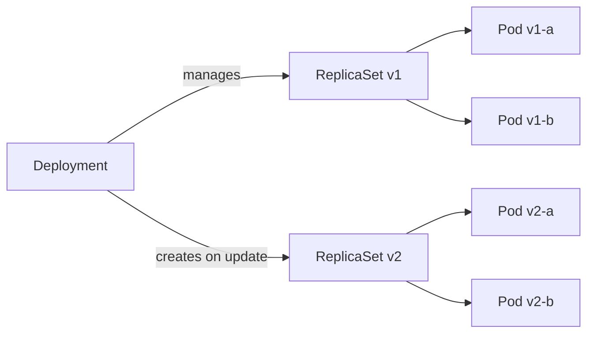

> 💡 **Quick Answer:** Create and manage Kubernetes Deployments for stateless applications. Covers replicas, selectors, rolling updates, rollback, and deployment strategies.

## The Problem

This is one of the most searched Kubernetes topics. A comprehensive, well-structured guide helps engineers of all levels quickly find actionable solutions.

## The Solution

Detailed implementation with production-ready examples below.


### Create a Deployment

```yaml
apiVersion: apps/v1
kind: Deployment
metadata:
  name: web-app
  labels:
    app: web
spec:
  replicas: 3
  selector:
    matchLabels:
      app: web
  strategy:
    type: RollingUpdate
    rollingUpdate:
      maxSurge: 1
      maxUnavailable: 0      # Zero-downtime
  template:
    metadata:
      labels:
        app: web
    spec:
      containers:
        - name: web
          image: nginx:1.25
          ports:
            - containerPort: 80
          resources:
            requests:
              cpu: 100m
              memory: 128Mi
            limits:
              memory: 256Mi
          readinessProbe:
            httpGet:
              path: /
              port: 80
            initialDelaySeconds: 5
          livenessProbe:
            httpGet:
              path: /
              port: 80
            initialDelaySeconds: 15
```

### Manage Deployments

```bash
# Create
kubectl apply -f deployment.yaml

# Scale
kubectl scale deployment web-app --replicas=5

# Update image
kubectl set image deployment/web-app web=nginx:1.26

# Check rollout
kubectl rollout status deployment/web-app
kubectl rollout history deployment/web-app

# Rollback
kubectl rollout undo deployment/web-app

# Restart (rolling)
kubectl rollout restart deployment/web-app

# Pause/resume
kubectl rollout pause deployment/web-app
kubectl rollout resume deployment/web-app

# Delete
kubectl delete deployment web-app
```

### Deployment Strategies

| Strategy | `maxSurge` | `maxUnavailable` | Behavior |
|----------|-----------|-------------------|----------|
| Safe (zero-downtime) | 1 | 0 | One new before removing old |
| Fast | 25% | 25% | Replace 25% at a time |
| Recreate | N/A | N/A | Kill all old, start all new |



## Frequently Asked Questions

### Deployment vs Pod?

Never create bare Pods in production. Deployments manage ReplicaSets which manage Pods — giving you replicas, rolling updates, rollback, and self-healing.

### How many revisions are kept?

Default `revisionHistoryLimit: 10`. Old ReplicaSets (scaled to 0) are kept for rollback. Set to 0 to save etcd space if you don't need rollback.

## Common Issues

Check `kubectl describe` and `kubectl get events` first — most issues have clear error messages pointing to the root cause.

## Best Practices

- **Follow least privilege** — only grant the access that's needed
- **Test in staging** before applying to production
- **Monitor and alert** on key metrics
- **Document your runbooks** for the team

## Key Takeaways

- Essential knowledge for Kubernetes operations
- Start simple and evolve your approach
- Automation reduces human error
- Share knowledge with your team
