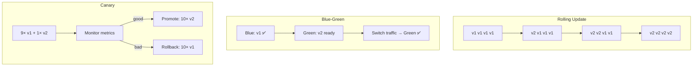

> 💡 **Quick Answer:** **Rolling Update** (default) — replace pods gradually with zero downtime. **Recreate** — kill all old pods, then start new (brief downtime). **Blue-Green** — run two full environments, switch traffic. **Canary** — route small % of traffic to new version. Use rolling update for most cases, canary for high-risk changes, blue-green for instant rollback needs.

## The Problem

Deploying new application versions without a strategy risks:

- Downtime during pod replacement
- Breaking changes hitting all users at once
- No ability to quickly revert bad deployments
- Version incompatibility between old and new pods

## The Solution

### Rolling Update (Default)

```yaml
apiVersion: apps/v1
kind: Deployment
metadata:
  name: web-app
spec:
  replicas: 6
  strategy:
    type: RollingUpdate
    rollingUpdate:
      maxSurge: 2            # 2 extra pods during update
      maxUnavailable: 1       # At most 1 pod down at a time
  template:
    spec:
      containers:
      - name: web
        image: myapp:v2       # Update image tag
```

```bash
# Trigger rolling update
kubectl set image deployment/web-app web=myapp:v2

# Watch rollout
kubectl rollout status deployment/web-app

# Rollback
kubectl rollout undo deployment/web-app

# Rollback to specific revision
kubectl rollout undo deployment/web-app --to-revision=3

# View history
kubectl rollout history deployment/web-app
```

### Recreate Strategy

```yaml
spec:
  strategy:
    type: Recreate      # Kill all old, start all new
```

Use when: schema changes that require all pods on same version, or singleton workloads.

### Blue-Green Deployment

```yaml
# Blue (current) deployment
apiVersion: apps/v1
kind: Deployment
metadata:
  name: web-blue
spec:
  replicas: 3
  selector:
    matchLabels:
      app: web
      version: blue
  template:
    metadata:
      labels:
        app: web
        version: blue
    spec:
      containers:
      - name: web
        image: myapp:v1
---
# Green (new) deployment
apiVersion: apps/v1
kind: Deployment
metadata:
  name: web-green
spec:
  replicas: 3
  selector:
    matchLabels:
      app: web
      version: green
  template:
    metadata:
      labels:
        app: web
        version: green
    spec:
      containers:
      - name: web
        image: myapp:v2
---
# Service — switch by changing selector
apiVersion: v1
kind: Service
metadata:
  name: web-svc
spec:
  selector:
    app: web
    version: blue      # Change to "green" to switch
  ports:
  - port: 80
```

```bash
# Switch traffic to green
kubectl patch service web-svc -p '{"spec":{"selector":{"version":"green"}}}'

# Rollback: switch back to blue
kubectl patch service web-svc -p '{"spec":{"selector":{"version":"blue"}}}'
```

### Canary Deployment

```yaml
# Stable (90% traffic)
apiVersion: apps/v1
kind: Deployment
metadata:
  name: web-stable
spec:
  replicas: 9
  selector:
    matchLabels:
      app: web
      track: stable
  template:
    metadata:
      labels:
        app: web
        track: stable
    spec:
      containers:
      - name: web
        image: myapp:v1
---
# Canary (10% traffic)
apiVersion: apps/v1
kind: Deployment
metadata:
  name: web-canary
spec:
  replicas: 1             # 1 out of 10 total = ~10%
  selector:
    matchLabels:
      app: web
      track: canary
  template:
    metadata:
      labels:
        app: web
        track: canary
    spec:
      containers:
      - name: web
        image: myapp:v2
---
# Service selects ALL pods (both stable + canary)
apiVersion: v1
kind: Service
metadata:
  name: web-svc
spec:
  selector:
    app: web              # Matches both tracks
  ports:
  - port: 80
```



### Strategy Comparison

| Strategy | Downtime | Rollback Speed | Resource Cost | Risk |
|----------|----------|---------------|---------------|------|
| **Rolling Update** | None | Slow (re-roll) | Normal (+surge) | Medium |
| **Recreate** | Yes | Slow | Normal | High |
| **Blue-Green** | None | Instant | 2× resources | Low |
| **Canary** | None | Fast (scale down) | +10% resources | Lowest |

## Common Issues

**Rolling update stuck**

New pods failing readiness probes. Check `kubectl rollout status` and pod logs. Use `kubectl rollout undo` to revert.

**Blue-green: both versions serve traffic**

Service selector matches both deployments. Ensure the `version` label differentiates them correctly.

**Canary traffic split is uneven**

Kubernetes Service uses round-robin — traffic split depends on pod ratio. For precise percentage control, use Istio, Linkerd, or Gateway API traffic splitting.

## Best Practices

- **Rolling Update for 90% of deployments** — simple, zero downtime, built-in
- **Set `maxUnavailable: 0`** for zero-downtime guarantee (needs `maxSurge > 0`)
- **Use canary for breaking changes** — test with 1-5% traffic first
- **Blue-green for instant rollback needs** — trading resources for speed
- **Always define readiness probes** — rolling update depends on them
- **`kubectl rollout undo` is your emergency brake** — practice it

## Key Takeaways

- Rolling Update is the default and sufficient for most workloads
- Blue-green provides instant rollback at the cost of 2× resources
- Canary minimizes risk by testing with a small traffic percentage first
- All strategies need readiness probes to work correctly
- `kubectl rollout undo` instantly reverts a rolling update
- For precise canary traffic control, use a service mesh or Gateway API
