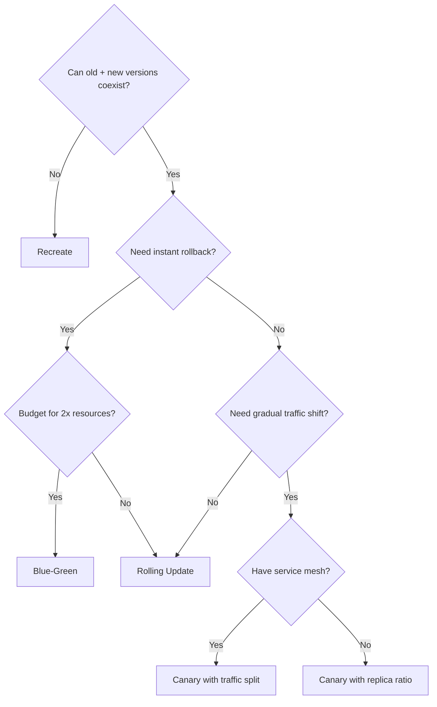

> 💡 **Quick Answer:** deployments

## The Problem

This is one of the most searched Kubernetes topics with thousands of monthly searches. A comprehensive, production-ready guide prevents hours of trial and error.

## The Solution

### Strategy Comparison

| Strategy | Downtime | Rollback | Resource Cost | Risk | Use For |
|----------|----------|----------|--------------|------|---------|
| **Rolling Update** | None | `rollout undo` | +25% | Medium | Most workloads |
| **Recreate** | Yes | Redeploy | None | High | DB schema changes |
| **Blue-Green** | None | Instant (switch) | +100% | Low | Critical services |
| **Canary** | None | Scale down | +10% | Very low | User-facing apps |
| **A/B Testing** | None | Remove route | +10% | Low | Feature experiments |

### Recreate Strategy

```yaml
spec:
  strategy:
    type: Recreate     # Kill all old pods, then create new
# Use when: app can't run 2 versions simultaneously
# Example: database migration, single-instance apps
```

### Rolling Update

```yaml
spec:
  strategy:
    type: RollingUpdate
    rollingUpdate:
      maxSurge: 25%
      maxUnavailable: 25%
# Use when: app supports running old + new simultaneously
# Default strategy — works for most stateless apps
```

### Decision Flowchart



### When to Use Each

| Scenario | Strategy |
|----------|----------|
| Regular updates, stateless app | Rolling Update |
| Database migration, breaking changes | Recreate |
| Payment system, zero tolerance for errors | Blue-Green |
| New feature, monitor error rates | Canary |
| A/B test, measure conversion | A/B Testing (Istio/Flagger) |
| First deploy, no existing users | Recreate |

## Frequently Asked Questions

### What's the default strategy?

Rolling Update with maxSurge=25% and maxUnavailable=25%. This works well for most stateless applications.

### Can I combine strategies?

Yes — Argo Rollouts supports canary with automated analysis that falls back to blue-green on failure. You can also pause rolling updates for manual canary testing.

## Best Practices

- Start with the simplest configuration that solves your problem
- Test in staging before production
- Use `kubectl describe` and events for troubleshooting
- Document team conventions for consistency

## Key Takeaways

- This is fundamental Kubernetes operational knowledge
- Follow established conventions and recommended labels
- Monitor and iterate based on real production behavior
- Automate repetitive tasks to reduce human error
