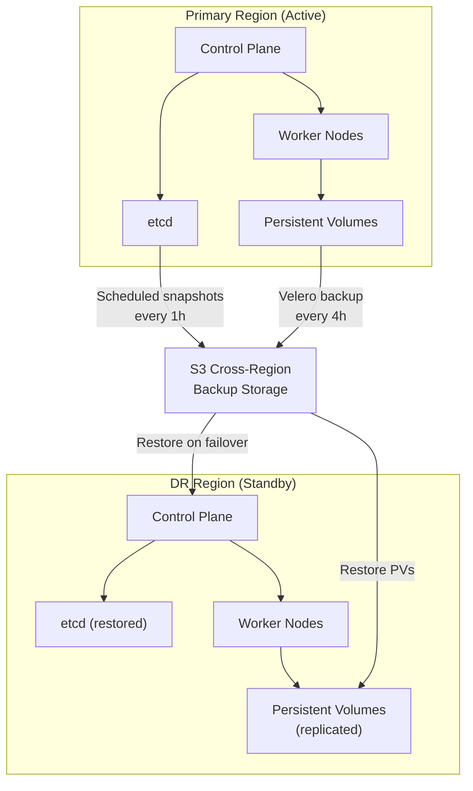

> 💡 **Quick Answer:** Enterprise DR combines etcd snapshots (cluster state), Velero backups (workloads + PVs), cross-region replication, and automated failover. Define RTO/RPO targets per workload tier, then implement matching backup frequency and recovery procedures.

## The Problem

Enterprise Kubernetes clusters run business-critical workloads where downtime means revenue loss, SLA violations, or regulatory penalties. You need a disaster recovery strategy that covers cluster-level failures (etcd corruption, control plane loss), application-level failures (accidental deletion, data corruption), and site-level failures (datacenter outage).



## The Solution

### Define RTO/RPO by Workload Tier

| Tier | RTO | RPO | Backup Freq | Examples |
|------|-----|-----|-------------|----------|
| **Tier 1** (Critical) | <15 min | <5 min | Continuous replication | Payment processing, auth services |
| **Tier 2** (Important) | <1 hour | <1 hour | Every 1h | APIs, databases, inference endpoints |
| **Tier 3** (Standard) | <4 hours | <4 hours | Every 4h | Internal tools, dashboards |
| **Tier 4** (Low) | <24 hours | <24 hours | Daily | Dev/staging, batch jobs |

### etcd Backup Strategy

```bash
#!/bin/bash
# etcd-backup.sh — scheduled via CronJob
set -euo pipefail

BACKUP_DIR="/backup/etcd"
TIMESTAMP=$(date +%Y%m%d-%H%M%S)
S3_BUCKET="s3://k8s-dr-backups/etcd"

# Create snapshot
ETCDCTL_API=3 etcdctl snapshot save "${BACKUP_DIR}/snapshot-${TIMESTAMP}.db" \
  --endpoints=https://127.0.0.1:2379 \
  --cacert=/etc/kubernetes/pki/etcd/ca.crt \
  --cert=/etc/kubernetes/pki/etcd/server.crt \
  --key=/etc/kubernetes/pki/etcd/server.key

# Verify snapshot
ETCDCTL_API=3 etcdctl snapshot status "${BACKUP_DIR}/snapshot-${TIMESTAMP}.db" --write-out=table

# Upload to cross-region S3
aws s3 cp "${BACKUP_DIR}/snapshot-${TIMESTAMP}.db" \
  "${S3_BUCKET}/snapshot-${TIMESTAMP}.db" \
  --storage-class STANDARD_IA

# Retain last 48 hourly snapshots
find "${BACKUP_DIR}" -name "snapshot-*.db" -mtime +2 -delete

echo "etcd backup completed: snapshot-${TIMESTAMP}.db"
```

```yaml
# CronJob for automated etcd backups
apiVersion: batch/v1
kind: CronJob
metadata:
  name: etcd-backup
  namespace: kube-system
spec:
  schedule: "0 * * * *"  # Every hour
  concurrencyPolicy: Forbid
  successfulJobsHistoryLimit: 3
  failedJobsHistoryLimit: 3
  jobTemplate:
    spec:
      template:
        spec:
          hostNetwork: true
          nodeSelector:
            node-role.kubernetes.io/control-plane: ""
          tolerations:
            - effect: NoSchedule
              key: node-role.kubernetes.io/control-plane
          containers:
            - name: etcd-backup
              image: registry.k8s.io/etcd:3.5.15-0
              command: ["/bin/sh", "-c"]
              args:
                - |
                  ETCDCTL_API=3 etcdctl snapshot save /backup/snapshot-$(date +%Y%m%d-%H%M%S).db \
                    --endpoints=https://127.0.0.1:2379 \
                    --cacert=/etc/kubernetes/pki/etcd/ca.crt \
                    --cert=/etc/kubernetes/pki/etcd/server.crt \
                    --key=/etc/kubernetes/pki/etcd/server.key
              volumeMounts:
                - name: etcd-certs
                  mountPath: /etc/kubernetes/pki/etcd
                  readOnly: true
                - name: backup
                  mountPath: /backup
          volumes:
            - name: etcd-certs
              hostPath:
                path: /etc/kubernetes/pki/etcd
            - name: backup
              persistentVolumeClaim:
                claimName: etcd-backup-pvc
          restartPolicy: OnFailure
```

### Velero Workload Backups

```bash
# Install Velero with S3 backend
velero install \
  --provider aws \
  --bucket k8s-dr-backups \
  --secret-file ./credentials-velero \
  --backup-location-config region=us-east-1 \
  --snapshot-location-config region=us-east-1 \
  --use-restic

# Tier 1: Continuous backup for critical namespaces
velero schedule create tier1-critical \
  --schedule="*/5 * * * *" \
  --include-namespaces=payments,auth,api-gateway \
  --ttl 168h \
  --snapshot-volumes=true

# Tier 2: Hourly for important workloads
velero schedule create tier2-important \
  --schedule="0 * * * *" \
  --include-namespaces=backend,databases,inference \
  --ttl 720h \
  --snapshot-volumes=true

# Tier 3: Every 4 hours for standard
velero schedule create tier3-standard \
  --schedule="0 */4 * * *" \
  --include-namespaces=monitoring,logging,internal-tools \
  --ttl 720h

# Tier 4: Daily for low priority
velero schedule create tier4-low \
  --schedule="0 2 * * *" \
  --include-namespaces=dev,staging \
  --ttl 720h
```

### Multi-Cluster Failover with Submariner

```yaml
# Primary cluster: export services for cross-cluster access
apiVersion: multicluster.x-k8s.io/v1alpha1
kind: ServiceExport
metadata:
  name: api-gateway
  namespace: production
---
# DR cluster: import services (ready for failover)
apiVersion: multicluster.x-k8s.io/v1alpha1
kind: ServiceImport
metadata:
  name: api-gateway
  namespace: production
spec:
  type: ClusterSetIP
  ports:
    - port: 443
      protocol: TCP
```

### DR Runbook: Full Cluster Recovery

```bash
#!/bin/bash
# dr-recover.sh — Full cluster recovery from backup
set -euo pipefail

echo "=== Step 1: Restore etcd from latest snapshot ==="
LATEST_SNAPSHOT=$(aws s3 ls s3://k8s-dr-backups/etcd/ | sort | tail -1 | awk '{print $4}')
aws s3 cp "s3://k8s-dr-backups/etcd/${LATEST_SNAPSHOT}" /tmp/etcd-restore.db

ETCDCTL_API=3 etcdctl snapshot restore /tmp/etcd-restore.db \
  --data-dir=/var/lib/etcd-restored \
  --name=dr-node-1 \
  --initial-cluster=dr-node-1=https://10.0.1.10:2380 \
  --initial-advertise-peer-urls=https://10.0.1.10:2380

echo "=== Step 2: Start control plane with restored etcd ==="
# Update etcd data-dir in manifests
sed -i 's|/var/lib/etcd|/var/lib/etcd-restored|' /etc/kubernetes/manifests/etcd.yaml

echo "=== Step 3: Restore workloads via Velero ==="
velero restore create full-dr-restore \
  --from-schedule tier1-critical \
  --restore-volumes=true

velero restore create tier2-restore \
  --from-schedule tier2-important \
  --restore-volumes=true

echo "=== Step 4: Verify cluster health ==="
kubectl get nodes
kubectl get pods --all-namespaces | grep -v Running | grep -v Completed

echo "=== Step 5: Update DNS to point to DR cluster ==="
echo "ACTION REQUIRED: Update external DNS records to DR cluster ingress IP"
```

## Common Issues

| Issue | Cause | Fix |
|-------|-------|-----|
| Velero restore stuck | PV snapshot not available in DR region | Enable cross-region snapshot replication |
| etcd restore fails | Snapshot from different cluster version | Match etcd version between backup and restore |
| Services unreachable after restore | ClusterIP/NodePort changed | Use Ingress with DNS-based failover, not direct IPs |
| PVC data missing | Velero didn't include PVs | Add `--snapshot-volumes=true` to backup schedule |
| Long RTO due to image pulls | Images not cached in DR region | Pre-pull images or use registry replication |

## Best Practices

- **Test DR quarterly** — run full recovery drills; untested DR plans are not DR plans
- **Automate everything** — manual recovery steps will be forgotten under pressure
- **Cross-region backups** — same-region backups don't protect against datacenter failures
- **Version-match etcd** — always restore etcd snapshots on the same etcd version
- **Document runbooks** — step-by-step recovery procedures accessible to the on-call team
- **Monitor backup health** — alert on failed Velero schedules and etcd backup jobs

## Key Takeaways

- Enterprise DR requires layered backups: etcd snapshots (cluster state) + Velero (workloads + volumes)
- Define RTO/RPO per workload tier and match backup frequency accordingly
- Cross-region S3 storage ensures backups survive datacenter failures
- Automate recovery with scripts and test quarterly with full failover drills
