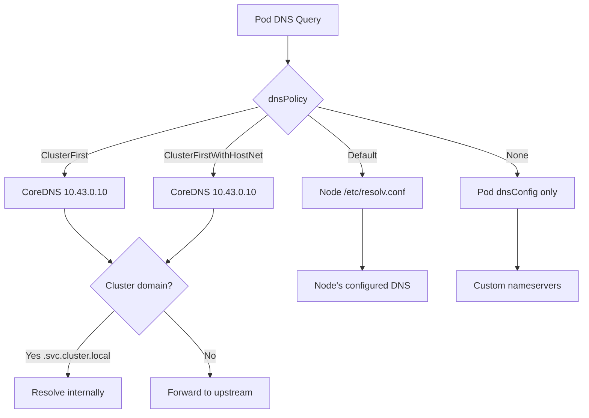

> 💡 **Quick Answer:** Use `dnsPolicy: ClusterFirstWithHostNet` when your pod uses `hostNetwork: true` but still needs to resolve cluster services (e.g., `myservice.namespace.svc.cluster.local`). Without it, hostNetwork pods use the node's `/etc/resolv.conf` and can't find cluster DNS.

## The Problem

When a pod uses `hostNetwork: true`:
- It gets the node's `/etc/resolv.conf` instead of the cluster DNS
- Service names like `postgres.default.svc.cluster.local` fail to resolve
- The pod can reach external DNS but not internal Kubernetes services

This breaks DaemonSets (monitoring agents, log collectors) that need both host networking and cluster service access.

## The Solution

### DNS Policy Options

```yaml
apiVersion: v1
kind: Pod
metadata:
  name: example
spec:
  # Choose one:
  dnsPolicy: ClusterFirst              # Default — uses cluster DNS (CoreDNS)
  dnsPolicy: ClusterFirstWithHostNet   # For hostNetwork pods needing cluster DNS
  dnsPolicy: Default                   # Uses node's /etc/resolv.conf
  dnsPolicy: None                      # Custom — must provide dnsConfig
```

### ClusterFirstWithHostNet (The Fix)

```yaml
apiVersion: apps/v1
kind: DaemonSet
metadata:
  name: monitoring-agent
spec:
  template:
    spec:
      hostNetwork: true
      dnsPolicy: ClusterFirstWithHostNet  # ← This is the fix
      containers:
        - name: agent
          image: monitoring-agent:1.0.0
          # Can now resolve both:
          # - external: google.com ✓
          # - cluster: prometheus.monitoring.svc.cluster.local ✓
```

### How Each Policy Resolves DNS



### Check Current DNS Configuration

```bash
# See what resolv.conf the pod actually uses
kubectl exec myapp-pod -- cat /etc/resolv.conf

# For ClusterFirst:
# nameserver 10.43.0.10
# search default.svc.cluster.local svc.cluster.local cluster.local
# options ndots:5

# For Default (hostNetwork without fix):
# nameserver 8.8.8.8
# search hetzner.cloud
# (no cluster.local — can't resolve services!)
```

### Custom DNS with dnsPolicy: None

```yaml
apiVersion: v1
kind: Pod
metadata:
  name: custom-dns
spec:
  dnsPolicy: None
  dnsConfig:
    nameservers:
      - 10.43.0.10      # Cluster DNS
      - 1.1.1.1         # Cloudflare fallback
    searches:
      - default.svc.cluster.local
      - svc.cluster.local
      - cluster.local
      - example.com      # Custom search domain
    options:
      - name: ndots
        value: "3"       # Reduce DNS queries (default 5 is often too high)
      - name: timeout
        value: "2"
      - name: attempts
        value: "3"
```

### ndots Optimization

```yaml
# Default ndots:5 means any name with < 5 dots gets search domains appended
# "postgres" → tries postgres.default.svc.cluster.local, postgres.svc.cluster.local, etc.
# Reducing ndots:2 means FQDNs (external.api.com) resolve faster

spec:
  dnsConfig:
    options:
      - name: ndots
        value: "2"
```

## Common Issues

| Issue | Cause | Fix |
|-------|-------|-----|
| hostNetwork pod can't resolve services | Using `dnsPolicy: Default` implicitly | Set `dnsPolicy: ClusterFirstWithHostNet` |
| Slow DNS resolution | ndots:5 causes extra lookups | Lower to ndots:2 or use FQDN with trailing dot |
| DNS timeout | CoreDNS pod not running | Check `kubectl get pods -n kube-system -l k8s-app=kube-dns` |
| Wrong search domain | Incorrect namespace in resolv.conf | Verify pod namespace matches expected searches |
| External DNS fails | CoreDNS upstream not configured | Check CoreDNS Corefile upstream block |

## Best Practices

1. **Always set `ClusterFirstWithHostNet` for hostNetwork pods** — don't rely on default
2. **Lower ndots to 2-3 for external-heavy workloads** — reduces DNS query volume by 3-4×
3. **Use FQDN with trailing dot for external names** — `api.example.com.` skips search domains
4. **Monitor CoreDNS metrics** — `coredns_dns_requests_total` and `coredns_dns_responses_total`
5. **Use `dnsPolicy: None` sparingly** — only for split-horizon or multi-cluster DNS

## Key Takeaways

- `ClusterFirst` is the default — resolves cluster services via CoreDNS
- `ClusterFirstWithHostNet` = ClusterFirst for `hostNetwork: true` pods (must be explicit)
- `Default` uses node DNS — no cluster service resolution
- `None` + `dnsConfig` gives full control — useful for custom DNS architectures
- `ndots:5` is the default and causes 4 extra DNS queries per external lookup — optimize for latency-sensitive apps
