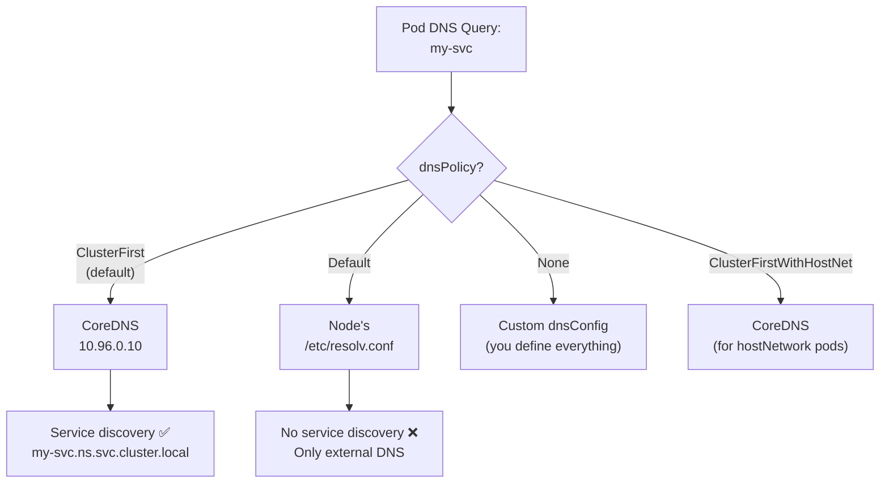

> 💡 **Quick Answer:** \`dnsPolicy: ClusterFirst\` (default) routes DNS through CoreDNS for service discovery. Use \`ClusterFirstWithHostNet\` when \`hostNetwork: true\` to keep cluster DNS. Use \`None\` with \`dnsConfig\` for fully custom DNS. Use \`Default\` to inherit node's DNS (skips cluster DNS entirely).

## The Problem

Pods need different DNS configurations depending on the workload:
- Standard pods need cluster DNS for service discovery (\`my-svc.my-ns.svc.cluster.local\`)
- Host-network pods lose cluster DNS unless you explicitly set \`ClusterFirstWithHostNet\`
- Some pods need external DNS servers or custom search domains
- High-QPS pods may need \`ndots\` tuning to reduce DNS lookups



## The Solution

### ClusterFirst (Default)

All DNS queries go to CoreDNS. Service discovery works automatically:

```yaml
apiVersion: v1
kind: Pod
metadata:
  name: app
spec:
  dnsPolicy: ClusterFirst    # Default — can be omitted
  containers:
    - name: app
      image: nginx
```

Resulting \`/etc/resolv.conf\`:
```
nameserver 10.96.0.10          # CoreDNS ClusterIP
search default.svc.cluster.local svc.cluster.local cluster.local
options ndots:5
```

### ClusterFirstWithHostNet

**Essential for hostNetwork pods** — without this, host-network pods use node DNS and lose service discovery:

```yaml
apiVersion: v1
kind: Pod
metadata:
  name: monitoring-agent
spec:
  hostNetwork: true
  dnsPolicy: ClusterFirstWithHostNet   # ← Required!
  containers:
    - name: agent
      image: datadog/agent
```

```bash
# Without ClusterFirstWithHostNet:
kubectl exec monitoring-agent -- cat /etc/resolv.conf
# nameserver 8.8.8.8             ← node DNS, no cluster service discovery!

# With ClusterFirstWithHostNet:
kubectl exec monitoring-agent -- cat /etc/resolv.conf
# nameserver 10.96.0.10          ← CoreDNS, service discovery works ✅
```

### Default (Node DNS)

Inherits the node's \`/etc/resolv.conf\`:

```yaml
spec:
  dnsPolicy: Default
  # Pod uses node's DNS servers
  # No service discovery — can't resolve my-svc.my-ns
```

**Use when:** Pod only needs external DNS (e.g., internet-only workloads, init containers pulling from external URLs).

### None + dnsConfig (Fully Custom)

Complete control over DNS configuration:

```yaml
apiVersion: v1
kind: Pod
metadata:
  name: custom-dns
spec:
  dnsPolicy: None
  dnsConfig:
    nameservers:
      - 8.8.8.8
      - 1.1.1.1
    searches:
      - my-company.internal
      - example.com
    options:
      - name: ndots
        value: "2"
      - name: timeout
        value: "3"
      - name: attempts
        value: "2"
  containers:
    - name: app
      image: nginx
```

### dnsConfig as Override (with Any Policy)

\`dnsConfig\` can extend any dnsPolicy — it merges with the policy-generated resolv.conf:

```yaml
spec:
  dnsPolicy: ClusterFirst          # Start with cluster DNS
  dnsConfig:
    nameservers:
      - 10.0.0.53                  # Add corporate DNS
    searches:
      - corp.example.com           # Add corporate search domain
    options:
      - name: ndots
        value: "2"                 # Override ndots (default 5)
```

### Tune ndots for Performance

Default \`ndots:5\` means any hostname with fewer than 5 dots gets all search domains appended first:

```bash
# With ndots:5, resolving "api.example.com" (2 dots < 5) causes:
# 1. api.example.com.default.svc.cluster.local  ← NXDOMAIN
# 2. api.example.com.svc.cluster.local          ← NXDOMAIN
# 3. api.example.com.cluster.local              ← NXDOMAIN
# 4. api.example.com                            ← SUCCESS (4th try!)

# With ndots:2:
# 1. api.example.com  ← SUCCESS (first try!) ✅
# But: "my-svc" (0 dots) still gets search domains appended correctly
```

```yaml
# Recommended for pods making many external DNS calls
spec:
  dnsPolicy: ClusterFirst
  dnsConfig:
    options:
      - name: ndots
        value: "2"
```

### Comparison Table

| Policy | DNS Server | Service Discovery | Use Case |
|--------|-----------|:-----------------:|----------|
| \`ClusterFirst\` | CoreDNS | ✅ Yes | Standard pods (default) |
| \`ClusterFirstWithHostNet\` | CoreDNS | ✅ Yes | hostNetwork pods |
| \`Default\` | Node DNS | ❌ No | Internet-only workloads |
| \`None\` | Custom | Depends on config | Full control needed |

### Debug DNS

```bash
# Check pod's resolv.conf
kubectl exec my-pod -- cat /etc/resolv.conf

# Test DNS resolution
kubectl exec my-pod -- nslookup kubernetes.default
kubectl exec my-pod -- nslookup my-svc.my-namespace.svc.cluster.local

# Check CoreDNS is running
kubectl get pods -n kube-system -l k8s-app=kube-dns

# CoreDNS logs
kubectl logs -n kube-system -l k8s-app=kube-dns
```

## Common Issues

| Issue | Cause | Fix |
|-------|-------|-----|
| hostNetwork pod can't resolve services | Missing \`ClusterFirstWithHostNet\` | Add \`dnsPolicy: ClusterFirstWithHostNet\` |
| Slow DNS for external domains | \`ndots:5\` causes 3-4 extra lookups | Set \`ndots: 2\` in dnsConfig |
| Pod can't resolve anything | CoreDNS down or NetworkPolicy blocking UDP/53 | Check CoreDNS pods and network policies |
| Custom nameserver not working | \`dnsConfig\` without \`dnsPolicy: None\` | \`dnsConfig\` merges — check resulting resolv.conf |
| Search domain limit exceeded | Max 6 search domains, 256 chars | Reduce search domains in dnsConfig |

## Best Practices

- **Always use \`ClusterFirstWithHostNet\`** for hostNetwork pods that need service discovery
- **Set \`ndots: 2\`** for pods making frequent external DNS calls — reduces latency 3-4×
- **Use FQDNs with trailing dot** (\`api.example.com.\`) to bypass search domain expansion
- **Don't use \`Default\` policy** unless you specifically want to skip cluster DNS
- **Monitor CoreDNS metrics** — high NXDOMAIN rates indicate ndots tuning needed

## Key Takeaways

- \`ClusterFirst\` is the default — routes all DNS through CoreDNS
- \`ClusterFirstWithHostNet\` is **required** for hostNetwork pods to keep cluster DNS
- \`dnsConfig\` can extend any policy — useful for adding nameservers or tuning ndots
- Default \`ndots:5\` causes 3-4 extra DNS lookups for external domains — tune to 2 for performance
- \`None\` gives full control but you must configure everything manually
- Debug with \`cat /etc/resolv.conf\` inside the pod
