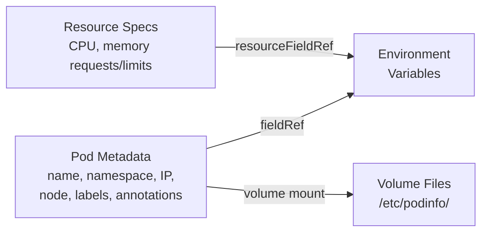

> 💡 **Quick Answer:** The Downward API lets containers access their own pod metadata without calling the Kubernetes API. Use \`fieldRef\` for pod name, namespace, node name, IP, service account. Use \`resourceFieldRef\` for CPU/memory requests and limits. Available as env vars or mounted files.

## The Problem

Containers often need to know about themselves — their pod name (for logging), node name (for topology-aware routing), IP address (for peer discovery), or resource limits (for runtime tuning). Without the Downward API, containers would need Kubernetes API access and RBAC permissions just to read their own metadata.



## The Solution

### Environment Variables with \`fieldRef\`

```yaml
apiVersion: v1
kind: Pod
metadata:
  name: my-app
  namespace: production
  labels:
    app: web
    version: v2
  annotations:
    owner: team-platform
spec:
  containers:
    - name: app
      image: nginx
      env:
        # Pod metadata
        - name: POD_NAME
          valueFrom:
            fieldRef:
              fieldPath: metadata.name           # → "my-app"

        - name: POD_NAMESPACE
          valueFrom:
            fieldRef:
              fieldPath: metadata.namespace       # → "production"

        - name: POD_IP
          valueFrom:
            fieldRef:
              fieldPath: status.podIP             # → "10.244.1.23"

        - name: NODE_NAME
          valueFrom:
            fieldRef:
              fieldPath: spec.nodeName            # → "worker-node-03"

        - name: SERVICE_ACCOUNT
          valueFrom:
            fieldRef:
              fieldPath: spec.serviceAccountName  # → "default"

        - name: HOST_IP
          valueFrom:
            fieldRef:
              fieldPath: status.hostIP            # → "192.168.1.103"

        - name: POD_UID
          valueFrom:
            fieldRef:
              fieldPath: metadata.uid             # → "a1b2c3d4-..."
```

### Available \`fieldRef\` Fields

| fieldPath | Value | Example |
|-----------|-------|---------|
| \`metadata.name\` | Pod name | \`my-app-7b8f4d\` |
| \`metadata.namespace\` | Pod namespace | \`production\` |
| \`metadata.uid\` | Pod UID | \`a1b2c3d4-e5f6-...\` |
| \`metadata.labels['key']\` | Specific label value | \`v2\` |
| \`metadata.annotations['key']\` | Specific annotation value | \`team-platform\` |
| \`spec.nodeName\` | Node the pod runs on | \`worker-03\` |
| \`spec.serviceAccountName\` | Service account name | \`default\` |
| \`status.podIP\` | Pod IP address | \`10.244.1.23\` |
| \`status.hostIP\` | Node IP address | \`192.168.1.103\` |
| \`status.podIPs\` | All pod IPs (volume only) | Dual-stack IPs |

### Resource Fields with \`resourceFieldRef\`

```yaml
env:
  - name: CPU_REQUEST
    valueFrom:
      resourceFieldRef:
        containerName: app     # Required if multiple containers
        resource: requests.cpu
        divisor: "1m"          # Output in millicores → "200"

  - name: CPU_LIMIT
    valueFrom:
      resourceFieldRef:
        resource: limits.cpu
        divisor: "1m"          # → "500"

  - name: MEMORY_REQUEST
    valueFrom:
      resourceFieldRef:
        resource: requests.memory
        divisor: "1Mi"         # Output in MiB → "256"

  - name: MEMORY_LIMIT
    valueFrom:
      resourceFieldRef:
        resource: limits.memory
        divisor: "1Mi"         # → "512"
```

### Volume-Based Downward API

Labels and annotations that change at runtime (via \`kubectl label\`) are reflected in volumes but NOT in env vars:

```yaml
spec:
  containers:
    - name: app
      image: nginx
      volumeMounts:
        - name: podinfo
          mountPath: /etc/podinfo
  volumes:
    - name: podinfo
      downwardAPI:
        items:
          - path: "name"
            fieldRef:
              fieldPath: metadata.name
          - path: "namespace"
            fieldRef:
              fieldPath: metadata.namespace
          - path: "labels"
            fieldRef:
              fieldPath: metadata.labels
          - path: "annotations"
            fieldRef:
              fieldPath: metadata.annotations
          - path: "cpu_limit"
            resourceFieldRef:
              containerName: app
              resource: limits.cpu
              divisor: "1m"
```

```bash
# Inside the container:
cat /etc/podinfo/name          # my-app
cat /etc/podinfo/namespace     # production
cat /etc/podinfo/labels        # app="web"\nversion="v2"
cat /etc/podinfo/cpu_limit     # 500
```

### Real-World Use Cases

#### 1. Logging with Pod Identity

```yaml
env:
  - name: POD_NAME
    valueFrom:
      fieldRef:
        fieldPath: metadata.name
  - name: POD_NAMESPACE
    valueFrom:
      fieldRef:
        fieldPath: metadata.namespace
# App uses: logger.info("Request handled", extra={"pod": os.environ["POD_NAME"]})
```

#### 2. Peer Discovery (StatefulSet)

```yaml
env:
  - name: POD_NAME
    valueFrom:
      fieldRef:
        fieldPath: metadata.name
  - name: POD_IP
    valueFrom:
      fieldRef:
        fieldPath: status.podIP
# Peer address: ${POD_NAME}.headless-svc.${NAMESPACE}.svc.cluster.local
```

#### 3. JVM Memory Tuning from Limits

```yaml
env:
  - name: MEMORY_LIMIT
    valueFrom:
      resourceFieldRef:
        resource: limits.memory
        divisor: "1Mi"
command:
  - java
  - -Xmx$(MEMORY_LIMIT)m    # Dynamic heap size from container limit
  - -jar
  - /app.jar
```

#### 4. NCCL Network Configuration

```yaml
env:
  - name: NODE_NAME
    valueFrom:
      fieldRef:
        fieldPath: spec.nodeName
  - name: POD_IP
    valueFrom:
      fieldRef:
        fieldPath: status.podIP
  - name: MASTER_ADDR
    value: "trainer-0.trainer-headless"
  - name: NCCL_SOCKET_IFNAME
    value: "eth0"
```

## Common Issues

| Issue | Cause | Fix |
|-------|-------|-----|
| Label changes not reflected | Env vars set at pod creation only | Use volume mount for dynamic labels |
| \`resourceFieldRef\` empty | Missing container name in multi-container pod | Specify \`containerName\` |
| \`status.podIP\` empty at start | IP not assigned yet | Use init container or retry logic |
| Wrong divisor output | Divisor doesn't match expected format | Use \`1m\` for CPU millicores, \`1Mi\` for memory MiB |
| Can't access other pod's metadata | Downward API is self-only | Use Kubernetes API client for other pods |

## Best Practices

- **Use env vars for static metadata** — pod name, namespace, node name don't change
- **Use volumes for labels/annotations** — they can change at runtime
- **Set \`divisor\`** for resource fields — get human-readable values instead of raw bytes
- **Avoid API calls when Downward API suffices** — no RBAC needed, lower latency
- **Combine with \`envsubst\`** — template config files using downward API env vars

## Key Takeaways

- Downward API exposes pod metadata to containers without Kubernetes API access
- \`fieldRef\` provides: pod name, namespace, IP, node name, UID, labels, annotations
- \`resourceFieldRef\` provides: CPU/memory requests and limits with configurable divisor
- Env vars are set at pod creation (static); volumes update dynamically for labels/annotations
- No RBAC required — containers read only their own pod's metadata
