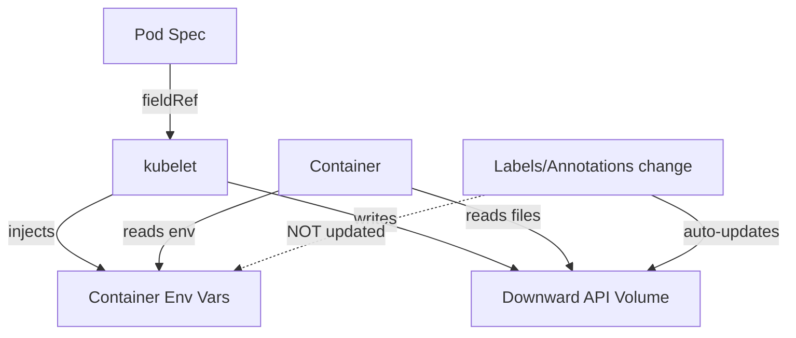

> 💡 **Quick Answer:** The Downward API exposes pod/container metadata via environment variables (`fieldRef`) or volume files. Use `fieldRef` for pod name, namespace, node name, labels, and annotations. Use `resourceFieldRef` for CPU/memory requests and limits.

## The Problem

Your application needs to know:
- Which pod it's running in (for logging, metrics)
- Which node it's on (for topology-aware decisions)
- Its own resource limits (for tuning thread pools, heap size)
- Its labels/annotations (for dynamic configuration)

But hardcoding this breaks portability. The Downward API injects it automatically.

## The Solution

### Environment Variables with fieldRef

```yaml
apiVersion: v1
kind: Pod
metadata:
  name: myapp
  labels:
    app: myapp
    version: v2
  annotations:
    team: platform
spec:
  containers:
    - name: app
      image: myapp:1.0.0
      env:
        # Pod metadata
        - name: POD_NAME
          valueFrom:
            fieldRef:
              fieldPath: metadata.name
        - name: POD_NAMESPACE
          valueFrom:
            fieldRef:
              fieldPath: metadata.namespace
        - name: POD_IP
          valueFrom:
            fieldRef:
              fieldPath: status.podIP
        - name: NODE_NAME
          valueFrom:
            fieldRef:
              fieldPath: spec.nodeName
        - name: SERVICE_ACCOUNT
          valueFrom:
            fieldRef:
              fieldPath: spec.serviceAccountName
        - name: HOST_IP
          valueFrom:
            fieldRef:
              fieldPath: status.hostIP
        - name: POD_UID
          valueFrom:
            fieldRef:
              fieldPath: metadata.uid

        # Resource limits
        - name: CPU_REQUEST
          valueFrom:
            resourceFieldRef:
              containerName: app
              resource: requests.cpu
        - name: CPU_LIMIT
          valueFrom:
            resourceFieldRef:
              containerName: app
              resource: limits.cpu
        - name: MEMORY_LIMIT
          valueFrom:
            resourceFieldRef:
              containerName: app
              resource: limits.memory
              divisor: "1Mi"  # Output in MiB

      resources:
        requests:
          cpu: "250m"
          memory: "256Mi"
        limits:
          cpu: "1"
          memory: "512Mi"
```

### Volume Files (Labels and Annotations)

```yaml
apiVersion: v1
kind: Pod
metadata:
  name: myapp
  labels:
    app: myapp
    version: v2
    environment: production
  annotations:
    build/commit: "abc123"
    team: platform
spec:
  containers:
    - name: app
      image: myapp:1.0.0
      volumeMounts:
        - name: podinfo
          mountPath: /etc/podinfo
          readOnly: true
  volumes:
    - name: podinfo
      downwardAPI:
        items:
          - path: "labels"
            fieldRef:
              fieldPath: metadata.labels
          - path: "annotations"
            fieldRef:
              fieldPath: metadata.annotations
          - path: "name"
            fieldRef:
              fieldPath: metadata.name
          - path: "namespace"
            fieldRef:
              fieldPath: metadata.namespace
          - path: "cpu_limit"
            resourceFieldRef:
              containerName: app
              resource: limits.cpu
              divisor: "1m"  # millicores
```

```bash
# Inside the container:
cat /etc/podinfo/labels
# app="myapp"
# environment="production"
# version="v2"

cat /etc/podinfo/name
# myapp

cat /etc/podinfo/cpu_limit
# 1000
```

### Available Fields

| fieldPath | Type | Description |
|-----------|------|-------------|
| `metadata.name` | env/vol | Pod name |
| `metadata.namespace` | env/vol | Pod namespace |
| `metadata.uid` | env/vol | Pod UID |
| `metadata.labels` | vol only | All labels |
| `metadata.labels['key']` | env | Specific label |
| `metadata.annotations` | vol only | All annotations |
| `metadata.annotations['key']` | env | Specific annotation |
| `spec.nodeName` | env | Node the pod runs on |
| `spec.serviceAccountName` | env | Service account |
| `status.podIP` | env | Pod IP address |
| `status.hostIP` | env | Node IP address |

### Practical: Java Heap from Memory Limit

```yaml
env:
  - name: MEMORY_LIMIT_MB
    valueFrom:
      resourceFieldRef:
        resource: limits.memory
        divisor: "1Mi"
  - name: JAVA_OPTS
    value: "-Xmx$(MEMORY_LIMIT_MB)m -Xms$(MEMORY_LIMIT_MB)m"
```

### Practical: Structured Logging with Pod Identity

```yaml
env:
  - name: POD_NAME
    valueFrom:
      fieldRef:
        fieldPath: metadata.name
  - name: POD_NAMESPACE
    valueFrom:
      fieldRef:
        fieldPath: metadata.namespace
  - name: NODE_NAME
    valueFrom:
      fieldRef:
        fieldPath: spec.nodeName
# App uses these for structured log context:
# {"pod": "myapp-6f7b9c4d5-abc12", "ns": "production", "node": "worker-3", "msg": "..."}
```

### Architecture



**Note:** Volume files update when labels/annotations change. Environment variables are set at container start and never change.

## Common Issues

| Issue | Cause | Fix |
|-------|-------|-----|
| Env var empty | Pod not yet scheduled (status fields) | Use volume for dynamic fields |
| Labels not in env | `metadata.labels` only works in volumes | Use `metadata.labels['key']` for env |
| Memory shows bytes | No divisor set | Add `divisor: "1Mi"` or `"1Gi"` |
| Value not updating | Env vars are static after start | Use volume mount (auto-updates) |
| fieldPath invalid | Using unsupported field | Check available fields table above |

## Best Practices

1. **Use env vars for identity** (POD_NAME, NAMESPACE) — simple, fast access
2. **Use volumes for labels/annotations** — they auto-update and support all keys
3. **Set divisor for resource fields** — `1Mi` for memory, `1m` for CPU millicores
4. **Inject POD_NAME and NAMESPACE everywhere** — essential for observability
5. **Don't rely on env vars for dynamic values** — they're set once at container start

## Key Takeaways

- Downward API exposes pod metadata without external API calls
- `fieldRef` for pod info (name, namespace, IP, node); `resourceFieldRef` for resources
- Environment variables: static, set at start. Volumes: dynamic, auto-update
- Labels/annotations as a whole are volume-only; specific keys work as env vars
- Essential for structured logging, auto-scaling tuning, and topology awareness
