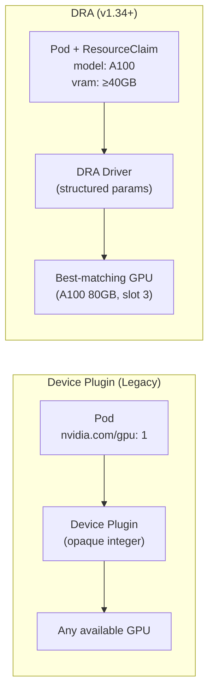

> 💡 **Quick Answer:** Dynamic Resource Allocation (DRA) replaces the device plugin model for GPUs with a richer, claim-based API. Instead of `nvidia.com/gpu: 1` in resource limits, pods create `ResourceClaim` objects specifying GPU model, VRAM, compute capability, or MIG partitions. DRA went GA in Kubernetes v1.34 and added partitionable devices in v1.36 — enabling fine-grained GPU sharing without MIG pre-configuration.

## The Problem

The traditional device plugin API (`nvidia.com/gpu: N`) is integer-based — you request whole GPUs with no way to express preferences like "A100 80GB with NVLink" or "any GPU with ≥40GB VRAM." MIG requires pre-partitioning. DRA solves this with structured parameters: pods describe what they need, and the scheduler finds the best match — including automatic GPU partitioning.



## The Solution

### Enable DRA (v1.34+)

```bash
# DRA is GA in v1.34 — no feature gate needed
# Verify DRA support
kubectl api-resources | grep resource.k8s.io

# Expected output:
# deviceclasses     resource.k8s.io/v1beta1   false   DeviceClass
# resourceclaims    resource.k8s.io/v1beta1   true    ResourceClaim
# resourceslices    resource.k8s.io/v1beta1   false   ResourceSlice
```

### Install NVIDIA DRA Driver

```bash
# NVIDIA DRA driver (replaces or runs alongside device plugin)
helm install nvidia-dra-driver nvidia/nvidia-dra-driver \
  --namespace nvidia-system \
  --set driver.enabled=true \
  --set deviceClasses.default.enabled=true
```

### DeviceClass Definition

```yaml
# DeviceClass published by NVIDIA DRA driver
apiVersion: resource.k8s.io/v1beta1
kind: DeviceClass
metadata:
  name: gpu.nvidia.com
spec:
  selectors:
    - cel:
        expression: "device.driver == 'gpu.nvidia.com'"
```

### ResourceClaim: Request Specific GPU

```yaml
# Request a specific GPU model
apiVersion: resource.k8s.io/v1beta1
kind: ResourceClaim
metadata:
  name: training-gpu
  namespace: ml-team
spec:
  devices:
    requests:
      - name: gpu
        deviceClassName: gpu.nvidia.com
        selectors:
          - cel:
              expression: >
                device.attributes["gpu.nvidia.com"].productName == "NVIDIA A100 80GB"
                && device.capacity["gpu.nvidia.com"].memory.compareTo(quantity("80Gi")) >= 0
---
# Pod using the ResourceClaim
apiVersion: v1
kind: Pod
metadata:
  name: training-job
spec:
  resourceClaims:
    - name: training-gpu
      resourceClaimName: training-gpu    # Reference the claim above
  containers:
    - name: trainer
      image: myorg/llm-trainer:v3.0
      resources:
        claims:
          - name: training-gpu
```

### ResourceClaim Template (Per-Pod)

```yaml
# Each pod gets its own GPU claim via template
apiVersion: apps/v1
kind: Deployment
metadata:
  name: inference-fleet
spec:
  replicas: 4
  template:
    spec:
      resourceClaims:
        - name: inference-gpu
          resourceClaimTemplateName: inference-gpu-template
      containers:
        - name: inference
          image: myorg/nim-llm:1.7.3
          resources:
            claims:
              - name: inference-gpu
---
apiVersion: resource.k8s.io/v1beta1
kind: ResourceClaimTemplate
metadata:
  name: inference-gpu-template
spec:
  spec:
    devices:
      requests:
        - name: gpu
          deviceClassName: gpu.nvidia.com
          selectors:
            - cel:
                expression: >
                  device.capacity["gpu.nvidia.com"].memory.compareTo(quantity("40Gi")) >= 0
```

### Partitionable Devices (v1.36+)

```yaml
# Request a GPU partition without pre-configuring MIG
apiVersion: resource.k8s.io/v1beta1
kind: ResourceClaim
metadata:
  name: small-gpu-partition
spec:
  devices:
    requests:
      - name: gpu-slice
        deviceClassName: gpu.nvidia.com
        selectors:
          - cel:
              expression: >
                device.attributes["gpu.nvidia.com"].productName == "NVIDIA A100 80GB"
        # Request a partition: 20GB VRAM, 2 compute slices
        partitionRequest:
          count: 1
          resources:
            memory: "20Gi"
            compute: 2             # Out of 7 MIG slices
```

### Multi-GPU with Topology Awareness

```yaml
# Request 4 GPUs with NVLink connectivity
apiVersion: resource.k8s.io/v1beta1
kind: ResourceClaim
metadata:
  name: nvlink-gpus
spec:
  devices:
    requests:
      - name: gpu
        deviceClassName: gpu.nvidia.com
        count: 4
        selectors:
          - cel:
              expression: >
                device.attributes["gpu.nvidia.com"].productName == "NVIDIA H100 80GB"
    constraints:
      - requests: ["gpu"]
        matchAttribute: "gpu.nvidia.com/nvswitch-domain"
        # All 4 GPUs must share the same NVSwitch domain
```

### DRA vs Device Plugin Comparison

| Feature | Device Plugin | DRA |
|---------|:------------:|:---:|
| Resource request | Integer count (`nvidia.com/gpu: 1`) | Structured claims (model, VRAM, features) |
| GPU selection | Random/first available | CEL-based matching |
| GPU partitioning | Pre-configure MIG profiles | Dynamic partitioning (v1.36+) |
| Topology awareness | Limited (topology manager) | Native constraint expressions |
| Multi-device correlation | Not supported | Constraint-based co-scheduling |
| Status | Stable, widely used | GA v1.34, expanding in v1.36 |
| NVIDIA support | nvidia-device-plugin | nvidia-dra-driver |

### Monitor DRA Claims

```bash
# Check ResourceClaims
kubectl get resourceclaims -A
kubectl describe resourceclaim training-gpu -n ml-team

# Check ResourceSlices (what's available)
kubectl get resourceslices -o wide

# Check allocation status
kubectl get resourceclaims -o jsonpath='{range .items[*]}{.metadata.name}{"\t"}{.status.allocation.devices[*].device}{"\n"}{end}'
```

## Common Issues

| Issue | Cause | Fix |
|-------|-------|-----|
| ResourceClaim stuck pending | No GPU matches selectors | Relax CEL expression or add matching hardware |
| DRA driver not installed | Missing nvidia-dra-driver | Install via Helm (requires GPU Operator 24.6+) |
| Partitioning fails | GPU doesn't support MIG | Use only A100/H100 for partitioning |
| "Unknown device class" | DeviceClass not created | Check DRA driver installed and published DeviceClasses |
| Multiple claims conflict | Topology constraint unsatisfiable | Reduce count or relax NVLink constraint |

## Best Practices

- **Use DRA for new clusters** — device plugin works but DRA is the future
- **Keep device plugin as fallback** — not all tooling supports DRA yet (2026)
- **Use CEL selectors conservatively** — overly specific selectors cause scheduling failures
- **Partition only when needed** — full GPU is always faster than partitioned
- **Combine with Kueue** — DRA handles GPU selection, Kueue handles queue management
- **Monitor ResourceSlice inventory** — know your GPU fleet's real-time availability

## Key Takeaways

- DRA replaces integer-based GPU requests with rich, structured resource claims
- CEL expressions match on GPU model, VRAM, compute capability, and topology
- Partitionable devices (v1.36) enable dynamic GPU sharing without pre-configured MIG
- Topology constraints co-locate multi-GPU workloads on the same NVSwitch domain
- GA since v1.34 — the future of accelerator scheduling on Kubernetes
- Combine with Kueue for complete GPU batch scheduling: DRA selects, Kueue queues
