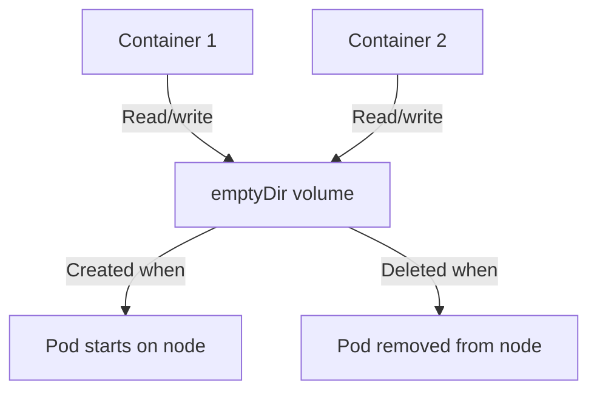

> 💡 **Quick Answer:** Use emptyDir volumes in Kubernetes for temporary storage, shared data between containers, and cache. Covers medium types, size limits, and tmpfs backing.

## The Problem

This is one of the most searched Kubernetes topics. Having a comprehensive, well-structured guide helps both beginners and experienced users quickly find what they need.

## The Solution

### Basic emptyDir

```yaml
apiVersion: v1
kind: Pod
metadata:
  name: web-app
spec:
  containers:
    - name: app
      image: my-app:v1
      volumeMounts:
        - name: cache
          mountPath: /tmp/cache
        - name: shared-data
          mountPath: /data
    - name: sidecar
      image: log-shipper:v1
      volumeMounts:
        - name: shared-data
          mountPath: /data    # Same volume — shared between containers
  volumes:
    - name: cache
      emptyDir:
        sizeLimit: 500Mi     # Evict pod if exceeded
    - name: shared-data
      emptyDir: {}           # No size limit (uses node disk)
```

### tmpfs (Memory-Backed)

```yaml
volumes:
  - name: fast-cache
    emptyDir:
      medium: Memory        # RAM-backed — ultra fast, counts against memory limits
      sizeLimit: 256Mi
```

### When to Use emptyDir

| Use Case | Configuration |
|----------|--------------|
| Scratch space / temp files | `emptyDir: {}` |
| Shared data between containers | `emptyDir: {}` |
| Cache directory | `emptyDir: { sizeLimit: 1Gi }` |
| High-speed processing | `emptyDir: { medium: Memory }` |
| Read-only rootfs writable /tmp | `emptyDir: {}` at `/tmp` |



## Frequently Asked Questions

### Does emptyDir persist across container restarts?

Yes — emptyDir survives container crashes/restarts within the same pod. It's deleted only when the pod is removed from the node.

### emptyDir vs PVC?

**emptyDir** is temporary (dies with the pod). **PVC** persists independently of the pod lifecycle. Use emptyDir for cache/temp, PVC for data that must survive pod deletion.

## Best Practices

- **Start simple** — use the basic form first, add complexity as needed
- **Be consistent** — follow naming conventions across your cluster
- **Document your choices** — add annotations explaining why, not just what
- **Monitor and iterate** — review configurations regularly

## Key Takeaways

- This is fundamental Kubernetes knowledge every engineer needs
- Start with the simplest approach that solves your problem
- Use `kubectl explain` and `kubectl describe` when unsure
- Practice in a test cluster before applying to production
