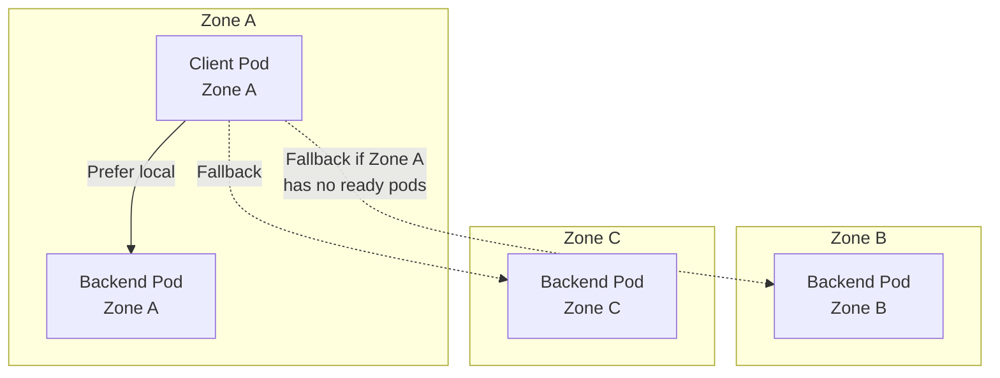

> 💡 **Quick Answer:** EndpointSlices replace Endpoints for clusters with 100+ pod backends. Enable topology-aware routing with `service.kubernetes.io/topology-mode: Auto` to prefer same-zone backends — reducing cross-zone data transfer costs by 60-80%.

## The Problem

With the legacy Endpoints API, every endpoint change (pod scale, rolling update) sends the FULL endpoint list to every node. For a Service with 1000 pods, that's 1000 endpoints × N nodes = massive etcd and network overhead. EndpointSlices split this into manageable chunks.

## The Solution

### EndpointSlices

```yaml
apiVersion: discovery.k8s.io/v1
kind: EndpointSlice
metadata:
  name: web-frontend-abc12
  labels:
    kubernetes.io/service-name: web-frontend
addressType: IPv4
endpoints:
  - addresses: ["10.244.1.5"]
    conditions:
      ready: true
    zone: "eu-west-1a"
    nodeName: worker-1
  - addresses: ["10.244.2.8"]
    conditions:
      ready: true
    zone: "eu-west-1b"
    nodeName: worker-3
ports:
  - name: http
    port: 8080
    protocol: TCP
```

Each EndpointSlice holds up to 100 endpoints. A Service with 500 pods = 5 EndpointSlices.

### Topology-Aware Routing

```yaml
apiVersion: v1
kind: Service
metadata:
  name: web-frontend
  annotations:
    service.kubernetes.io/topology-mode: Auto
spec:
  selector:
    app: web-frontend
  ports:
    - port: 80
      targetPort: 8080
```

With `topology-mode: Auto`, kube-proxy routes traffic to same-zone endpoints when possible:



### Endpoints vs EndpointSlices Performance

| Metric | Endpoints | EndpointSlices |
|--------|-----------|----------------|
| 1000 pod Service update | Full 1000-entry object | Only affected slice (~100 entries) |
| etcd write size | Large (O(n)) | Small (O(1) per slice) |
| kube-proxy memory | High | 10x lower at scale |
| API server watch traffic | High | Significantly reduced |

## Common Issues

**Topology-aware routing sends all traffic to one zone**

If zone capacity is imbalanced (10 pods in zone A, 2 in zone B), Kubernetes falls back to cluster-wide routing. Ensure even pod distribution with topology spread constraints.

**EndpointSlice not updating — stale endpoints**

Check EndpointSlice controller: `kubectl get events -n kube-system | grep endpointslice`. Ensure the Service selector matches pod labels exactly.

## Best Practices

- **EndpointSlices are the default since K8s 1.21** — no action needed for most clusters
- **Enable topology-aware routing** for multi-zone clusters — reduces cross-zone costs
- **Combine with topology spread constraints** — even distribution enables topology routing
- **Monitor EndpointSlice count** — too many slices (>50 per Service) indicates churn
- **Legacy Endpoints API still works** — but causes performance issues above ~300 pods per Service

## Key Takeaways

- EndpointSlices are the scalable replacement for the Endpoints API
- Each slice holds up to 100 endpoints — updates are incremental, not full-list
- Topology-aware routing prefers same-zone backends — reduces cross-zone data transfer
- `topology-mode: Auto` falls back to cluster-wide if zone capacity is imbalanced
- Essential for large clusters (100+ pods per Service) — 10x less API server and etcd load
